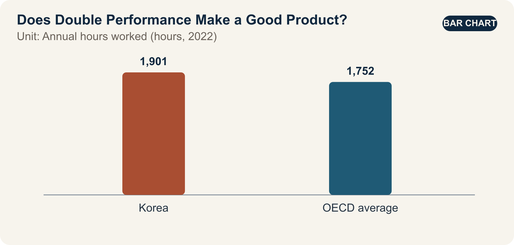

::: {.book-question}
[Today’s Chaekmun]{.book-question-label}

{.book-question-image width=30mm fig-alt="A minimalist ink-wash symbol showing a fast-moving chip followed by scales weighing electricity, time, and quality of life"}

[Even if a new chip doubles performance, can it be considered a success if electricity use, replacement cost, and work intensity all rise?]{.book-question-prompt}
:::

Jungjong’s 1515 chaekmun on ideal government^[The historical chaekmun ([策問]{.hanja}) connected to this chapter asked what should come first when putting an ideal into practice in present circumstances. The Chaekmun Archive condenses its meaning in the reconstructed Classical Chinese passage “[欲致堯舜之治於今日，何者爲先？子若孔子，將何以治國歟？]{.hanja}.” This is not a literal transcription of the original. It asks, “If the government of Yao and Shun were to be realized today, what should come first? If you were Confucius, how would you govern the state?” Today’s question does not translate ideal government into product KPIs. It borrows the question’s structure: do not stop at praising a desirable condition; state real priorities and criteria for implementation.] did not stop at listing the elements of a good society. It required candidates to state what should come first and by what results the ideal would be verified.

A product can likewise be declared successful with one sentence: “Its performance is higher.” But benchmark performance and improvements in life diverge if users do not spend less time waiting, if electricity, cooling, and replacement costs rise sharply, or if higher throughput merely results in more work being assigned.

OECD indicators measure labor productivity and working hours separately. Product evaluation should also look beyond benchmark performance and independently assess user time and health, electricity and cooling, and replacement costs. Only then can we tell whether good components have produced a good system in practice.

## Why This Question Matters Now

In the comparison cited by the *OECD Economic Surveys: Korea 2024*, Korea’s annual hours worked in 2022 were 1,901—149 hours, or about 8.5%, more than the OECD average of 1,752 hours. This does not mean that every worker in Korea worked exactly 1,901 hours; it is a national-average comparison.

OECD productivity data also show that Korea’s hourly labor productivity rose from $13.9 in 1995 to $52.0 in 2024—almost quadrupling. The unit is constant 2020 US dollars at purchasing power parity. Productivity growth creates a foundation for higher living standards, but it does not mean that working hours, health, distribution, and the environment automatically improved.

A new engineer in a product-review meeting is not expected to discount performance. The engineer should trace how higher performance translates into outcomes: Does benchmark performance reduce actual waiting and completion time? What are system electricity use and total cost of ownership? How much earlier will existing equipment be discarded? Did night and emergency work increase? Do older users and users with disabilities share in the benefit?

## Data Lens

{fig-alt="A data graphic showing annual hours worked in Korea and the OECD average, the long-term rise in Korea’s hourly productivity, and multiple indicators of product success"}

### Evidence Table

| Evidence | Figure or range in the primary source | Status | Significance for the debate |
|---:|---|---|---|
| 1 | Annual hours worked in Korea were **1,901 hours** in 2022. | OECD national-average statistic | This is social context for asking whether technological benefits actually reduce users’ time. |
| 2 | The OECD average in the same year was **1,752 hours**. Korea’s figure was 149 hours, or about **8.5%**, higher. | Arithmetic comparison of OECD figures | Institutions and industry structures differ across countries, so the gap must not be linked directly to chip performance. |
| 3 | Korea’s hourly labor productivity rose from **$13.9** in 1995 to **$52.0** in 2024. | OECD, constant 2020 PPP dollars | A near quadrupling of productivity does not mean every quality-of-life indicator changed at the same rate. |
| 4 | The case assumes double the benchmark performance, 35% more system electricity, 20% higher replacement cost, and an 8% reduction in actual work time. | **Hypothetical assumptions for discussion** | The case practices decisions in which performance, cost, and user outcomes move in different directions. |
| 5 | If performance is represented as 2 and system electricity as 1.35, theoretical performance per unit of electricity is about **1.48 times** the baseline. | **Arithmetic using hypothetical figures for discussion** | Data-sheet efficiency improves, but it is a different metric from an 8% reduction in actual work time. |

### How to Read These Numbers

Annual hours worked are an average. The distribution differs by employment status, gender, occupation, and income, and long hours cannot be explained by semiconductors or AI alone. The national average is not a direct KPI for product success; it is a reason to measure user time separately.

The hourly labor-productivity figures of $13.9 and $52.0 are not dollars converted at nominal exchange rates; they are in constant 2020 PPP terms. The ratio is about 3.74, so “almost four times” is more accurate than “exactly four times.” Productivity measures output per labor hour; it is not a unit of pay, life satisfaction, or environmental quality.

A twofold benchmark result depends on the task, precision, power limit, and software. Separate maximum performance, sustained performance, and average user task time. The calculation 2/1.35≈1.48 also applies only to a scenario in which maximum performance and system electricity are measured under the same conditions.

An 8% reduction in work time does not automatically create 8% more leisure. Determine whether the saved time became additional work, waiting, reporting, training, or rest. Measure team workloads, nighttime calls, and error-correction time alongside it.

## Competing Answers

### Answer A — Performance Leadership

Computing performance is a general-purpose foundation that expands the possibilities of science, manufacturing, medicine, and creative work. If performance doubles and performance per unit of electricity rises 1.48 times, organizations can solve larger problems in the same time and reduce the number of servers required. Even if electricity use and replacement costs rise initially, new features, revenue, and shorter customer waiting times may create long-term benefits.

But mistaking a peak benchmark for actual demand leads to premature replacement and idle capacity. Unless the organization verifies that saved time was returned to users, performance remains an internal target.

### Answer B — Human Outcomes First

If actual work time falls by only 8% while electricity rises 35% and replacement costs rise 20%, it is difficult to call a twofold performance gain a success. Users’ lives should improve when work intensity, night work, health, affordability, product life, and disposal are included. Keeping an existing product whose performance is sufficient can also be innovation.

But delaying a launch until every long-term human outcome is known may forfeit needed performance gains and market opportunities. A focus on time savings alone can also miss qualitative benefits such as higher medical accuracy or research that was not previously possible.

### Answer C — Multiple Thresholds

Instead of allowing performance, electricity, cost, user, and environmental outcomes to offset one another in a single weighted average, set minimum thresholds first. Safety and reliability, improvement in real core work, power and thermal limits, total cost of ownership, accessibility, and product life must all pass before a weighted product-family score is calculated. Even extremely high performance does not justify a launch that fails a safety or grid threshold.

After launch, examine who receives the saved time. If work time falls but workloads and nighttime calls rise, change the organizational process; if actual utilization remains low, defer replacement. Accept higher costs for customers whose research or medical work delivers exceptional benefits, but do not force the same replacement cycle on general office work.

## AI Research Design

### Prompt for the AI

> Design a dashboard that evaluates the success of a new semiconductor product through actual user, cost, and environmental outcomes as well as benchmark performance. Check sources in this order: ① chip and system benchmarks under equivalent conditions, ② customer work logs and before-and-after time studies, ③ electricity, cooling, failure, replacement, and disposal data, ④ price, total cost of ownership, accessibility, and health surveys, and ⑤ original OECD sources on working hours and productivity. Mark double performance, a 35% increase in electricity, a 20% increase in cost, and an 8% reduction in work time as hypothetical case assumptions, and conduct sensitivity analysis by function and customer group. Present distributions and the worst-affected group as well as averages, and distinguish whether saved time became additional work or rest. Put verified facts, company claims, user observations, AI inferences, and forecasts in separate columns. De-identify safety and personal logs, and test causality through a comparison group or phased rollout.

### Data Acquisition

| Step | Source | What to verify |
|---:|---|---|
| 1 | Chip and system testing | Task, accuracy, sustained performance, chip, memory, and cooling power, temperature, errors |
| 2 | User time-and-motion study | Type of work, before-and-after completion time, waiting and correction, throughput, nighttime calls, learning time |
| 3 | Economic data | Product, installation, training, electricity, cooling, maintenance, downtime, replacement, residual value |
| 4 | Access, health, and quality | Adoption by price tier, disability access, fatigue and stress, errors, customer outcomes |
| 5 | Life cycle and environment | Manufacturing, transport, use, disposal, actual service life, early replacement, take-back and reuse |

### Evaluating the Information

1. **Equivalent conditions:** Align benchmark accuracy, software, and power limits.
2. **Real-world use:** Separate maximum performance from customer utilization and completion time.
3. **Distribution:** Break down average benefits and costs by user group, shift, and company size.
4. **Destination of saved time:** Determine whether saved time became rest, additional production, meetings, or reporting.
5. **Full life cycle:** Check whether lower use-phase electricity is offset by manufacturing or premature disposal.
6. **Causality:** Distinguish the chip’s effect from other institutional and demand changes before and after adoption.

### Core Questions for Debate

- Which safety, electricity, cost, or time thresholds cannot be offset by higher performance?
- How can the organization determine whether an 8% reduction in actual work time improved user well-being or merely enabled more work?
- If researchers capture the performance benefit while society bears the electricity cost, what should be reflected in the price?
- Is it fair to use different success KPIs for different customer groups?

## Case Discussion

You are a system engineer seven months into the job, attending a new-product review meeting. The new chip doubles performance on a core benchmark, but system electricity rises 35%, replacement costs rise 20%, and pilot users’ actual work time falls 8%. All figures below are hypothetical assumptions for discussion.

- The pilot observed 60 design-validation employees for eight weeks, with a comparison group of 60 using existing equipment.
- Median utilization of the new chip was 42%, while utilization among the top 10% of users was 78%.
- Nighttime error calls from automated jobs rose from 10 to 16 per week, while daytime waiting fell by an average of 50 minutes.
- Existing equipment has two years of remaining accounting life, and replacing 1,000 units early would add KRW 12 billion in cost.

The new engineer must recommend one of three options: **full launch, limited launch for high-workload customer groups, or deferral for one product generation**. The performance team, user representative, finance, sustainability, safety and quality, and sales each propose KPIs.

The final proposal should include non-offsettable minimum thresholds, weights, pilot bias, early replacement, actual time savings, nighttime calls, customer-specific launch scope, six-month reevaluation, and stop conditions.

## Sample 90-Second Response

“I choose **Answer C: a limited launch only for high-workload customer groups.** OECD data show that annual hours worked in Korea were 1,901 in 2022, about 8.5% above the OECD average of 1,752. This is social context for measuring technological performance and user time separately. The case figures—double chip performance, 35% higher electricity, 20% higher replacement cost, an 8% reduction in work time, and 42% utilization—are all hypothetical. I accept the counterargument that delaying peak performance risks losing a competitive opportunity. But a faster benchmark does not make a successful product if actual work and total costs do not improve. I would launch only for customers expected to achieve at least 60% utilization, and I would not replace existing equipment early. The review would combine safety and errors, actual work time, total cost of ownership, electricity and service life, and the benchmark. After six months, I would expand if work time has fallen by at least 10% and nighttime calls and electricity increases remain within their thresholds. If any threshold fails, the product would be modified and reviewed again. A good chip is not merely a faster chip; it is one that demonstrably improves users’ time and society’s costs.”

## Follow-Up Questions

**Cross-Examination and Rebuttal**

- If the quality of medical or scientific work improves substantially, would you broaden the launch even if work time falls by only 8%?
- If the 60 pilot users were all high-performance users, how would you adjust the observed 8% time saving?
- If nighttime calls rise by 60% but daytime waiting falls by 50 minutes, which time should receive greater weight?
- Would a benchmark weight of only 10% understate a semiconductor company’s core competitiveness?
- If existing equipment has two years of life remaining but competitors adopt the new product, would you allow early replacement?
- If the company captures the productivity gain while users and communities bear the electricity and health costs, what should be included in price and compensation?

## Sources

- [OECD, *OECD Economic Surveys: Korea 2024*—Working-Hours Comparison (2024)](https://www.oecd.org/content/dam/oecd/en/publications/reports/2024/07/oecd-economic-surveys-korea-2024_9343c046/c243e16a-en.pdf)
- [OECD, *Compendium of Productivity Indicators 2026*—Long-Term Change in Korea’s Hourly Labor Productivity (2026)](https://www.oecd.org/en/publications/oecd-compendium-of-productivity-indicators-2026_734a5e68-en/full-report/labour-productivity-in-oecd-economies-recent-trends-and-shifting-drivers-of-growth_cd896487.html)
- [Joseon Dynasty Chaekmun Archive, Jungjong 1515, “How to Make Ideal Government a Reality”](https://waterfirst.github.io/Joseon-Dynasty-Civil-Service-Examination/#jungjong-1515/0)
- [Academy of Korean Studies, 1515 Special Palace Examination Roster](https://dh.aks.ac.kr/~sonamu5/wiki/index.php/SEDB%3A1515%EB%85%84%28%E4%B8%AD%E5%AE%97_10%29_%E4%B9%99%E4%BA%A5_%EC%95%8C%EC%84%B1%EC%8B%9C%28%E8%AC%81%E8%81%96%E8%A9%A6%29_%EB%AC%B8%EA%B3%BC%28%E6%96%87%E7%A7%91%29)

> **Data note:** The 1,901-hour and 1,752-hour figures are 2022 OECD comparisons; the $13.9 and $52.0 productivity figures are for 1995 and 2024 in constant 2020 PPP dollars. The doubled performance, 35% more electricity, 20% higher cost, 8% time saving, and all case figures concerning the pilot, utilization, calls, replacement cost, and sample-answer KPIs are hypothetical assumptions for discussion.
