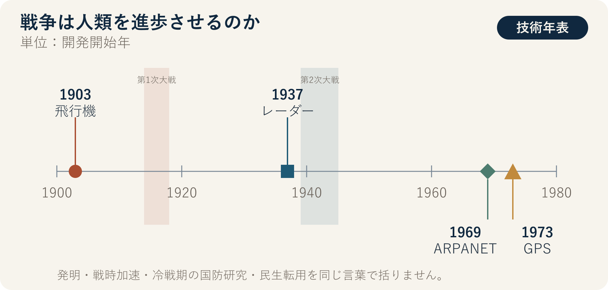

::: {.book-question}
[本日の策問]{.book-question-label}

{.book-question-image width=30mm fig-alt="戦争と半導体のデュアルユースを象徴するイラスト"}

[戦争で発達した自律追跡技術を、新任の設計エンジニアは民生用災害対応ドローンに応用すべきでしょうか。]{.book-question-prompt}
:::

1568年、宣祖の策問^[本章が参照した策問、すなわち「王の問い」は、「外敵に対するとき、征伐と講和のどちらを選び、大義・力・情勢をどう総合して判断すべきか」というものでした。策問アーカイブが公開訳の趣旨を要約し、再構成した漢文は「[禦外之道，戰與和而已。義、力、勢，何所先後？]{.hanja}」です。原文を直訳した引用ではありません。本章の問いも原文の現代語訳ではなく、戦争を大義だけで判断せず、力・情勢・事後の結果まで見るよう求めた構造を、今日の技術問題へ適用した再解釈です。]は、怒りだけで征伐を、恐れだけで講和を選ばず、大義・力量・情勢をともに判断するよう求めました。その問いの構造を借り、戦争が技術的能力を高めたという事実と、その技術が人間の暮らしを良くしたという評価を分けて考えます。

> 兵器は日々精巧になったが、民の暮らしも同じだけ良くなったのか。戦争が生んだ技術を進歩と呼ぶには、何を基準とすべきか。

この問いは、特定の王の原文を訳した引用ではありません。朝鮮時代の策問の形式を借り、本章の論点に合わせて新たに書いたものです。

## なぜ今、この問いなのか

戦争が技術を「発明した」という言い方と、すでに存在した技術の開発・量産・普及を「加速した」という言い方は区別しなければなりません。飛行機は第一次世界大戦前に発明されましたが、戦時中に偵察・通信・高高度飛行・エンジン技術が急速に発達し、航空産業の生産基盤も拡大しました。第二次世界大戦は、レーダー・電子計算・ジェット推進の研究と大規模運用を早めました。一方、インターネットの源流であるARPANETは1969年、GPSの統合開発は1973年に始まりました。この二つは世界大戦の直接の産物というより、冷戦期の国防研究が民間インフラへ広がった事例です。

ウクライナ戦争では、低価格ドローン、衛星通信、電子戦、画像認識、戦場ソフトウェアを短い周期で統合する方法が発達しました。その基盤には、イメージセンサー、通信チップ、パワー半導体、メモリー、プロセッサがあります。同じ半導体が山火事の現場で人を捜し、交通事故を防ぐ一方、標的を探して攻撃する兵器の目と頭脳にもなります。

したがって本章の論点は、「戦争は技術を発達させるか」だけではありません。**技術的能力の進歩と人類の進歩を同じ言葉で語れるのか**、そして戦争で蓄積した技術を平和の便益へ転換する責任は誰にあるのかを問います。

## データの視点

{fig-alt="飛行機・レーダー・ARPANET・GPSの開発時期と、軍事技術の民生転用を比較したデータカード"}

### 根拠データ表

| 根拠 | 確認済みの事実 | 討論での意味 |
|---:|---|---|
| 1 | 米国スミソニアン国立航空宇宙博物館は、第一次世界大戦が飛行機を性能の限られた機械から専門任務を担う軍用航空機へ変え、戦後の航空産業の基礎を築いたと説明しています（2025年）。 | 戦争は飛行機を発明したのではなく、性能・標準化・量産を加速しました。 |
| 2 | 米陸軍は、1937年に実演されたレーダーが第二次世界大戦で急速に発達し、その後、航空交通・気象観測など日常の領域へ入ったと説明しています（2025年）。 | 軍事研究の民間への普及は可能ですが、戦争の犠牲を正当化するものではありません。 |
| 3 | DARPAの4ノードARPANETは1969年に稼働し、米国防総省が統合したNAVSTAR GPS事業は1973年に始まりました。 | インターネットとGPSを世界大戦の直接の発明品とすれば、年表が誤ります。冷戦期の国防研究の民生転用と表現すべきです。 |
| 4 | NATOのウクライナ戦訓資料は、低価格の一方向攻撃型無人機と電子戦が互いの運用方法を急速に変えていると分析しています。 | 継続中の戦争の戦果・生産量を確定値のように引用せず、技術の反復周期が短くなったという質的変化だけを判断材料にします。 |

本章で最初に読むべきものは**開発時期**です。飛行機は第一次世界大戦前に、レーダーは第二次世界大戦前に存在しました。ARPANETとGPSは二度の世界大戦が終わった後に始まりました。この年表だけでも、「戦争による発明」「戦争が加速した開発」「冷戦期の国防研究の民生転用」を区別できます。継続中の戦争における生産量・撃墜率は変化し続け、発表主体の利害も大きいため、模範回答の根拠数値から除外します。

### 数字の読み方

- ドローンの生産量と攻撃回数は、発表時点ごとに変わる作戦上の数値であり、技術の民間便益を示しません。
- 戦後に民間で使われた技術があるという事実は、「戦争がなければその技術は生まれなかった」という反実仮想を証明しません。
- 交戦当事者が発表する迎撃率・破壊率・戦果には測定方法と利害があるため、相手側の資料と独立調査で交差検証する必要があります。
- 研究費・人材・半導体が兵器へ集中したために、医療・気候・教育技術が失った機会は、戦果統計には表れません。

## 対立する答案

### 答案A — 進歩論

戦争は失敗のコストと時間的圧力を極端に高め、研究費、人材、現場のフィードバックを一か所に集めます。第一次世界大戦の航空・無線通信、第二次世界大戦のレーダー・電子計算、冷戦期のARPANET・GPSのように、軍事需要から始まった、あるいは軍事需要によって加速した技術が、民間航空、通信、物流、災害対応の基盤となりました。ウクライナ戦争でも、低価格無人機、電子戦、衛星通信、迅速調達の発達が、災害捜索・施設点検・自律移動技術へ広がる可能性があります。

この答案の強みは、戦争が技術開発の速度と規模を実際に変える点を直視することです。しかし、技術の性能向上をそのまま人類の道徳的・社会的進歩と呼ぶ瞬間、犠牲者をイノベーションの費用として扱う誤りに陥ります。

### 答案B — 後退論

戦争が最初に最適化するのは、人を救う方法ではなく、より早く探知し、より遠くから攻撃し、より低い費用で攻撃する方法です。ドローンとAIは兵士の危険を減らせますが、攻撃の政治的な敷居を下げ、責任の所在が不明確な自動化された殺傷を増やす可能性があります。インフラ破壊、人材流出、教育中断、監視の日常化、莫大な機会費用まで含めれば、一部技術の発達だけで人類が進歩したとは言いにくいでしょう。

この答案の強みは、「民間で使えるようになった」という事後的便益が戦争自体の正当性を生まない点を明確にすることです。弱みは、防御技術と抑止力、戦時中に命を救った通信・迎撃・地雷除去技術の価値を十分に説明できない可能性があることです。

### 答案C — 条件付き進歩論

戦争は**技術的能力を発達させることはあっても、人類を自動的に進歩させるわけではありません。** 進歩という判定は、性能ではなく結果に基づいて下すべきです。民生転用の広がり、生命保護の効果、制御可能性、責任追跡可能性、普及後の悪用リスク、戦争以外の公共研究で同じ成果を得られる可能性をともに見る必要があります。半導体企業も、「民生用部品を販売した」という理由だけで責任を免れることはできません。最終用途の確認、人権デューデリジェンス、輸出規制の順守、悪用を発見した場合の供給停止手続きを備える必要があります。

### 答案Cの判定軸

討論では、「技術の進歩」と「人類の進歩」を二つの行に分けて評価します。

| 判定軸 | 確認する問い |
|---|---|
| 技術的能力 | 性能・価格・生産速度・信頼性は実際にどれだけ改善しましたか。 |
| 生命と安全 | 民間人と戦闘員の死亡・負傷・誤認被害は減りましたか。 |
| 民間への普及 | 戦後に医療・交通・通信・災害対応へ移転した便益は、誰に届きますか。 |
| 制御と責任 | 人間による最終判断、ログ、監査、停止装置、責任主体がありますか。 |
| 代替案と機会費用 | 戦争ではない公共研究と国際協力によって、同じ技術を作れましたか。 |

五つの軸のうち技術的能力だけが改善し、生命・責任・代替案の指標が悪化したなら、「技術は発達したが、人類は後退した」と答えられます。これは矛盾ではなく、本章の核心となる区別です。

## AI調査設計

### AIへのプロンプト

> 第一次・第二次世界大戦とロシア・ウクライナ戦争で、開発・量産・運用が加速した技術を調査してください。飛行機・レーダー・原子力・ドローン・電子戦・衛星通信・AI・半導体を区別し、各技術について①戦争前に存在したか、②戦争中に変わった性能・運用方法、③戦後の民生転用、④民間人被害と悪用、⑤発表主体・文書名・年・原文URLを表で示してください。ARPANETとGPSを世界大戦の直接の発明品とせず、実際の開発時期を確認してください。継続中の戦争の戦果・生産量・迎撃率は結論の根拠数値から除外し、確認済み事実・機関の主張・分析者の推論を分けてください。最後に、技術加速論・人類後退論・民生転用論を最も強くする資料と、結論を変える閾値をそれぞれ示してください。

### データ取得

| 優先順位 | 資料 | 確認項目 |
|---:|---|---|
| 1 | 軍・政府・国際機関の原文 | 技術開発時期、作戦範囲、概念定義 |
| 2 | 博物館・公共研究機関の技術史 | 戦前に存在したか、戦時中の改善、民生転用時期 |
| 3 | 被害・人道資料 | 民間人被害、インフラ破壊、医療・教育の損失 |
| 4 | 企業・研究機関資料 | 部品・ソフトウェアの実際の機能、最終用途管理、戦後転用の可能性 |

### 情報の判定

1. **発明と加速を区別します。** 戦争前に存在した技術なら、「発明」ではなく性能改善・量産・統合が加速したと記します。
2. **年表を照合します。** ARPANETの1969年、GPS統合開発の1973年のような冷戦期の事業を、世界大戦の直接の産物にしません。
3. **能力と結果を分けます。** 探知距離のような技術指標は、生命・自由・福祉の改善を自動的に証明しません。
4. **継続中の戦争の変動数値は回答の根拠から外します。** 戦果・被害・迎撃率・生産量は、独立検証が終わるまで論点の背景としてのみ扱います。
5. **代替案の機会費用を問います。** 同じ研究費と人材が平和的な公共研究に使われた場合に得られる成果は、反実仮想の仮定として表示します。

### 討論の核心

- 戦争が技術の**速度**を高めたという事実と、人類の**方向**を改善したという評価は異なります。
- 民生転用の便益と、戦時中に生じた生命・自由・教育の損失を、同じ単位に無理に換算しません。
- 半導体・AIのように民生と軍事が重なる技術には、最終利用者の確認・人間による制御・悪用発見後の停止手続きが必要です。
- 良い答案は戦争を賛美することも、技術を否定することもなく、技術的能力が人類の進歩へ変わる条件を示します。

## ケース討論

次は実在企業の事例ではない**面接用の仮定**です。あなたは入社6か月目の画像処理チップ設計エンジニアです。チームは、公開された戦争映像データと商用ドローン資料をともに学習させた物体追跡器を、山火事救助ドローンへ搭載しようとしています。既存モデルより行方不明者の検出率は12%ポイント高く、演算電力は18%低い一方、車両と人を長時間追跡する機能は軍事標的化へ転用されるおそれがあります。民生データだけで再学習すれば、発売は4か月遅れ、検出率は6%ポイント低下する見込みです。これらの数値はすべて仮定です。

1. 設計チームは、長時間追跡・座標出力・外部モデル交換機能のうち、チップとファームウェアで何を制限するか示します。
2. 救助機関は悪天候下の検出と行方不明者の再識別の必要性を、安全・倫理担当者は監視と標的化への転用リスクを示します。
3. 検証チームは、戦争資料が検出率向上へ実際に寄与したかを、民生データだけを使った対照モデルと比較します。
4. チームは、**既存モデルのまま発売・民生データだけで全面再開発・危険機能を除いた民生専用設計**のうち一つを選びます。

核心は、取引相手を審査するだけでなく、エンジニアが製品機能とデータの段階で悪用可能性を実際に減らせるかを判断することです。

## 90秒回答例

「私は**答案C、危険機能を除いた民生専用設計**を選びます。飛行機は第一次世界大戦前に存在し、ARPANETとGPSはそれぞれ1969年と1973年に始まりました。この年表は、戦争があらゆる技術を発明したという主張を退けますが、戦争が開発と運用を速めた事実まで否定するものではありません。ケースの検出率12%ポイント向上、電力18%削減、発売4か月遅延はすべて仮定です。民生データだけを使えば救助性能と発売時期を失うという反論も認めます。そこでモデルは維持しつつ、個人の長時間追跡、精密座標の外部送信、未承認モデルへの交換を防ぎます。民生用対照モデルと比較して戦争データの寄与を検証し、行方不明者の検出率と誤追跡をともに公開します。制限機能を回避できる場合、または誤追跡が事前基準を超える場合は発売を保留します。この基準は民生転用後も継続して点検します。技術的能力の向上が生命保護と制御可能性につながる場合にだけ、人類の進歩と呼びます。」

## 追加質問

**反対尋問と再反論**

- 飛行機・インターネット・GPSの民間便益が大きいなら、戦争も必要なイノベーション手段だと認めるべきですか。
- 戦争と同等の予算・規制緩和を気候・感染症研究へ適用していれば、同じ速度を実現できたのではありませんか。
- 継続中の戦争に関するドローンの数値を模範回答から除外すると、どの重要情報を見落とす可能性がありますか。
- 画像処理チップメーカーが最終利用者を知り得なかった場合、どこまで責任を負うべきですか。
- 人間が承認していても、AIの推奨にほぼそのまま従う兵器システムを「人間による制御」と呼べますか。
- 戦後の民生転用を禁止すべき技術と、積極的に転用すべき技術を、どの基準で分けますか。

## 出典

- [Smithsonian National Air and Space Museum, *The Evolution of World War I Aircraft*（2025）](https://airandspace.si.edu/explore/stories/world-war-i-laboratory-air)
- [U.S. Army, *Radar demonstration transforms the Army*（2025）](https://www.army.mil/article/285662/radar_demonstration_transforms_the_army)
- [DARPA, *ARPANET*（2025年更新）](https://www.darpa.mil/news/features/arpanet)
- [GPS.gov, *The History of GPS Technology: Government Collaboration and Technology Transfer*（2018）](https://www.gps.gov/sites/default/files/2025-07/gps_finalreport618.pdf)
- [NATO JALLC, *Ukraine Insights: Electronic Warfare against One-Way Attack Drones*（2026）](https://nllp.jallc.nato.int/iks/sharing%20public/20260409_u_q2-26%20sagu%20nsatu%20ukraine%20insights%20newsletter.pdf)
- [U.S. Congressional Research Service, *Defense Primer: Emerging Technologies*（2026）](https://www.congress.gov/crs-product/IF11105)
- [朝鮮時代策問アーカイブ、宣祖1568年「征伐か講和か」](https://waterfirst.github.io/Joseon-Dynasty-Civil-Service-Examination/#seonjo-1568/0)

> **資料メモ：** 継続中の戦争の戦果・撃墜率・生産量は急速に変化し、発表主体の利害も大きいため、模範回答の根拠数値から除外しました。ケースの性能・日程の数値は討論用の仮定です。
