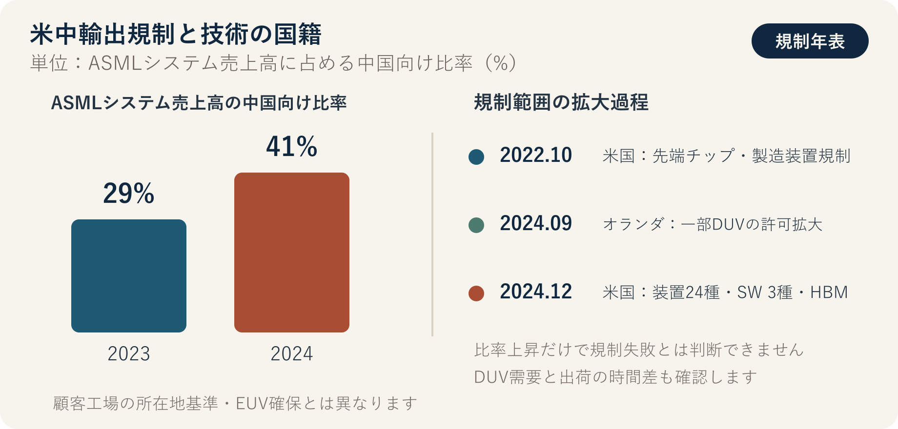

::: {.book-question}
[本日の策問]{.book-question-label}

{.book-question-image width=30mm fig-alt="米国と中国の間で技術主権を判断する半導体産業の象徴イラスト"}

[米国の対中先端半導体規制の下で、中国向け売上比率が高い韓国装置メーカーの新任戦略担当者は、中国との契約を保留し、代替市場での認証を前倒しすべきでしょうか。]{.book-question-prompt}
:::

中宗時代の文集に伝わる策問^[本章が参照した策問、すなわち「王の問い」は、「国の意思を正確に伝え、国の品格を守る使臣には、弁舌や文章力より先に何が必要か」というものでした。策問アーカイブが再構成した漢文は「[奉使傳國意，才辯與德行孰先？]{.hanja}」であり、原文の直訳ではありません。公開資料では正確な試験年と順位が確定していないため、「中宗時代の文集に収録された対策」とだけ表記します。本章の問いも原文の翻訳ではなく、外交の技術より長期的な信頼と責任を先に問う構造を、輸出規制の問題へ適用した再解釈です。]は、外交を弁舌や短期的成果だけで捉えず、国の意思と信頼に誰がどう責任を持つのかを問いました。今日の受験者も、「米国側」と「中国側」のどちらかを選ぶだけでは不十分です。規制が生む時間的利益、韓国企業が失う市場、中国による代替技術の開発、韓国が確保すべき独自技術をともに計算する必要があります。

## なぜ今、この問いなのか

米国の対中規制は、「半導体の輸出禁止」という一文では要約できません。2022年10月に先端コンピューティングチップと半導体製造装置の規制が始まり、2023年には性能基準と迂回防止の範囲が調整されました。2024年12月の措置は、装置24種類、ソフトウェアツール3種類、HBM、中国関連機関140社まで対象を広げました。オランダも2023年から一部の先端DUV露光装置へ許可制を適用し、2024年9月に範囲を拡大しました。これは、すべての露光装置を一律に禁止するものではなく、品目・最終利用者・仕向地に応じた許可制度です。

韓国には相反する効果が同時に生じます。先端露光装置とAIチップの中国への流入が鈍れば、韓国のメモリー・ファウンドリー・先端パッケージング企業は、技術格差と同盟市場を活用する時間を得られます。一方、中国顧客への依存度が高い韓国の装置・材料企業は、輸出許可、フィールドサービス、部品交換、売上減少の負担を負う可能性があります。規制が長期化するほど、中国企業が国産装置、プロセス自動化、歩留まり改善、旧式装置の生産性向上へ多くの資源を投じる誘因も強まります。

したがって核心は、「規制に賛成するか」ではありません。**規制によって得た時間を韓国独自の技術へ変えられるか**、そして安全保障同盟の便益と産業コストをどう配分するかです。

## データの視点

{fig-alt="ASMLのシステム売上高に占める中国向け出荷比率が2023年の29%から2024年の41%へ上昇した事実と、主な輸出規制の日程をともに示すグラフ"}

### 根拠データ表

| 根拠 | 原資料の数値・範囲 | 討論での意味 |
|---:|---|---|
| 1 | 米国BISは2022年10月7日、先端コンピューティングチップ・スーパーコンピューター・半導体製造装置に対する対中規制を実施し、2023年10月17日に性能基準と迂回防止範囲を補完しました。 | 規制は一度きりの措置ではなく、技術の変化に合わせて修正されるルールです。 |
| 2 | BISの2024年12月2日の措置には、半導体製造装置24種類、ソフトウェアツール3種類、HBM、Entity Listへの140社追加が含まれました。 | 韓国の装置企業も、米国由来の技術・ソフトウェアと最終利用者に応じて許可の影響を受ける可能性があります。 |
| 3 | オランダは2024年9月7日から、一部の先端DUV露光装置に対する国家許可の範囲を拡大しました。オランダ政府は、全面禁止ではなく個別審査だと明記しました。 | 「中国によるすべての露光装置輸入を阻止した」と言えば、範囲を誇張することになります。 |
| 4 | ASMLのシステム売上高に占める中国向け出荷比率は、2023年の29%から2024年の41%へ上昇しました。同じ資料で、2024年のシステム売上高に占めるEUVは38%、ArF液浸DUVは44%でした。 | 規制が強化されても、許可されたDUV需要と出荷の時間差により、中国売上比率は上昇し得ます。規制の効果を単一の売上数値で判定してはいけません。 |
| 5 | ASMLは、2025年の中国におけるDUV需要が予想より強かったと述べ、2026年の中国売上高は2024〜2025年より大幅に減少すると予測しました。 | 規制の効果はすぐに表れない場合があり、受注・出荷・売上計上の時点を分けて見る必要があります。 |
| 6 | 韓米両国は、サプライチェーン・産業対話において、安全保障を守りつつ世界の半導体サプライチェーンの混乱を減らし、産業の存続可能性と技術発展を維持する原則を確認しました（2023年）。 | 同盟の目標にも、安全保障と産業コストの均衡が明記されています。韓国は費用分担と予測可能性を交渉する必要があります。 |

### 数字の読み方

グラフの**29%→41%**は、「規制が失敗した」という結論ではありません。ASMLのシステム売上高全体のうち、顧客工場の所在地が中国である比率であり、中国が先端EUVを確保したという意味でもありません。反対に、規制が韓国企業へ自動的に利益を与えた証拠でもありません。この数値が示すのは、**技術規制と市場取引は、直ちに同じ方向へ動くとは限らない**ということです。

韓国企業を分析するときは、次の四つの指標群を別々に集める必要があります。

- 中国向け売上比率と規制対象品目の売上比率
- 米国由来の部品・ソフトウェアが製品原価と機能に占める比率
- 許可申請から承認・拒否までに要した期間とサービス停止日数
- 代替市場での受注額、顧客認証期間、主要装置の性能・歩留まり格差

中国の技術的自立度も、発表された投資額や特許数だけで判断しません。実際の量産ラインにおける装置採用率、ウエハー処理量、欠陥密度、稼働率、顧客認証、反復受注で確認する必要があります。

## 対立する答案

### 答案A — 同盟の機会活用論

米国の市場・技術規制は、韓国が先端半導体で技術格差と利益を守る時間を与えます。中国がEUVと一部の先端DUV露光装置、先端AIチップ、HBMを十分に確保できなければ、最先端プロセスとAIアクセラレーター生産の参入障壁は高まります。韓米同盟の中で、韓国のメモリー、HBM、先端パッケージング、材料・装置企業が信頼できる供給者として定着すれば、米国・日本・欧州の顧客との共同研究、補助金、長期契約の便益も得られます。

この答案の強みは、技術格差は恒久的ではなく、得た時間を投資へ変えなければならないという現実を見ることです。ただし、規制自体が韓国の利益を保証するわけではありません。米国・日本・欧州の競合企業も同じ機会を得るうえ、韓国企業の中国工場と装置顧客も規制コストを負うからです。

### 答案B — 規制の逆効果論

広範で頻繁に変わる規制は、韓国の装置・材料企業による中国への輸出、設置、部品交換、保守を制限し、コンプライアンス費用を増やす可能性があります。さらに重要な長期リスクは、中国が規制された装置を待つのではなく、国産装置、プロセス自動化、マルチパターニング、歩留まり制御、旧式装置の生産性向上へ投資を集中することです。BISが2024年の規制に「より低性能な装置の生産性を高めるソフトウェア」まで含めた事実は、米国もこの迂回的イノベーションの可能性を警戒していることを意味します。

市場で競合を恒久的に排除する戦略は、技術変化と第三国取引のため、コストが増え続けます。韓国が米国のルールに受動的に従うだけなら、中国市場を失いながら、核心的な基盤技術を米国・オランダ・日本に依存する二重の脆弱性が残りかねません。

### 答案C — 技術優位・市場分散論

韓国は二大国の間で規制を避ける迂回路を探すのではなく、どちらも容易に代替できない技術を確保すべきです。メーカーはHBM・先端パッケージング・低消費電力メモリー・高歩留まりプロセスで、装置企業は検査・計測・エッチング・成膜・プロセス制御・保守データで独自の性能を作る必要があります。同時に、中国向け売上の集中度を下げ、米国技術への依存度を把握し、同盟市場の顧客認証を前倒ししなければなりません。

条件付き論の要旨は、「双方とほどほどに取引しよう」ではありません。**規制で得た時間をR&Dと顧客多角化へ投資し、許可範囲内でのみ取引し、売上集中度・技術格差・許可遅延が定めた限界を超えれば戦略を変えること**です。

## AI調査設計

### AIへのプロンプト

> 米国の対中半導体輸出規制が、韓国の半導体メーカーと装置企業へ与える機会とリスクを調査してください。①BISとFederal Registerの規則原文、②オランダ政府の許可範囲、③ASML・韓国企業の事業報告書、④韓国政府の貿易統計の順に探してください。各主張について、機関名、文書名、発表日、統計基準年、単位、原文URLを表で示してください。「禁止」と「許可が必要」、「受注」と「出荷・売上」、「中国売上」と「規制品目売上」を区別してください。確認済み事実、企業・政府の主張、分析者の推論を別々の列に書き、出典がない、または互いに矛盾する数値は結論に使わないでください。最後に、積極論・警戒論・条件付き論をそれぞれ最も強い形で構成し、韓国企業が四半期ごとに確認すべき指標を提案してください。

### データ取得

| 優先順位 | 資料 | 必ず記録する項目 |
|---:|---|---|
| 1 | BIS規則・Federal Register・EAR | 施行日、ECCN、対象性能、最終利用者、許可原則、例外 |
| 2 | オランダ・韓国政府資料 | 許可対象装置、個別審査の有無、韓国企業の例外・協議内容 |
| 3 | 企業の事業報告書・決算資料 | 地域別売上高の定義、受注・出荷・売上計上時点、製品構成 |
| 4 | 関税・貿易統計 | HSコード、金額・数量、名目・実質、中国・香港の区分 |
| 5 | 特許・報道・分析資料 | 原資料リンク、利害関係、量産検証の有無、他の出典による反証 |

### 情報の判定

1. **法的範囲：** 「全面禁止」なのか「許可が必要」なのかを、規則の文言で確認します。
2. **時間の一致：** 規則施行日前の受注が、後になって売上計上されたものではないか確認します。
3. **分母の一致：** 中国売上比率が売上高全体なのかシステム売上高なのか、装置台数なのか金額なのかを確認します。
4. **因果検証：** 規制後に中国の投資が増えたからといって、規制が唯一の原因だと断定しません。
5. **企業別のエクスポージャー：** 大手メーカーと中小装置企業の中国依存度・代替顧客・現金余力は別々に見ます。

### 討論の核心

- 規制が韓国へ与えた**技術開発の時間**は何年であり、どのR&Dへ変えるべきですか。
- 同盟の安全保障上の便益と、韓国装置企業の売上損失を、誰がどう分担すべきですか。
- 中国の国産化が発表ではなく量産成果として確認できる指標は何ですか。
- 韓国企業が振り回されない「独自技術」は、性能・歩留まり・認証期間のどれで測りますか。

## ケース討論

2027年3月、韓国の中堅検査装置会社が、中国のファウンドリーから1,200億ウォン規模の受注を得ました。前年売上高の34%が中国で発生し、この装置には米国製レーザー制御モジュールと設計ソフトウェアが使われています。契約上の出荷日は、新しいBIS規則の施行45日後です。米国顧客からの代替受注は700億ウォンですが、認証には9か月必要で、会社が損失に耐えられる現金は14か月分です。中国顧客は、最終利用者とプロセスノードを非公開にするよう求めています。すべての数値は討論用の仮想条件です。

1. コンプライアンスチームは、ECCN・最終利用者・許可の要否と、拒否された場合の制裁リスクを示します。
2. 営業チームは、中国契約の利益と顧客喪失リスク、米国顧客の認証日程を示します。
3. 技術チームは、米国製モジュールを合法的に代替するために必要な期間と性能低下を示します。
4. 戦略チームは、**契約を保留して許可申請・条件付き契約・契約を断念して代替市場へ転換**のうち一つを選びます。
5. 最終案には、利用可能なキャッシュフロー、中国向け売上の上限、R&D項目、顧客認証日程、規則変更時の中止条件を含めます。

この状況で「迂回輸出」は選択肢ではありません。良い答案は、法令を守りながら会社が生き残り、技術を蓄積する道筋を数値と日程で示します。

## 90秒回答例

「私は**答案C、契約を保留したうえで許可と最終利用者を確認する方法**を選びます。BISは2024年に規制範囲を装置24種類、ソフトウェア3種類、HBMまで広げましたが、ASMLの中国向けシステム売上比率は2023年の29%から2024年の41%へ上昇しました。規制が技術格差を広げても、韓国企業の利益を自動的に保証するわけではないという意味です。ケースの契約1,200億ウォン、中国売上34%、代替受注700億ウォン、認証9か月はすべて仮定です。契約を断念すれば中国市場だけを失い、代替受注も確定しないという反論が最も強いでしょう。そこでECCNと米国製モジュール・ソフトウェアの範囲を確認し、許可が承認される、または許可不要品目だと証明された場合に限り、再輸出禁止と規則変更時の中止権を付けて契約します。顧客が最終利用者を隠し続ける、または許可が拒否された場合は契約を断念し、代替市場の認証と国産モジュールの開発を前倒しします。許可条件は四半期ごとに確認し直します。規制で得た時間を技術と顧客多角化へ変えた場合にだけ、機会となります。」

## 追加質問

**反対尋問と再反論**

- ASMLの中国売上比率が41%へ上昇したにもかかわらず、規制が有効だと言えるのはなぜですか。
- 中国がEUVなしでDUVマルチパターニングにより先端プロセスを実現すれば、規制による時間的利益はどれだけ減りますか。
- 韓国装置企業の中国売上比率が34%から15%へ減れば、政府と大手メーカーが費用を分担すべきですか。
- 米国製ソフトウェアが製品開発の一部だけに使われていても米国規則が適用されるか、何で確認しますか。
- 米国が韓国のHBMまでさらに広く規制すれば、積極論の結論を維持しますか。
- 独自技術を判断する指標を一つ選ぶなら、スループット・欠陥密度・稼働率・顧客認証期間のどれですか。

## 出典

- [米国BIS、2022・2023年の先端コンピューティングおよび半導体製造規制に関する案内](https://www.bis.gov/press-release/bis-updated-public-information-page-export-controls-imposed-advanced-computing-semiconductor)
- [米国BIS、2024年12月の半導体製造装置・HBM規制発表](https://media.bis.gov/press-release/commerce-strengthens-export-controls-restrict-chinas-capability-produce-advanced-semiconductors-military)
- [米国BIS、*Export Administration Regulations §744.23*（2026年閲覧）](https://www.bis.gov/regulations/ear/744)
- [オランダ政府、先端DUV露光装置の輸出許可拡大（2024）](https://www.government.nl/latest/news/2024/09/06/the-netherlands-expands-export-control-measure-advanced-semiconductor-manufacturing-equipment)
- [ASML、*Q4 and Full Year 2024 Investor Presentation*（2025）](https://ourbrand.asml.com/m/62a213cac2117ee6/original/2025_01_29-Presentation-Investor-Relations-Q4-FY-2024.pdf)
- [ASML、*2025 Annual Report—Financials*（2026）](https://www.asml.com/en/investors/annual-report/2025/financials)
- [ASML、*Q3 2025 Financial Results*（2025）](https://www.asml.com/news/press-releases/2025/q3-2025-financial-results)
- [韓米サプライチェーン・産業対話共同声明、輸出規制協力の原則（2023）](https://www.korea.net/Government/Briefing-Room/Press-Releases/view?articleId=6837&type=O)
- [朝鮮時代策問アーカイブ、中宗時代「外交官に必要な資質とは何か」（2026年閲覧）](https://waterfirst.github.io/Joseon-Dynasty-Civil-Service-Examination/#jungjong-diplomat/0)

> **資料メモ：** 輸出規制は品目・性能・最終利用者・仕向地と例外が頻繁に変わるため、商業出版の直前にBIS、Federal Register、オランダ政府、企業開示の原文を再確認します。
