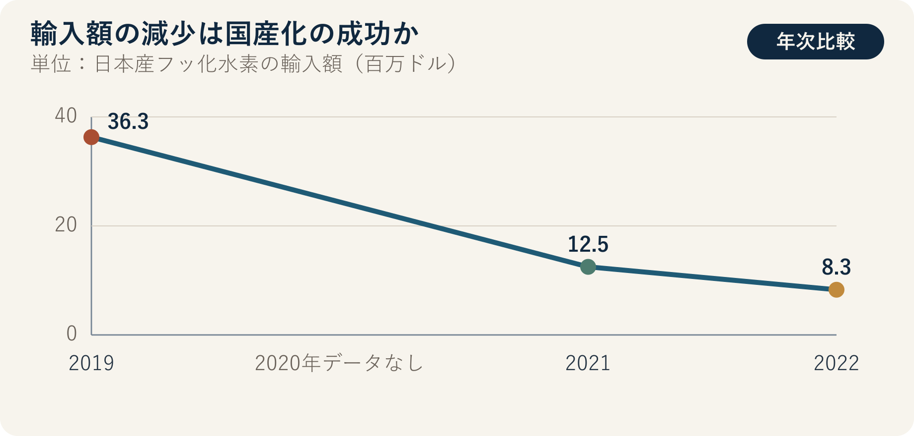

::: {.book-question}
[本日の策問]{.book-question-label}

{.book-question-image width=30mm fig-alt="輸入材料と国内代替材料を天秤にかけるミニマルな水墨画"}

[日本産フッ化水素の輸入額が減ったなら、新任の調達担当者は国産化の成功と報告してよいのでしょうか。]{.book-question-prompt}
:::

朝鮮の策問^[本章は、1798年に正祖が湖南の現実と解決策を問うた実在の策問「湖南の七つの弊害と解決策」と結び付きます。伝わる原文の冒頭は「王若曰，湖南一路卽我朝興王之地也。」です。「王はこう言う。湖南一路は、わが王朝が興った地である」という宣言に続き、地域の物産と人材、積み重なった弊害をともに診断するよう求めました。]は、物産が豊富だという称賛と、民が経験する現実を区別しました。今日の調達担当者も、「日本産の輸入額が減った」という成果文句をそのまま書き写すのではなく、国内代替品の歩留まり・価格・原料原産地・顧客認証まで確認する必要があります。

## なぜ今、この問いなのか

産業通商資源部の資料では、日本産フッ化水素の輸入額は2019年の3,630万ドルから2021年の1,250万ドルへ66%減少しました。貿易統計を追うと、2022年の半導体用フッ化水素の対日輸入額は830万ドルと示されています。規制直前における高純度フッ化水素の日本依存度は43.9%でした。この動きは、供給元が大きく変化した事実を示します。

しかし、輸入額の減少には異なる物語が入り得ます。国内生産が増えた可能性も、第三国からの輸入へ変わった可能性もあり、単価や為替が変わった、あるいは生産自体が減った可能性もあります。半導体プロセスで「同じ化学式」は、直ちに「同じ材料性能」を意味しません。金属不純物、水分、粒子、容器・輸送管理が異なれば、エッチング均一性と歩留まりに影響する場合があります。

新任の調達担当者の報告書は、国家間の感情を評価する文書ではありません。HSコード別の輸入額・数量・単価、供給者別の承認品目、国産品投入前後の欠陥率と歩留まり、原材料の原産地、緊急在庫、顧客再認証期間を結び付ける文書です。「国産化完了」という表現は、調達先が変わったという事実より、はるかに強い主張です。

## データの視点

{fig-alt="日本産フッ化水素の輸入額が2019年の3,630万ドルから2022年の830万ドルへ減少した推移を示すグラフ"}

### 根拠データ表

| 区分 | 原資料の数値・範囲 | 報告書に使う際の限界 |
|---:|---|---|
| 政策資料 | 日本産フッ化水素の輸入額は、2019年に3,630万ドルでした。 | 規制直前の基準点ですが、数量と純度別の構成も併記する必要があります。 |
| 政策資料 | 2021年の輸入額は1,250万ドルで、2019年より66%減少しました。 | 減少率は供給元変化の兆候であり、国産品の量産性能を証明するものではありません。 |
| 貿易統計に基づく資料 | 2022年の半導体用フッ化水素の対日輸入額は830万ドルでした。 | HSコードの範囲と集計基準を記録しなければ、他の年度と比較できません。 |
| 規制直前の資料 | 高純度フッ化水素の日本依存度は43.9%と示されました。 | 金額・数量・特定等級のうち、どれを分母とするか確認しなければ利用できません。 |
| 原資料からの計算 | 2019年の3,630万ドルから2022年の830万ドルへ、約77%減少しました。 | 計算した減少幅だけでは、国内生産、第三国への転換、需要減少を分解できません。 |

### 数字の読み方

第一に、輸入額は`数量 × 単価 × 為替レート`の結果です。金額が減っても数量が同じか、高純度品の単価が変わったかは分かりません。必ず同じHSコード、同じ期間の重量・単価をともに確認する必要があります。

第二に、「日本依存度の低下」と「国内バリューチェーンの自立」を区別します。完成品を国内で精製していても、原料、容器、分析装置、プロセスノウハウを特定の海外供給者へ依存している可能性があります。国名だけが変わり、単一依存が残るなら、レジリエンスは十分に改善していません。

第三に、国産化の最終判定者は調達チームだけではありません。生産チームが長期間の歩留まりと欠陥を確認し、品質チームが変更管理を承認し、必要であれば顧客が再認証を終える必要があります。試作品の成功、一つのラインへの投入、全製品群での承認、安定した反復納入を同じ段階として書いてはいけません。

## 対立する答案

### 答案A — 成果を認める立場

輸入額が大幅に減り、国内供給が実際の量産につながったなら、その過程は明確な学習成果です。供給者が増えれば調達交渉力が生まれ、突然の許可遅延が起きても生産を続ける選択肢が増えます。完全な自立を待つあまり部分的成果まで否定すれば、次の投資と現場改善の推進力を失いかねません。

ただし、成果を認める根拠は国籍ではなく、納期と性能でなければなりません。同じ製品群で顧客承認を得て反復納入し、緊急時の増産能力が確認された時点で、「サプライチェーン多角化の成果」と報告する方が正確です。

### 答案B — 性急な成功宣言への警戒

輸入額だけで国産化成功を宣言すれば、価格上昇、生産減少、第三国経由、品質コストが隠れます。代替品が高価で歩留まりが低ければ、表面上の輸入は減っても、ウエハー一枚当たりの総コストは上がる可能性があります。保護された供給者が品質改善を遅らせるリスクもあります。

とりわけ、原料を別の一国から集中的に調達しているなら、日本依存を別の依存へ移したにすぎません。調達チームは宣伝文句を作るのではなく、単一障害点がどこへ移ったかを探すべきです。

### 答案C — 段階別の国産化判定

結論を「完了」と「失敗」の間に置くのではなく、開発、ライン検証、顧客認証、反復量産、原料多角化に分けます。輸入額減少は最初の観察指標として認めつつ、国産品の使用比率・歩留まり・総保有コスト・納期・原料原産地が基準を満たした場合にだけ次の段階へ進めます。

この答案の切替条件も公開します。代替品の歩留まり差がなくなり、顧客再認証が終わり、緊急増産能力が検証されれば、「完了」へ変えられます。反対に、品質コストと価格プレミアムが続き、新たな国への依存度が高まるなら、多角化戦略を再設計する必要があります。

## AI調査設計

### AIへのプロンプト

> 日本産の半導体用フッ化水素の輸入減少が国産化の成果かを、新任の調達担当者が検証するための調査票を作成してください。韓国関税庁・産業通商資源部・韓国貿易協会の統計、日本経済産業省の輸出管理文書、企業開示、顧客認証資料の順に確認してください。HSコード、期間、国、金額、重量、単価、純度・用途の範囲を記し、2019・2021・2022年の数値が比較可能かを判定してください。国内供給者の原料原産地、生産能力、実際の納入量、製品群別の歩留まり、顧客承認状態を別表にしてください。確認済み統計、政府・企業の主張、計算値、社内仮定を区別し、すべての項目に直接URLを付けてください。最後に、「国産化完了」という文を維持・修正・削除する条件を示してください。

### データ取得

| 優先順位 | 資料 | 必ず記録する項目 |
|---:|---|---|
| 1 | 関税・貿易の原資料 | HSコード、輸入国、金額、重量、単価、期間、修正の有無 |
| 2 | 輸出管理規則 | 許可対象品目、施行日、包括・個別許可、制度変更時点 |
| 3 | 社内の調達・品質記録 | 供給者別購入量、ロット不良、歩留まり、返品、緊急調達所要日数 |
| 4 | 顧客の変更承認資料 | 製品群別の再認証範囲、承認日、保留理由、定期監査結果 |
| 5 | 国内供給者のデューデリジェンス | 原料原産地、精製・分析能力、増産限界、主要装置の海外依存 |

### 情報の判定

1. **品目の一致：** 産業用フッ化水素全体と、半導体用高純度品目を区別します。
2. **値の分解：** 輸入額の変化を、数量・単価・為替レートの変化に分けます。
3. **段階の確認：** 開発発表と顧客承認、一時納入と反復量産を別々に表示します。
4. **性能比較：** 歩留まりは同じ製品・ライン・期間の対照群と比較し、他のプロセス変数を記録します。
5. **依存の移転：** 国産品の原料・容器・分析装置が新たな一国へ集中していないか確認します。

### 討論の核心

- 輸入額77%減少のうち、国内生産拡大で説明できる割合はどれだけですか。
- 歩留まり0.4%ポイントの損失を、供給安定性の保険料として受け入れられる条件は何ですか。
- 価格プレミアムと緊急調達リスクを、ウエハー一枚当たりの総コストへどう統合しますか。
- 「国産化」ではなく「サプライチェーン多角化」と書くと、報告書の責任範囲はどう変わりますか。

## ケース討論

以下の値はすべて、実在企業のデータではない**面接用の仮定**です。あなたは入社3か月目の調達担当者です。日本産材料の輸入額は基準年より77%減りましたが、国内代替品は15%高く、一つの製品群で既存材料より歩留まりが0.4%ポイント低くなっています。現在の在庫は90日分で、顧客再認証には9か月かかります。国内供給者が精製に使う原料の原産国は、まだ完全には確認されていません。

1. 調達チームは、輸入額・数量・単価と、供給者別の総保有コストを再計算します。
2. 生産・品質チームは、0.4%ポイントの差が材料によるものかを、同一条件の試験で検証します。
3. 営業チームは、9か月の再認証期間中に適用できる製品と顧客を区分します。
4. あなたは、報告書の結論を**国産化完了・部分的国産化・供給元多角化の進行中**のうち一つに決めます。
5. 90日分の在庫が減る前に、原料原産地のデューデリジェンス、品質改善、二重調達比率を含む補完策を示します。

面接官が聞きたいのは、愛国的な修辞ではありません。会社がどのような品質・コスト上のリスクを受け入れるのか、誰がそのリスクを確認し、いつ結論を変えるのかです。

## 90秒回答例

「私は**答案C、『国産化完了』ではなく『供給元多角化の進行中』と報告**します。公開資料では、日本産フッ化水素の輸入額は2019年の3,630万ドルから2022年の830万ドルへ約77%減少しました。しかし輸入額は数量・単価・為替レートの積であり、国内材料の量産性能を直接証明しません。ケースの価格15%プレミアム、歩留まり0.4%ポイントの劣位、在庫90日分、再認証9か月はすべて仮定です。日本依存が減り、供給安定性が高まったという反論は認めます。ただし、原料が別の一国へ集中し、歩留まり損失が続くなら、依存先の住所が変わっただけです。そこで90日以内に原料原産地と増産能力を実査し、同じ製品・ラインで歩留まり差を再検証し、顧客承認期間中は二重調達を維持します。歩留まり差がなくなり、顧客承認と反復納入が確認されれば『完了』へ変更します。反対に、品質コストを含む総コストの劣位と新たな単一依存が続けば、第三の供給者を追加します。国産化は輸入額減少ではなく、承認された品質と納期対応力で判定すべきです。」

## 追加質問

**反対尋問と再反論**

- 輸入額は減ったものの輸入数量が増えていたら、報告書の結論をどう修正しますか。
- 歩留まり0.4%ポイントの損失額を計算する際、どの製品価格と期間を使いますか。
- 顧客再認証の9か月中に日本産在庫が不足すれば、どの製品へ優先的に配分しますか。
- 国内供給者が主要原料を一国からしか購入していない場合、国産化と認められますか。
- 15%の価格プレミアムを供給安定性の保険料として認める最長期間をどう決めますか。
- 政府発表と社内品質データが衝突した場合、最終報告書へどう記録しますか。

## 出典

- [韓国産業通商資源部、「材料・部品・装置の競争力強化の成果」政策資料（2022）](https://www.korea.kr/news/policyNewsView.do?newsId=148899420)
- [韓国貿易協会国際貿易通商研究院、*日本の輸出規制措置解除の経済効果と示唆* Trade Brief No.09（2023）](https://fileview.kita.net/getDownload/pY0FySquqta)
- [日本経済産業省、*Security Export Control Policy*（2026年閲覧）](https://www.meti.go.jp/english/policy/external_economy/trade_control/index.html)
- [朝鮮時代策問アーカイブ、「湖南の七つの弊害と解決策」（正祖、1798）](https://waterfirst.github.io/Joseon-Dynasty-Civil-Service-Examination/#jeongjo-1798/0)
- [韓国学中央研究院・韓国古文書資料館、1798年の応製検索資料](https://archive.aks.ac.kr/search/list.do?fq=com_%EC%97%B0%EB%8F%84_fct%3A1798%EB%85%84%28%EC%A0%95%EC%A1%B022%29&fq=com_%EC%B0%B8%EA%B3%A0%EB%AC%B8%ED%97%8C_fct%3A%E3%80%8E%ED%95%9C%EA%B5%AD%EC%9D%98+%EA%B3%BC%EA%B1%B0%EC%A0%9C%EB%8F%84%E3%80%8F&q=query&sortField=%EC%9E%91%EC%84%B1%EB%85%84%EB%8F%84)

> **資料メモ：** 公開輸入統計とケースの仮定を区別しており、15%・0.4%ポイント・90日・9か月は教育用の数値です。
