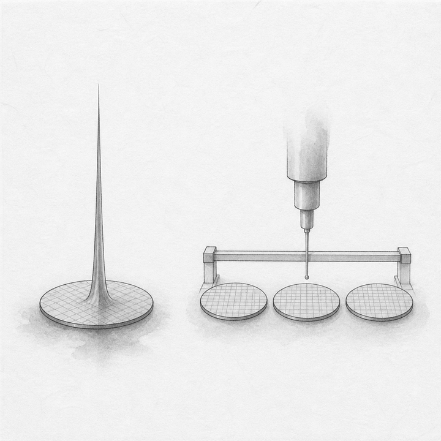
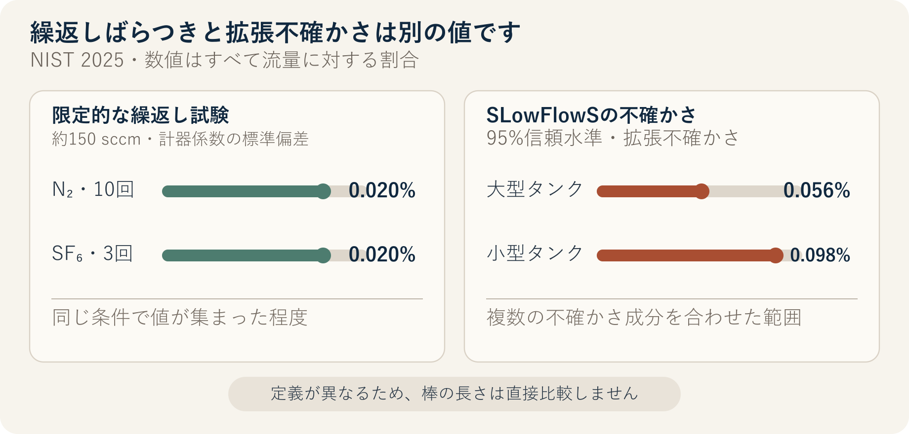

::: {.book-question}
[本日の策問]{.book-question-label}

{.book-question-image width=30mm fig-alt="一度だけの高い最高値と、同一条件で繰り返し測定される複数のウエハーを対比したミニマルな水墨画"}

[一つの研究試料の最高性能と繰返し性・再現性が衝突するなら、何を次の開発段階へ進めるべきでしょうか。]{.book-question-prompt}
:::

1447年、世宗の法と運用に関する策問^[本章が結び付けた実在の策問は、法が弊害を生み、そのため再び法を設ける循環と、権限の所在を問うものでした。策問アーカイブが公開訳の趣旨を要約し、再構成した漢文は「[法立而弊生，弊生而法又立。其所以救之者何歟？政權當歸於何所歟？]{.hanja}」であり、原文の直訳ではありません。「法を設ければ弊害が生じ、弊害が生じればまた法を設ける。これを救う方法は何か、権限はどこに帰すべきか」という問いです。本日の問いは、当時の法制を実験規程へ翻訳したものではありません。優れた基準も、運用者と検証手続きが正しくなければ成果を保証できない、という問いの構造を研究開発へ結び付けた再解釈です。]は、新しい基準を一つ追加するだけで終わらず、誰がどの原則でその基準を運用するのかまで答えるよう求めました。研究開発でも、一度の最高値は可能性を示しますが、同じ手順を別の日・別のウエハー・別の装置で繰り返せて初めて、次の担当者がその結果を利用できます。

## なぜ今、この問いなのか

米国NISTが2025年に発表した半導体プロセスガス向け低流量標準SLowFlowSは、0.01〜1,000 cm³/minの流量範囲で、95%信頼水準の拡張不確かさを流量の0.056〜0.098%としています。同じ研究に先行する繰返し性試験では、約150 sccmにおける窒素10回と六フッ化硫黄3回の計器係数の標準偏差が、それぞれ0.02%でした。

これらの数値を「誤差がほとんどない」という一文にまとめることはできません。0.02%は特定の反復測定条件で値がどれだけ集まったかを示し、0.056〜0.098%は校正・温度・圧力・体積などの不確かさ成分を含む95%拡張不確かさです。反復測定値が密に集まっていても、すべて同じ方向へ偏っていれば正確な結果とは限りません。

研究試料の最高性能も同じように読む必要があります。最高値は技術の上限を探索するうえで重要ですが、最良の試料だけを選んで平均値のように報告したり、測定不確かさより小さい差を改善と呼んだりすれば、量産チームは再現不能な目標を引き継ぐことになります。新任研究員は、最高値、代表値、ばらつき、規格未達数、測定不確かさ、条件変更後の結果を一つの表に置く必要があります。

## データの視点

{fig-alt="NIST半導体プロセスガス標準の繰返し測定における標準偏差と、大型・小型タンクの95%拡張不確かさを別の指標として区分したデータカード"}

### 根拠データ表

| 区分 | 原資料の数値・範囲 | 研究開発判断での意味 |
|---:|---|---|
| 測定範囲 | SLowFlowSは標準状態273.15 K、101.325 kPaにおける0.01〜1,000 cm³/minを対象とします。 | 性能数値には適用範囲と基準状態を併記する必要があります。 |
| 繰返し性試験 | 約150 sccmで、窒素10回と六フッ化硫黄3回の計器係数の標準偏差は、それぞれ0.02%でした。 | 同じ条件でばらつきが小さい根拠ですが、装置・日付を変えた再現性のすべてを証明するものではありません。 |
| 拡張不確かさ | 大型タンクは流量の0.056%、小型タンクは0.098%でした。二つとも95%信頼水準の拡張不確かさです。 | 標準偏差とは定義が異なるため、同じ棒グラフの順位で優劣を決めてはいけません。 |
| 温度検証 | 15時間にわたり、タンク表面の温度センサー24個は互いに63 mK以内で一致し、各センサーの標準偏差は2 mK未満でした。 | 長時間・多点検証は、一瞬だけの良好な測定より強い根拠となります。 |
| ガス種の影響 | 窒素の校正値にメーカーの補正係数を適用した他ガスの測定では、流量に対して最大±6%の誤差が残りました。 | 繰返し性が良くても、物質・方法が変われば系統誤差が大きくなる場合があります。 |

### 数字の読み方

0.02%と0.056〜0.098%は異なる問いに答えています。前者は限定された繰返し試験の標準偏差、後者は複数の不確かさ成分を合わせた95%拡張不確かさです。標準偏差が小さいという理由だけで、測定精度が0.02%だと言ってはいけません。

窒素10回と六フッ化硫黄3回も、量産検証に十分な標本ではありません。NISTの研究は新しい国家流量標準の検証であり、特定のプロセスレシピの歩留まり保証試験ではありません。ただし、「何回測定したか、何を変えたか、どの不確かさを含めたか」を性能値とともに公開する研究姿勢の事例です。

最高値と再現性は敵対する概念ではありません。最高値は探索段階の仮説を作り、繰返し性と再現性は、その仮説を次の段階へ進める資格があるかを確認します。報告書から最高値を消すのではなく、事前に定めた除外基準なしに良い試料だけを選んだ値か、独立した再測定でも維持されるかを明らかにする必要があります。

## 対立する答案

### 答案A — 最高値を優先した探索

初期研究の目的は、まだ見たことのない性能の可能性を探すことです。平均値を安定させることだけに集中すれば、リスクの高い仮説を早く捨て、既存プロセスの周辺しか探索できなくなるおそれがあります。一つの試料の最高値でも、測定誤差ではないという最低限の確認を通過していれば、次の実験の方向を変える重要な証拠です。

ただし、最高値を開発完了値とは呼びません。生データ、試料選択、測定条件を公開し、「探索結果」と表示したうえで、再現の原因を探る追試予算を求めるべきです。

### 答案B — 再現性を優先した移管

量産と製品開発が使うのは、偶然良かった試料ではなく、繰り返し規格を満たす分布です。最高値が高くても試料間のばらつきが大きく、規格未達が繰り返されるなら、プロセスウィンドウが狭い、または未把握の交絡要因があるという意味です。次の段階には、最高値が低くても代表値とばらつきが安定した条件を渡す方が責任ある選択です。

しかし、過度に保守的な基準は、革新的な候補を研究し続ける機会を失わせる可能性があります。安定条件を移管しても、最高値候補は別の研究トラックに残し、原因を明らかにする必要があります。

### 答案C — 探索と移管の二重ゲート

最高値を「技術的可能性」、反復測定の分布を「移管可能性」として分けて承認します。最高値候補には、独立した再測定と、装置・日付・ウエハーを変えた再現試験を設計します。安定候補には、限定的なパイロットで工程能力と性能損失を確認します。

同じ数値で二つの候補を順位付けしません。最高値候補には改善メカニズムと再現成功率、安定候補には平均・ばらつき・規格未達率・コストをゲートとして設定します。どちらの候補もゲートを通れなければ、「成果なし」ではなく、仮説と失敗条件が明確になったと記録します。

## AI調査設計

### AIへのプロンプト

> パワー半導体の研究試料に用いた二つのレシピのうち、パイロット工程へ移管する候補を評価してください。生データにある試料・ウエハー・装置・測定日・作業者別の絶縁破壊電圧、オン抵抗、欠測、再測定の履歴を保存してください。最高値・平均・中央値・標準偏差・規格未達数を計算し、測定システムの校正履歴と95%拡張不確かさを別の列に表示してください。除外値は、事前基準によるものと事後に除いたものを区別してください。同一条件での繰返し性、装置・日付・作業者を変えた再現性、量産プロセスウィンドウを分けて評価してください。事実・計算・仮定・推奨を分離し、各外部根拠には文書名・発行機関・年・直接URLを付けてください。最高値優先、再現性優先、二重ゲートの長所と短所、および結論が変わる数値条件を示してください。

### データ取得

| 優先順位 | 資料 | 必ず記録する項目 |
|---:|---|---|
| 1 | 試料の生データ | すべての測定値、試料・ウエハー位置、欠測、再測定、除外理由 |
| 2 | 実験レシピ・装置ログ | 材料ロット、プロセス条件、装置、チャンバー状態、測定日、作業者 |
| 3 | 測定システム資料 | 校正標準、分解能、繰返し性・再現性、不確かさバジェット、環境条件 |
| 4 | 規格・製品要求 | 絶縁破壊電圧の下限、オン抵抗・熱・寿命の限界、顧客の使用条件 |
| 5 | 後続パイロット計画 | 標本数、無作為化、独立再現機関、成功・中止・再試験の基準 |

### 情報の判定

1. **選択バイアス：** 最高値の試料だけを残したり、事後基準で外れ値を除いたりしません。
2. **測定の区別：** 繰返し性、再現性、正確さ、拡張不確かさを同じ指標のように混ぜません。
3. **効果量：** 候補間の差が、測定不確かさと試料のばらつきより大きいかを確認します。
4. **工程移管：** 一枚のウエハー上のダイ数を、独立したウエハー数のように数えません。
5. **移管ゲート：** 平均だけでなく、規格未達、ばらつき、プロセスウィンドウ、独立再現を通過しなければなりません。

### 討論の核心

- 最高値が規格を大幅に上回っても、繰返し標本の3分の1が未達なら移管できますか。
- 測定不確かさより小さい性能差を研究成果と呼べますか。
- 別の装置で平均は同じでもばらつきが大きくなれば、再現成功と見なしますか。
- 安定レシピのオン抵抗悪化をどこまで受け入れられますか。

## ケース討論

次の数値は特定企業や製品の実際の結果ではない**面接用の仮定**です。あなたはパワー半導体研究チームの新任エンジニアです。パイロット工程へ進められるレシピは一つだけです。

- レシピAは、12個のデバイスにおける絶縁破壊電圧の最高値が1,280 V、平均が1,195 V、標準偏差が42 Vで、4個が規格1,200 Vに届きませんでした。
- レシピBは、最高値が1,250 V、平均が1,232 V、標準偏差が11 Vで、12個すべてが1,200 V以上でした。
- 測定の95%拡張不確かさを±8 Vと仮定します。
- Bのオン抵抗はAより6%高く、効率低下が予想されます。

1. 研究チームは、Aの最高値が測定・選択誤差ではなく、物理的改善かを確認します。
2. 計測チームは、±8 Vの不確かさバジェットと、装置・日付を変えた再測定を検討します。
3. 製品チームは、Bのオン抵抗6%増加が熱設計と顧客規格へ与える影響を計算します。
4. あなたは、**Aを移管・Bを移管・両方とも保留**のうち一つを選びます。
5. 選ばなかったレシピの追試と、結論を変える条件も示します。

良い答案は、平均が高い候補を選ぶだけでは終わりません。規格未達をどう扱うか、不確かさとばらつきを区別したか、安定性のために失う性能をどこまで許容するかを説明する必要があります。

## 90秒回答例

「私は**答案B、再現性の高いレシピBを限定パイロットへ移管**し、Aは研究トラックに残します。NISTの2025年プロセスガス標準は、0.01〜1,000 cm³/minで95%拡張不確かさ0.056〜0.098%を示しています。反復測定値が密に集まっていても、系統誤差がないという意味ではないことを示す実例です。一方、私たちの数値は仮定です。Aは最高1,280 Vですが、平均は1,195 Vで、12個中4個が規格未達です。Bは平均1,232 V、標準偏差11 Vで、未達はありません。Aの最高値がより大きな技術的可能性を示すという反論は認めますが、次の段階には他のエンジニアも再現できるプロセスウィンドウを渡す必要があります。Bのオン抵抗がAより6%高く、熱規格を超えるなら移管を保留します。Aは独立装置でウエハー3枚、1枚当たり20個を再試験し、平均1,230 V以上、標準偏差15 V以下、不確かさ±8 V以下をすべて満たせば再審査します。パイロット移管後も、ロットごとのばらつきと規格未達を透明に公開し続けます。最高値は探索成果として記録し、開発段階への移管は再現可能な結果に対して承認します。」

## 追加質問

**反対尋問と再反論**

- レシピAの未達4個がすべてウエハー端部にあったなら、結論を変えますか。
- レシピBのオン抵抗6%増加がシステム電力1%増加にとどまるなら、どの根拠で許容しますか。
- 12個が一枚のウエハーから得られた値なら、なぜ標本数をそのまま12と見てはいけないのですか。
- 別の装置で平均は維持されたものの、標準偏差が22 Vに増えたら、再現できたと見なしますか。
- 測定不確かさが±8 Vから±20 Vへ大きくなれば、二つのレシピの比較をどう再設計しますか。
- 最高値をプレスリリースで先に公開するよう求められたら、どのような表現と制限条件を付けますか。

## 出典

- [米国NIST、Popeほか、*SLowFlowS: A Novel Flow Standard for Semiconductor Process Gases*（2025）](https://www.nist.gov/publications/slowflows-novel-flow-standard-semiconductor-process-gases)
- [米国国立医学図書館PMC、SLowFlowS論文全文・実験データ（2025）](https://pmc.ncbi.nlm.nih.gov/articles/PMC11894916/)
- [米国NIST、*Research Updates—Gas Flow for Semiconductor Manufacturing*（2025）](https://www.nist.gov/pml/sensor-science/fluid-metrology/research-updates-gas-flow-semiconductor-manufacturing)
- [BIPM/JCGM、*International Vocabulary of Metrology—Repeatability and Reproducibility*（2012、2026年閲覧）](https://jcgm.bipm.org/vim/en/2.25.html)
- [BIPM/JCGM、*Guide to the Expression of Uncertainty in Measurement*（2008）](https://www.bipm.org/documents/20126/2071204/JCGM_100_2008_E.pdf/cb0ef43f-baa5-11cf-3f85-4dcd86f77bd6?version=1.7)
- [米国NIST、*CHIPS for America Metrology Program*（2026年閲覧）](https://www.nist.gov/chips/research-development-programs/metrology-program)
- [朝鮮時代策問アーカイブ、世宗1447年「法の弊害と権力の所在」](https://waterfirst.github.io/Joseon-Dynasty-Civil-Service-Examination/#sejong-1447/0)
- [韓国国史編纂委員会、『世宗実録』世宗29年8月27日条（1447）](https://sillok.history.go.kr/id/kda_12908027_001)

> **資料メモ：** 0.01〜1,000 cm³/min、0.02%、0.056〜0.098%、センサー24個、63 mK、2 mK、最大±6%はNISTの原資料です。絶縁破壊電圧1,280・1,250・1,195・1,232 V、標準偏差42・11 V、規格1,200 V、不確かさ±8 V、オン抵抗6%、後続ゲートは面接用の仮定です。
