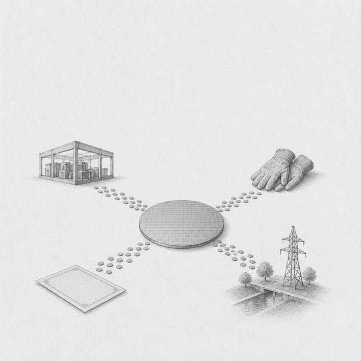
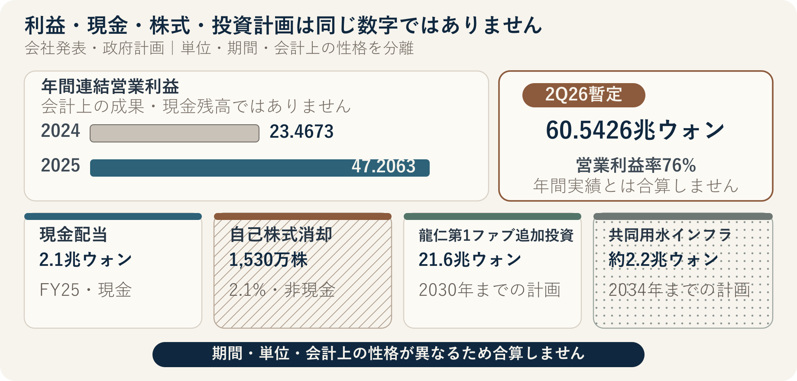

::: {.book-question}
[本日の策問]{.book-question-label}

{.book-question-image width=30mm fig-alt="半導体ウエハーから工場、労働者、株主、地域へ四つの水路が伸びるミニマルな水墨画風の象徴イラスト"}

[AI・データセンター好況の利益を、再投資・労働・株主・公共の取り分に、どのような基準で配分すべきでしょうか。]{.book-question-prompt}
:::

1798年、正祖が湖南について出した策問^[本章が結び付けた実在の策問は、湖南の物産と人材だけでなく、民が背負う負担と積み重なった弊害をともに立て直す方策を問うものでした。アーカイブで公開されている原文の冒頭は「[王若曰，湖南一路卽我朝興王之地也。]{.hanja}」、すなわち「王はこう言う。湖南一路は、わが王朝が興った地である」です。本日の問いは、当時の租税制度を現代企業に移し替えた翻訳ではありません。豊かさの総量と負担の分布をともに見よ、という問いの構造を借りた再解釈です。]は、物産が豊富だという称賛だけで善政が証明されるとは考えませんでした。誰が生産の便益を享受し、誰が税・賦役・地域の弊害を負うのかまで見極める必要がありました。

AIメモリー好況も、「利益が出たのだから公平に分けよう」だけでは終わりません。企業は研究開発と設備投資の失敗リスクを負い、労働者は歩留まり・納期・顧客認証を実現し、株主は不況期の資本損失を引き受けました。政府と市民も、税額控除、送電網、導水管、教育、地域の生活コストを通じて生産基盤をともに築きました。最初に問うべきことは、各主体の功績に順位を付けることではなく、**何を利益と呼ぶのか、会計上の性格が異なる項目をどう分けるのか、好況と不況に同じルールを適用するのか**を決めることです。

## なぜ今、この問いなのか

SKハイニックスの会社発表によると、2025年の連結売上高は97.1467兆ウォン、営業利益は47.2063兆ウォン、純利益は42.9479兆ウォンでした。2024年の営業利益23.4673兆ウォンと比べると23.7390兆ウォン増え、増加率は101%でした。同社は、HBM売上高が前年の2倍以上に増え、過去最高の業績に大きく寄与したと説明しました。ただし、この発表ではHBMの売上高の絶対額と製品別営業利益は個別に示されていません。全社の営業利益増加分をすべて「AI超過利益」と呼べば、原因と分母を誇張するおそれがあります。

2026年第2四半期の暫定連結実績は、売上高79.3187兆ウォン、営業利益60.5426兆ウォン、営業利益率76%でした。四半期末の現金及び現金同等物は88兆ウォン、総借入金は18.6兆ウォン、ネットキャッシュは69.4兆ウォンと発表されました。直近の好況の大きさは示していますが、単一四半期の暫定値と年間で確定した配分能力は同じではありません。価格急騰、運転資本、税金、設備代金の支払時期、非経常損益を確認する必要があります。

「利益」には少なくとも四つの意味があります。営業利益は本業の会計上の成果であり、純利益は金融・税金・非経常項目を反映した結果です。フリーキャッシュフローは、実際の現金から投資を差し引いた値です。労使が定めた業績連動賞与の基準と、経済学上の超過利潤も別の概念です。新入社員が配分案を作る際には、一つだけを選び、残りを隠すのではなく、**法令・契約上の支払いを先に分離したうえで、裁量配分できる現金**を計算しなければなりません。

## データの視点

{fig-alt="AIメモリー好況の営業利益、現金配当、自己株式消却、複数年投資計画、税金、公共インフラを会計上の性格ごとに分けたデータ図"}

### 根拠データ表

| 根拠 | 公開された数値・期間・分母 | 性格 | 討論での意味 |
|---:|---|---|---|
| 1 | SKハイニックスの2025年連結売上高は**97.1467兆ウォン**、営業利益は**47.2063兆ウォン**、純利益は**42.9479兆ウォン**です。2024年の営業利益は23.4673兆ウォンでした。 | 会社のK-IFRS年間決算発表 | 営業利益の増加額は23.7390兆ウォンですが、現金の配分可能額でも、HBMだけの利益でもありません。 |
| 2 | 2026年第2四半期の暫定連結売上高は**79.3187兆ウォン**、営業利益は**60.5426兆ウォン**、営業利益率は**76%**で、四半期末のネットキャッシュは**69.4兆ウォン**と会社が発表しました。 | 2026年7月29日付の会社の四半期暫定値 | 直近の好況と財務余力を示しますが、単一四半期を長期配分算定式の基準として固定してはいけません。 |
| 3 | 会社は、2025年の**HBM売上高が前年の2倍以上**に増えたと発表しました。 | 会社による要因説明 | HBM売上高の絶対額、製品別の原価・営業利益という分母がないため、全社利益をHBM寄与分へ換算できません。 |
| 4 | 2025年度の配当総額は**2.1兆ウォン**、自己株式の消却は**1,530万株**でした。取締役会は2026年8月19日、自己株式を**40兆ウォン**取得して全量消却することを決議し、決議前日の終値基準で**2,407万株・発行済み株式の3.3%**と発表しました。 | 2025年は株式数、2026年は取得金額が確定値です | 確定値と換算値が二つの年度で入れ替わるため、「消却規模」を同じ列で比較できません。実際の消却株式数は取得期間中の株価で決まります。 |
| 5 | 会社は2026年2月、龍仁第1ファブに2030年12月まで**21.6兆ウォン**を追加投資し、既存の9.4兆ウォンを含む総投資額を約**31兆ウォン**へ増やすと発表しました。装置設置費は除外されています。 | 取締役会決議に基づく複数年の設備計画 | 21.6兆ウォンは2025年の年間設備投資額でも、一度に支出する現金でもありません。期間、取消可能性、装置費を個別に見る必要があります。 |
| 6 | 会社の2025年DBL測定は、間接的な経済貢献として「雇用」**8.7114兆ウォン**、「納税」**9.5329兆ウォン**、「配当」**2.1117兆ウォン**を示しています。対象には子会社5社と社会的企業4社を含むと説明しています。 | 会社が定義した社会価値の測定値 | 雇用値を賃金・業績連動賞与の総額、納税値を連結損益計算書の法人税費用と同一だと断定できません。測定範囲と方法の確認が必要です。 |
| 7 | 政府の2025年半導体支援策は、インフラへの財政投資を**3.1兆ウォンから5.1兆ウォン**へ拡大し、龍仁・平沢の送電線地中化における企業負担分の**70%**を国費で分担し、2025年1月1日以降の半導体投資税額控除率を国家戦略技術より**5%ポイント**高くするとしています。 | 国全体の支援計画・上限・税制 | 特定企業がこの金額を実際に受け取ったという意味ではありません。公共への貢献を論じるには、企業別に実現した税額控除と補助金、その条件・返還条項を確認する必要があります。 |
| 8 | 環境部と韓国水資源公社は、龍仁統合用水事業に2034年まで約**2.2兆ウォン**を投じ、1日**107.2万m³**を供給し、第1段階では2031年1月から1日**31万m³**を供給する計画だと発表しました。 | 複数企業・産業団地のための長期公共インフラ計画 | 一企業の現在の水使用量や補助金受領額ではありません。取水・供給・再利用量と事業費分担を分けて見る必要があります。 |

### 数字の読み方

第一に、**営業利益と現金を分けます。** 営業利益には減価償却費が含まれ、設備代金、在庫、売掛金、税金の支払時期はキャッシュフロー計算書上で異なる動きをします。「営業利益の何%」は簡単ですが、維持投資と運転資本を差し引かなければ支払能力を誇張します。

第二に、**現金・株式数・市場価値を同じ列で足しません。** 2025年は消却株式数が確定値であり、2026年8月の決議では取得金額40兆ウォンが確定値、3.3%は終値から換算した値でした。同じ名称の数値でも、何が確定値で何が派生値なのかを毎年確認し直す必要があります。

第三に、**年間実績・四半期暫定値・複数年計画の期間をそろえます。** 2026年第2四半期の営業利益を4倍して年間利益と断定したり、2030年までの21.6兆ウォンを2026年だけの投資額としたりすれば、配分可能額が歪みます。

第四に、**製品の寄与と全社業績を分けます。** HBM売上高が2倍以上に増えた事実は、AI需要の強さを示します。しかし既存DRAM、NAND、eSSD、為替、価格、原価も営業利益に影響します。HBM別の営業利益が非開示なら、「AIが生んだ取り分」は幅で示す必要があります。

第五に、**税金・補助金・インフラは総額と純額をともに見ます。** 法人税は法的義務であり、投資税額控除は条件を満たす投資への減免です。送電・用水支援は複数の利用者が共有する場合があります。納税額と支援計画を単純に相殺して「政府の取り分」を作ることはできません。

第六に、**労働の寄与を会社の「雇用」測定値一つで代用しません。** 人員、基本給、時間外労働、業績連動賞与、協力会社の労働、労働災害、離職率、技能、歩留まり改善を分けて見る必要があります。労使交渉の数値が公開されていなければ、一人当たりの賞与を推定事実のように示してはいけません。

## 対立する答案

### 答案A — 積極配分論

記録的な利益は、技術と資本だけで生まれるものではありません。現場の労働者は交替勤務・歩留まり改善・顧客対応によって納期を守り、政府と地域は税額控除・送電網・用水・交通の費用を分担しました。株主も不況期の資本損失を引き受けました。平常時の中央値を大きく上回ることが確認された余剰現金は、一時金としての業績連動賞与、協力会社の単価・安全改善、地域インフラ、特別配当へ幅広く配分し、好況の正当性と組織への信頼を高めるべきです。

ただし、営業利益の増加額をそのまま配分すれば、未払いの税金、維持投資、顧客契約、次のプロセス移行を見落としかねません。一時的な好況を基本給・固定配当のような恒久費用へ変えれば、不況期に急激な構造調整圧力が生じます。

### 答案B — 再投資・株主権重視論

HBMと先端パッケージングは、研究開発の失敗、装置の先行発注、長期認証を先に引き受けて初めて得られる成果です。会社と株主は過去の赤字期にも資本を投入しており、次世代の生産能力がなければ現在の雇用と税収も続きません。法定税金と合意済みの報酬を支払った後に残る現金は、顧客の長期契約、歩留まり、投資回収可能性を基準に、再投資と株主還元へ優先的に配分すべきです。

しかし「将来投資」という言葉だけで、現金を蓄積しながら役員・従業員と地域の貢献を無期限に先送りすることはできません。投資案の需要根拠、中止条件、期待収益、実現した公共支援額を公開しなければ、再投資も検証不能な社内主張にとどまります。

### 答案C — 条件付き配分算定式

私はまず、裁量配分の分母を次のように定めます。

**配分可能額 = 税引後営業キャッシュフロー − 維持・安全投資 − 契約済み成長投資 − 運転資本・ネット有利子負債の安全余力**

法定税金、基本給、労働安全義務、締結済みの契約は、このプールの「取り分」ではなく、先に守るべき義務です。残った配分可能額だけを、追加再投資、労働への成果配分、株主への現金還元、電力・用水効率と地域便益、不況準備金に分けます。自己株式消却の市場価値は現金配分表の外に置き、株式数への効果として別途表示します。

比率は自動的に固定しません。取消不能な受注と下方シナリオのキャッシュフローが確認できれば再投資の取り分を、合意済みの成果指標と安全・技能への寄与が確認できれば労働の取り分を増やします。ただし業界では、フリーキャッシュフローの一定比率を株主還元へ**事前に約束**します。すると株主の取り分は残余ではなく、分母から先に差し引く取り分となり、上記の順序と衝突します。約束は下限としてのみ認め、それを超える部分は配分可能額の中で調整します。

損失分担も対称でなければなりません。配分可能額が2四半期連続でマイナスになれば、裁量的な自己株式取得、役員変動報酬、追加業績連動賞与、取消可能な成長投資を事前に定めた順序で減らします。基本給・安全・必須教育を最初の調整項目とせず、好況期に積み立てた準備金で賞与の急減を緩和します。反対に、不況時に投資と報酬を減らしたなら、回復後は同じ指標に従って増やさなければなりません。

## AI調査設計

### AIへのプロンプト

> AI・データセンター好況の恩恵を受ける韓国半導体企業の利益配分案を設計してください。①金融監督院DARTの事業報告書・監査報告書・キャッシュフロー計算書、②韓国取引所の開示と会社の取締役会・株主総会・決算発表、③会社と労働組合の公式賃金・業績連動賞与合意書または雇用労働部資料、④企画財政部・国税庁の法人税・投資税額控除、補助金・返還条件、⑤産業通商資源部・環境部・地方自治体の電力・用水事業費と分担資料の順に調査してください。数値ごとに対象年度、単位、連結・個別の範囲、現金・非現金、実績・計画、分子と分母を記録してください。「確認済み事実、会社の主張、労働側の主張、政府計画、討論用仮定、AI推論」を別々の列に表示してください。営業利益を配分可能現金として使わず、税引後営業キャッシュフローから維持・安全投資、契約済み成長投資、運転資本・負債の安全余力を差し引く算式を提示してください。再投資・労働・株主・公共の取り分と、好況・不況の切替条件を表にし、すべての外部資料に機関名、文書名、発表日、直接URLを付けてください。

### データ取得

| 優先順位 | 資料 | 確認項目 |
|---:|---|---|
| 1 | 監査済み財務諸表・キャッシュフロー計算書・注記 | 連結範囲、営業利益、営業キャッシュフロー、法人税納付、維持・成長CAPEX、運転資本、ネット有利子負債 |
| 2 | 取締役会・株主総会・取引所開示 | 配当基準日・総額、自己株式取得原価・消却株式数、投資期間・取消条件、実際の執行額 |
| 3 | 製品・顧客資料 | HBM・サーバーDRAM・eSSDの売上範囲、長期契約、取消権、歩留まり、顧客集中度、下方価格 |
| 4 | 労使の公式資料 | 基本給・業績連動賞与の算式、分母、上限・繰延べ、対象人員、協力会社の範囲、不況時の調整ルール |
| 5 | 税制・補助金の原文 | 法人税費用と現金納付、実現した税額控除、補助金支給・返還、雇用・投資条件 |
| 6 | 電力・用水・地域資料 | 政府・企業の分担額、純取水・再利用、最大電力・使用量、住民負担、地域基金と公開範囲 |

### 情報の判定

1. **会計上の性格：** 利益、現金流入、現金流出、株式数の変化、市場価値を区別します。
2. **期間：** 四半期暫定値、年間実績、5年投資計画を同じ期間に換算し、推定であることを表示します。
3. **範囲：** 連結・個別・国内法人・子会社・協力会社のうち、どの範囲かを記します。
4. **因果：** HBM売上増と全社営業利益の間で、価格・為替・既存製品・原価を統制します。
5. **追加性：** 政府支援の前後で投資が実際に増えたのか、既定の投資を補助したのかを確認します。
6. **対称性：** 好況期の支給基準と不況期の削減基準が、同じ指標・順序で作動するかを検査します。
7. **主張の出所：** 会社・労働・政府の評価文を事実値と分け、反対資料が公開されているかを記録します。

### 討論の核心

- 営業利益、純利益、フリーキャッシュフロー、労使の賞与算定基準のうち、何を「配分する利益」としますか。
- HBMの製品別利益が非開示なら、AI好況の寄与分をどのような幅で示しますか。
- 現金配当と自己株式消却、複数年CAPEXと当年支出を、同じ配分表の中でどう分けますか。
- 税額控除とインフラへの国費支援が実際に確認できた場合、企業の公共・地域への義務を何に連動させますか。
- 不況に入る際、株主還元・変動賞与・選択的投資のどれを、どの順序で調整しますか。

## ケース討論

以下の会社と数値はすべて**討論用の仮想条件**であり、SKハイニックスや他の実在企業のデータではありません。あなたは「ハンビットメモリ」の財務・労使・サステナビリティ共同タスクフォースに配属された新任アナリストです。会社は2026年の税引後営業キャッシュフローを10兆ウォンと予想しています。維持・安全CAPEX 3兆ウォン、契約済み成長CAPEX 2兆ウォン、運転資本・ネット有利子負債の安全余力1兆ウォンを差し引くと、配分可能額は4兆ウォンです。

各ステークホルダーの要求は次のとおりです。

- 投資部門は、取消可能な追加HBMラインに2.2兆ウォンを求めています。顧客の最低購入量はまだ交渉中です。
- 労働組合は、これまでの歩留まり改善と交替勤務の負担を根拠に、追加成果配分1.4兆ウォンを求めています。
- 株主側は、特別配当と自己株式取得に現金1.8兆ウォンを求めています。
- 地域・公共協議体は、送電網分担、水の再利用、協力会社の安全、地域基金に0.6兆ウォンを求めています。

要求総額は6兆ウォンで、配分可能額を2兆ウォン上回ります。会社には実際に実現した投資税額控除0.8兆ウォンとインフラ支援0.2兆ウォンがあると仮定します。翌年にメモリー価格が35%下落すると、税引後営業キャッシュフローは5.5兆ウォンへ減り、追加ラインを取り消す際に0.3兆ウォンの違約金が発生する可能性があります。これらの数値もすべて仮定です。

新任アナリストは、**積極配分、再投資・株主優先、条件付き算式**のうち一つを選び、4兆ウォンの金額表を示さなければなりません。会社・労働・株主・政府・地域のいずれも、相手の寄与を0にすることはできません。提案書には、配分可能額の算式、各取り分の現金・非現金区分、顧客契約と歩留まりに応じた投資の切替条件、実現した公共支援の開示と返還条件、価格35%下落時の調整順序、次の好況で復元する基準を含めてください。

## 90秒回答例

「私は**答案C、営業利益ではなく配分可能額を基準に配分する方法**を選びます。実際の会社発表では、2025年の営業利益は47.2063兆ウォン、配当は2.1兆ウォンでしたが、どちらも配分可能な現金と同じではありません。仮想ケースでは、税引後営業キャッシュ10兆ウォンから維持・安全投資3兆ウォン、契約済み成長投資2兆ウォン、運転資本・負債の安全余力1兆ウォンを差し引き、4兆ウォンだけを配分します。提案は、再投資1.6兆ウォン、労働1兆ウォン、株主0.8兆ウォン、電力・用水と地域0.4兆ウォン、不況準備金0.2兆ウォンです。好況期により多く投資してこそ将来の雇用と収益を守れるという反論は妥当です。そこで、顧客の最低購入量が確定し、価格が35%下落しても投資現金が1.5倍残る場合は、準備金と株主の取り分の一部を再投資へ移します。反対に、配分可能額が2四半期連続でマイナスになれば、自己株式取得と役員変動報酬から止めますが、基本給・安全・必須教育は守ります。公平な配分とは同じ比率ではなく、同じ分母と好況・不況の対称的なルールを事前に合意することです。」

## 追加質問

**反対尋問と再反論**

- HBMの製品別営業利益が非開示なら、23.7390兆ウォンの増加分のうち「AI超過利益」をどう推定しますか。
- 提案した40%・25%・20%・10%・5%をそれぞれ5%ポイント変える客観的指標は何ですか。
- 労働者は長年の技能による寄与を、株主は赤字期の資本損失を主張します。一つの景気循環の中で、両者の寄与をどう比較しますか。
- 2025年は消却株式数、2026年は取得金額40兆ウォンが確定値でした。二つの年度を同じ基準で比較するには、何を統制しますか。
- 税額控除とインフラ支援が増える際に地域基金も増やせば、法人税・補助金・地域分担を二重計上することになりませんか。
- メモリー価格が35%下落し、配分可能額がマイナスになれば、株主還元・業績連動賞与・追加投資のうち何を先に減らし、回復後は何を先に戻しますか。

## 出典

- [SKハイニックス、*SK hynix Announces FY25 Financial Results*（2026-01-28）](https://news.skhynix.com/en/sk-hynix-announces-fy25-financial-results/)
- [SKハイニックス、*SK hynix Announces 2Q26 Financial Results*（2026-07-29）](https://news.skhynix.com/en/q2-2026-business-results/)
- [SKハイニックス、*New Facility Investment for Yongin Semiconductor Cluster*（2026-02-25）](https://news.skhynix.com/new-facility-investment-for-yongin-semiconductor-cluster/)
- [SKハイニックス、*DBL Performance—2025年SV・EV測定値*（2026年閲覧）](https://www.skhynix.com/sustainability/UI-FR-SA04/)
- [韓国政策ブリーフィング・企画財政部、「グローバル半導体競争力の先取りに向けた財政投資強化策」（2025-04-17）](https://www.korea.kr/news/policyNewsView.do?newsId=148941998)
- [国家水管理委員会・環境部、「龍仁半導体クラスター用水供給事業を本格化」（2025-05-16）](https://www.water.go.kr/board/PolicyNews/10620)
- [国税庁、「法人税の主な控除・減免制度」—国家戦略技術・半導体投資税額控除（2026年閲覧）](https://www.nts.go.kr/nts/cm/cntnts/cntntsView.do?cntntsId=7987)
- [朝鮮時代策問アーカイブ、正祖1798年「湖南の七つの弊害と解決策」](https://waterfirst.github.io/Joseon-Dynasty-Civil-Service-Examination/#jeongjo-1798/0)

> **資料メモ：** 2025年・2026年の業績、配当、自己株式数と会社が示した市場価値、複数年設備計画、DBL測定値は、各社の原文に基づく実際の公開値または会社の公式計画・評価です。HBMが業績に寄与したという説明とDBL分類は会社の主張・測定であり、製品別利益や法人税費用と同じとは見なしません。政府の5.1兆ウォン、70%、5%ポイントと、用水の2.2兆ウォン・107.2万m³/日は、国全体の支援・インフラ計画であり、特定企業の受領額・使用量ではありません。ハンビットメモリの10兆・3兆・2兆・1兆・4兆・2.2兆・1.4兆・1.8兆・0.6兆・0.8兆・0.2兆・5.5兆・0.3兆ウォン、価格35%、配分額、切替基準はすべて討論用の仮定です。
