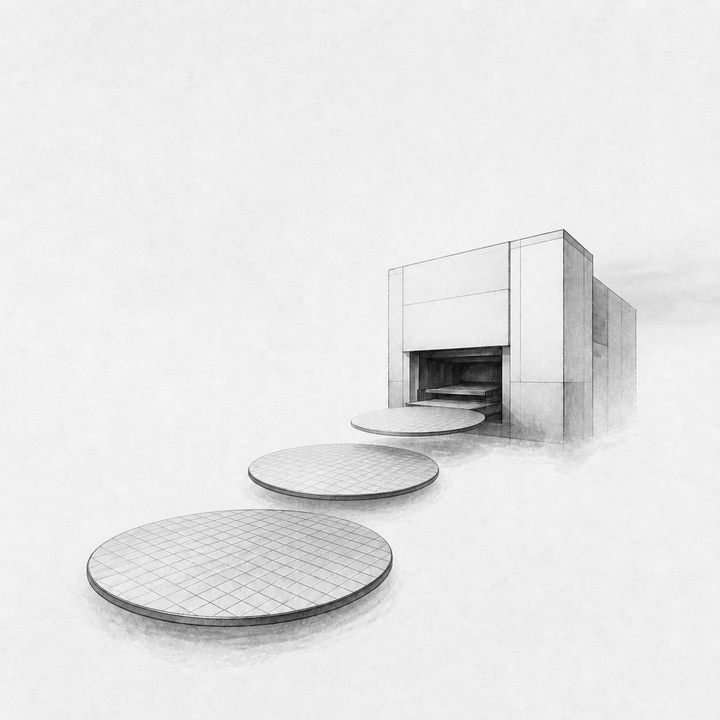
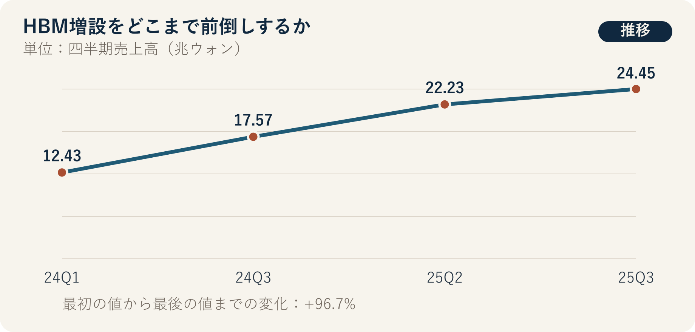

::: {.book-question}
[本日の策問]{.book-question-label}

{.book-question-image width=30mm fig-alt="HBM積層と段階別設備投資ゲートを象徴するミニマルな水墨画"}

[5年の長期受注を得ても設備の投資回収に7年かかるなら、新任アナリストは一括増設を提案すべきでしょうか。]{.book-question-prompt}
:::

朝鮮の策問^[本章は、1507年に中宗が最初の志を最後まで守る方法を問うた実在の策問「始めと終わりが同じ政治」を受け継ぎます。策問アーカイブが意味を要約して再構成した漢文は「善始者未必善終，何也？欲始終惟一，其道何由？」であり、原文の直訳ではありません。「良く始めた者が必ずしも良く終えられないのはなぜか。始めと終わりを一貫させるには、どの道に従うべきか」という問いです。]は、出発時の勢いではなく、最後まで機能する制度と姿勢を求めました。HBM好況での良い始まりは、装置を早く発注することかもしれません。しかし良い終わりとは、需要が下がってもキャッシュフローを守り、設備を次世代製品へ転用することです。

## なぜ今、この問いなのか

SKハイニックスの売上高は、2024年第1四半期の12.43兆ウォンから、2024年第3四半期の17.57兆ウォン、2025年第2四半期の22.23兆ウォン、2025年第3四半期の24.45兆ウォンへ増加しました。2024年第1四半期と2025年第3四半期を単純に比較すると、約97%増えた規模です。2025年第3四半期の営業利益は11.38兆ウォンでした。

製品構成も変わりました。会社の開示では、HBMは2024年第3四半期のDRAM売上高の30%を占め、第4四半期には40%となる見通しでした。この数値はAIメモリーの重要性を示しますが、HBM出荷量、契約期間、将来需要が確定したという意味ではありません。売上高の増加は、数量だけでなく価格と高付加価値製品ミックスの影響も受けます。

設備投資チームの新任アナリストは、好況の物語を投資案へ変える際に、時間軸をそろえる必要があります。顧客の受注期間、取消権と前受金、装置の発注・設置、歩留まりの立ち上げ、パッケージングのボトルネック、減価償却、投資回収期間を一つの軸に置く必要があります。顧客が5年分の数量を示しても、設備回収に7年かかるなら、最後の2年間のキャッシュフローは契約外の需要に左右されます。

## データの視点

{fig-alt="SKハイニックスの四半期売上高が2024年第1四半期から2025年第3四半期まで増加した推移を示すグラフ"}

### 根拠データ表

| 区分 | 原資料の数値・範囲 | 投資判断での意味 |
|---:|---|---|
| 企業開示 | 2024年第1四半期の売上高は12.43兆ウォンでした。 | 比較の出発点であり、HBM単独の売上高ではありません。 |
| 企業開示 | 2024年第3四半期は17.57兆ウォン、2025年第2四半期は22.23兆ウォンでした。 | 四半期売上高の上昇経路ですが、価格・数量・製品ミックスへ分解する必要があります。 |
| 企業開示 | 2025年第3四半期の売上高は24.45兆ウォン、営業利益は11.38兆ウォンでした。 | 高い収益性を示しますが、新ラインの7年間のキャッシュフローを保証しません。 |
| 企業発表 | HBMは2024年第3四半期のDRAM売上高の30%を占め、第4四半期は40%となる見通しでした。 | 分母は売上高全体ではなくDRAM売上高であり、40%は当時の予測値です。 |
| 原資料からの計算 | 2024年第1四半期から2025年第3四半期まで、売上高は約97%増加しました。 | 離れた二つの四半期の単純比較であり、長期成長率や需要の下振れを意味しません。 |

### 数字の読み方

24.45兆ウォンは、会社全体の四半期売上高です。HBMの数量や顧客別契約残高ではありません。11.38兆ウォンの営業利益も、既存設備と製品価格の結果が混在するため、新ラインの内部収益率へそのまま入れることはできません。

HBM 30%の分母はDRAM売上高です。販売数量の比率ではなく、高価格製品ほど売上比率は大きく見えます。40%は発表時点の第4四半期予測であるため、実績値と分けて記録する必要があります。新任アナリストは、開示済み実績、経営陣の予測、自らの需要仮定を別の色で表示する必要があります。

長期受注も、契約書を読む前は確定需要ではありません。最低購入量、価格再交渉、取消手数料、顧客の設計変更、品質未達、供給者変更権を確認する必要があります。装置を取り消す費用だけでなく、パッケージング・検査・電力・熟練人材への関連投資も下方シナリオに含める必要があります。

## 対立する答案

### 答案A — 先行一括増設論

HBMは、装置調達とプロセス・パッケージング認証に時間がかかるため、需要が確認されてから動けば顧客の製品サイクルを逃す可能性があります。長期受注と技術格差が確認された時点で設備を確保すれば、顧客と標準を囲い込み、後発企業の参入を遅らせることができます。

増設遅延の機会費用も大きいでしょう。装置の発注待ちとクリーンルーム・電力工事が長引けば、一度逃した数量を次の四半期に取り戻せない可能性があります。顧客の安定供給要求を満たす能力自体が、次の契約の根拠となります。

### 答案B — 過剰投資警戒論

5年の受注より投資回収期間が7年と長ければ、契約終了後の需要と価格は会社が負担します。AI投資の速度が鈍化したり、顧客が自社アクセラレーターの構造を変えたりすれば、固定費と減価償却の衝撃は大きくなります。メモリー業界の過剰増設の経験を無視した一括発注は、次の不況を深くする可能性があります。

また、HBMウエハーの生産だけを増やしても、パッケージング・検査・基板・電力が追い付かなければ、販売可能な製品にはなりません。最大規模の装置へ予算を集中し、実際のボトルネックを見落とす方が危険です。

### 答案C — 需要連動型の三段階増設論

クリーンルーム・基盤施設、主要装置、後続装置を段階に分け、顧客の前受金・最低購入量・認証と、パッケージング稼働率が確認された時点で次の発注に進みます。こうすれば、装置調達のリードタイムを一部先取りしつつ、下振れ需要が現れた際に取り消せる余地を残せます。

切替条件は、契約の質とキャッシュフローです。取消可能な受注が増える、前受金が減る、下方シナリオで投資期間中に現金不足となる場合は次の段階を止めます。反対に、顧客がリスクを分担し、パッケージングのボトルネックと歩留まりの問題が解消すれば、増設を前倒しします。

## AI調査設計

### AIへのプロンプト

> HBMの長期受注5年と、新ラインの投資回収7年を比較し、一括増設または三段階増設を推奨する資料を作成してください。企業開示・決算発表、顧客契約書と需要予測、装置発注書、プロセス・パッケージングの月次能力、財務モデルの順に調査してください。売上高・出荷量・ASP・DRAM売上高に占めるHBM比率を区別し、実績、企業予測、社内仮定を別々の列に書いてください。顧客別の最低購入量・取消権・前受金・価格調整、装置のリードタイム・取消手数料、ウエハー・積層・検査のボトルネックと歩留まりの立ち上げを表で示してください。基準・下方・上方シナリオのキャッシュフローと投資回収期間を計算し、各仮定の出典と感応度を明らかにしてください。最後に、次段階の発注に進む、または止める数値と責任者を提案してください。

### データ取得

| 優先順位 | 資料 | 必ず記録する項目 |
|---:|---|---|
| 1 | 顧客契約・需要合意 | 期間、最低購入量、取消権、価格調整、前受金、品質・納期条件 |
| 2 | 装置・建設契約 | 発注・設置リードタイム、支払日程、取消手数料、転用・中古売却の可能性 |
| 3 | プロセス・パッケージング運用資料 | ウエハー投入、積層・検査能力、歩留まり、稼働率、ボトルネック、人員 |
| 4 | 企業開示・市場資料 | 実績と予測の区分、HBM比率の分母、価格・数量・ミックスの変化 |
| 5 | 財務モデル | 減価償却、運転資本、電力・材料費、基準・下方キャッシュフロー、投資回収期間 |

### 情報の判定

1. **実績と予測：** 2024年第4四半期の40%のように、発表時点で予測だった数値を実績値として使いません。
2. **契約の質：** 受注期間より、最低購入量・取消・価格調整・前受金がリスク分担を決めます。
3. **ボトルネックの一致：** ウエハー能力と積層・検査・基板能力を、同じ完成品単位へ換算します。
4. **時間の一致：** 顧客契約期間と装置寿命・減価償却・投資回収期間を、同じ年の軸に置きます。
5. **下方シナリオでの生存：** 需要が低いときの取消費用、固定費、現金残高を優先的に確認します。

### 討論の核心

- 5年の受注後に残る2年分の回収リスクを、顧客とどう分担できますか。
- 装置確保の機会費用と12%の取消手数料のどちらが大きいか、どう計算しますか。
- ウエハーよりパッケージングがボトルネックなら、どの設備を先に発注しますか。
- 段階的増設は遅すぎて顧客を失うという反論に、どの先行投資で答えますか。

## ケース討論

以下の値は、SKハイニックスの実際の投資計画ではない**面接用の仮想条件**です。あなたは設備投資チームの新任アナリストです。主要顧客が5年分の数量を提案しましたが、新ラインの投資回収には7年かかります。下方シナリオの需要は基準案の50%で、発注済み装置の取消手数料は契約金額の12%です。顧客の最低購入量と前受金、パッケージングのボトルネックはまだ交渉中です。

1. 営業チームは、5年分の数量のうち取消可能な部分と、価格調整条項を公開します。
2. 生産チームは、ウエハー・積層・検査の月次能力と、目標歩留まりの達成時期を示します。
3. 調達チームは、装置別のリードタイム、12%の取消費用、段階別発注の可能性を整理します。
4. 財務チームは、基準案と50%下方シナリオの7年間キャッシュフローを比較します。
5. あなたは、**一括増設・三段階増設**のうち一つを選び、次段階に進む条件と止める条件を書きます。

一括増設を選んでも、「AI需要が続く」という文だけでは不十分です。三段階を選んでも、第一段階で装置の発注枠を確保できるほど迅速に動けるかを説明する必要があります。

## 90秒回答例

「私は**答案C、三段階増設**を推奨します。開示資料では、四半期売上高は2024年第1四半期の12.43兆ウォンから2025年第3四半期の24.45兆ウォンへ約97%増え、HBMは2024年第3四半期のDRAM売上高の30%を占めました。ただし、会社全体の売上高とHBM比率は、7年間の投資収益を保証しません。ケースの顧客契約5年、投資回収7年、下方需要50%、取消手数料12%はすべて仮定です。装置と認証が遅れれば好況を逃すという一括増設論の反論は妥当であるため、クリーンルームとボトルネック装置は先に確保します。しかし、回収期間が契約より2年長いため、一括発注は危険です。次段階へは、顧客の最低購入量・前受金とパッケージング歩留まりが確認された場合にだけ進みます。50%下方シナリオで投資期間中に現金不足となれば、取消費用を負担して後続発注を止めます。反対に、顧客がリスクを分担し、ボトルネックが解消すれば日程を前倒しします。各段階でキャッシュフローと歩留まりを再計算し、取締役会へ報告します。設備投資の速度は好況の雰囲気ではなく、契約とプロセスデータで決めるべきです。」

## 追加質問

**反対尋問と再反論**

- 顧客の5年分の数量が拘束力のない予測なら、第一段階も保留すべきですか。
- 装置取消手数料12%と、過剰設備を7年間維持する費用をどう比較しますか。
- 下方需要50%でも競合他社が増設するなら、市場シェア防衛を優先しますか。
- HBM売上比率の分母がDRAMである事実は、投資案にどのような違いを生みますか。
- パッケージング歩留まりが低い一方、ウエハー装置のリードタイムが長ければ、どちらを先に発注しますか。
- 顧客の前受金が十分なら、投資回収7年という懸念はなくなりますか。

## 出典

- [SKハイニックス、*1Q24 Financial Results*（2024）](https://news.skhynix.com/sk-hynix-announces-1q24-financial-results/)
- [SKハイニックス、*3Q24 Financial Results*（2024）](https://news.skhynix.com/sk-hynix-announces-3q24-financial-results/)
- [SKハイニックス、*3Q25 Financial Results*（2025）](https://news.skhynix.com/en/sk-hynix-announces-3q25-financial-results/)
- [朝鮮時代策問アーカイブ、「始めと終わりが同じ政治」（中宗、1507）](https://waterfirst.github.io/Joseon-Dynasty-Civil-Service-Examination/#jungjong-1507/0)

> **資料メモ：** 企業業績・発表数値とケースの仮定を区別しており、5年・7年・50%・12%は教育用の条件です。
