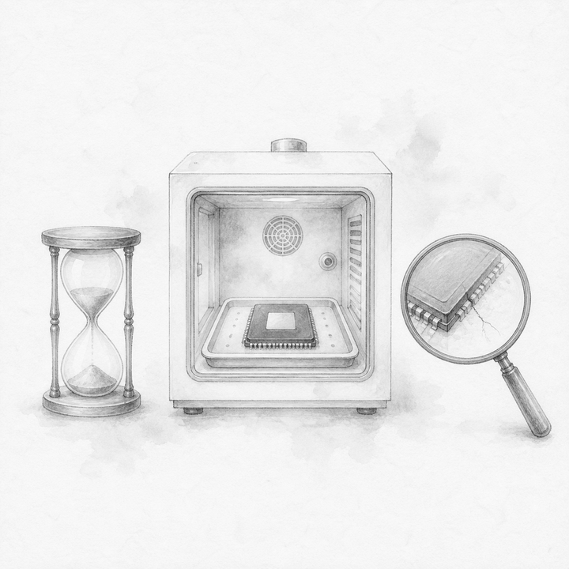
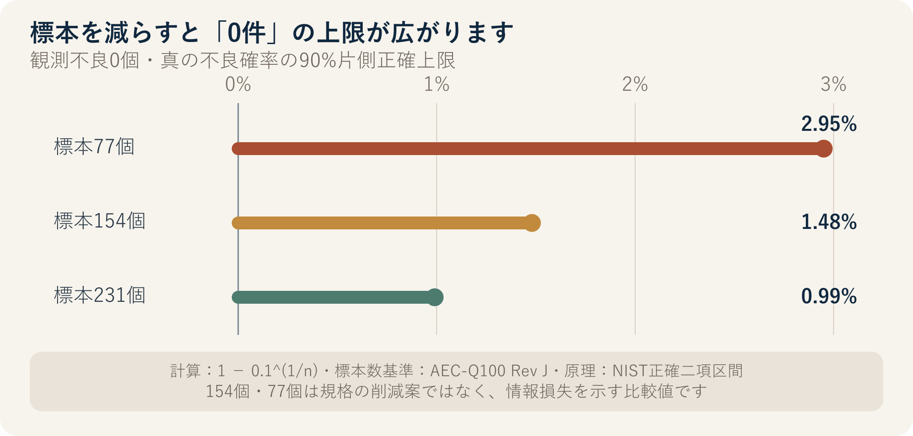

::: {.book-question}
[本日の策問]{.book-question-label}

{.book-question-image width=30mm fig-alt="信頼性試験チャンバー、砂時計、虫眼鏡の下に隠れた微細亀裂を描いたミニマルな水墨画"}

[顧客納期を守るために、信頼性試験の一部が終わる前に製品を出荷すべきでしょうか。]{.book-question-prompt}
:::

1515年、中宗が理想の政治を今日に実現する道を問うた策問^[本章が結び付けた実在の策問は、堯舜の政治を当時に実現するには何を最初に行うべきか、孔子ならどのように国を治めるかを問いました。策問アーカイブの公開訳を要約して再構成した漢文は「[欲致堯舜之治於今日，何者爲先？子若孔子，將何以治國歟？]{.hanja}」であり、原文の直訳ではありません。「今日、堯舜の政治を実現するには何が先か。あなたが孔子なら、どのように国を治めるか」という意味です。本日の問いは、歴史上の理想政治を品質規格に対応させたものではありません。良い目標を語るだけでなく、実行順序と検証条件を示せ、という問いの構造を信頼性判断へ結び付けた再解釈です。]は、良い意図を語るだけでなく、最初に行うことと実行方法を明らかにするよう求めました。「品質を守ります」と「納期を守ります」も、宣言だけでは答案になりません。どの試験がどの故障モードを検出するのか、まだ見えていないリスクがどれだけあるのか、誰にどの範囲まで出荷するのかを決める必要があります。

## なぜ今、この問いなのか

先端パッケージでは、ダイ、バンプ、インターポーザー、アンダーフィル、基板の熱膨張差が一つのシステム内で作用します。材料や厚さが変わると、界面剥離・亀裂・金属間化合物の成長など、支配的な故障モードも変わる可能性があります。前世代が同じプロセス名と外形を持つという理由だけで、過去の信頼性データをそのまま借用することは困難です。

AEC-Q100 Rev J（2023）は、代表的なストレス試験群で1ロット当たり77個、3ロット、合計231個、不良0個を要求しています。この標本構造はLTPD 1、90%信頼水準と結び付いていますが、規格は、工程管理や出荷品のPPM水準を直接推定する資料として使わないよう明記しています。試験に合格した事実と、実使用環境の不良率を正確に把握したという主張は異なります。

加速試験は時間を圧縮しますが、あらゆるストレスを高めればよいわけではありません。NISTは、複数のストレスセルで無作為標本を試験し、使用条件と同じ故障メカニズムを加速するかを確認し、過大なストレスによって新たな故障メカニズムを作らないよう説明しています。納期が厳しいほど、試験時間を単純に半分へ減らすのではなく、故障モードと加速モデルの妥当性を先に確認する必要があります。

## データの視点

{fig-alt="観測不良が0個のとき、標本231個、154個、77個について、真の不良確率の90%片側上限を比較したグラフ"}

### 根拠データ表

| 区分 | 原資料の数値・範囲 | プロセス・品質判断での意味 |
|---:|---|---|
| 標本構造 | AEC-Q100 Rev Jの代表的ストレス試験は、77個/ロット × 3ロット、合計231個、不良0個としています。 | ロット数は、プロセス・材料の変動を最低限含めるための構造です。1ロット77個へ変えれば、同じ根拠にはなりません。 |
| 統計的意味 | 規格はLTPD 1を90%信頼水準と結び付け、この標本だけでは工程管理やPPMを推定するには不十分だと明記しています。 | 「不良0個」は、不良確率が0だという意味ではありません。 |
| 高温高湿ストレス | 文書は85°C/85% RHで1,000時間、または加速条件として130°C/85% RHで96時間、110°C/85% RHで264時間などを示しています。 | 時間だけを比較せず、バイアス印加、パッケージ構造、対象故障モードをともに確認する必要があります。 |
| 標本削減の計算 | 観測不良0個のとき、90%片側正確上限は、231個で0.99%、154個で1.48%、77個で2.95%です。 | 標本を3分の1へ減らすと、「見えていない不良」の上限が約3倍に広がります。 |
| 加速試験の原則 | NISTは、故障モード別のストレスセル、無作為標本、加速モデル、使用条件への外挿を求めています。 | 過大なストレスが新たな故障モードを作れば、速い試験ではなく別の試験になります。 |
| 最新の軍用規格 | DLAが公開したMIL-STD-883 Rev L Change 1は2025年版です。 | 適用規格・改訂版は契約と製品群ごとに確認する必要があり、互いに代用できません。 |

### 数字の読み方

0.99%、1.48%、2.95%は、実際のフィールド不良率の予測値ではありません。同一の二項試行で不良を一つも観測しなかったと仮定したとき、真の不良確率の90%片側上限を(1-0.1^{1/n})で計算した値です。標本231個で不良0個でも、「不良率0%」とは言えないことを示します。

154個と77個は、AEC-Q100が認めた削減案ではありません。納期のために3ロットのうち2ロットまたは1ロットだけ完了したと仮定し、統計情報の損失を比較した値です。実際の認定は、適用規格、製品群、変更範囲、顧客承認に従う必要があります。

加速試験の時間と標本数は、完全に置き換えられるものではありません。より高い温度で短時間試験するには、同じ故障メカニズムを加速するという物理モデルと検証データが必要です。標本数を増やしても試験時間が足りなければ遅れて現れる故障モードを見落とし、所定時間を満たしても1ロットだけならロット間変動を見落とす可能性があります。

## 対立する答案

### 答案A — 計画した試験をすべて完了する

材料・構造が変わった製品では、既存データによって潜在故障モードを消すことはできません。量産出荷は取り戻しにくく、初期不良が顧客システムで見つかれば、回収・分析・信頼喪失のコストが納期遅延を上回る可能性があります。計画したロット数、ストレス時間、後続の電気検査をすべて終えるまで出荷を保留します。

ただし、「すべての試験を完了」が、すべてのリスクを除去したという意味ではありません。試験計画が実際の故障モードと使用条件を適切に反映しているかも検討する必要があります。

### 答案B — リスクに基づく試験削減

変更していない構造と検証済みの故障モードには過去ロットのデータを活用し、変更点に関連するストレスへ標本・分析資源を集中できます。顧客納期を守りながら重複試験を減らす工学的な選択です。材料・供給者・プロセスウィンドウ・加速モデルの同等性が文書で立証され、規格・顧客が認める場合に限り適用します。

しかし、「変更点だけを試験する」という考えは、まだ分かっていない相互作用を見落とす可能性があります。アンダーフィルとインターポーザーの厚さがともに変わったなら、既存パッケージデータの代表性は弱くなります。

### 答案C — 量産出荷を保留し、技術サンプルだけを限定提供する

全体の認定試験は減らさず、顧客の組立・ファームウェア検証に使う非売品の技術サンプルだけを、数量・用途・回収条件を限定して提供します。量産用・フィールド用の出荷と区別し、未完了の試験、既知のリスク、使用禁止事項を書面で合意します。

この選択は顧客日程の一部を守りますが、技術サンプルが事実上の量産品として使われるリスクがあります。追跡番号、使用場所、再譲渡禁止、試験失敗時の即時回収権限がなければ選択できません。

## AI調査設計

### AIへのプロンプト

> 新規先端パッケージについて、納期前に信頼性を踏まえて出荷を判断する表を作成してください。アンダーフィル、インターポーザー厚さ、バンプ、基板、プロセス条件の変更点を前製品と比較し、変更点ごとに故障メカニズムを結び付けてください。適用契約規格と改訂版を確認し、各試験の温度・湿度・バイアス・サイクル・時間・ロット数・ロット当たり標本数・許容不良数を記してください。完了、進行中、未着手、失敗、打ち切りデータを区別してください。観測不良0個については標本数別に90%片側正確上限を計算しますが、フィールド不良率として解釈しないでください。既存データを再利用するには、材料・供給者・プロセスウィンドウ・故障モード・加速モデルの同等性を示す根拠を求めてください。事実・計算・面接用仮定・推奨を分離し、各外部根拠には機関名・文書名・年・直接URLを付けてください。全面保留、リスクに基づく削減、技術サンプル限定提供の長所と短所、結論を変える条件を示してください。

### データ取得

| 優先順位 | 資料 | 必ず記録する項目 |
|---:|---|---|
| 1 | 変更点一覧 | 材料・寸法・供給者・設備・プロセスウィンドウ、前製品との差 |
| 2 | 試験の生データ | サンプル・ロット、ストレス条件と時間、打ち切り、前後の電気検査、不良位置 |
| 3 | 故障解析資料 | 断面・SAM・X-ray・電気解析、故障モード、根本原因 |
| 4 | 規格・顧客要求 | 適用文書と改訂版、標本・許容不良、変更通知、逸脱承認 |
| 5 | 出荷管理 | 技術・量産の区分、数量、使用先、追跡・回収・再譲渡禁止条件 |

### 情報の判定

1. **規格の同一性：** 名称が似ているという理由で、別の製品群の試験条件を適用しません。
2. **標本の独立性：** 1ロットの複数ダイを、複数ロットの変動を代表するかのように数えません。
3. **無故障の解釈：** 観測不良0個を、真の不良確率0と表現しません。
4. **加速の妥当性：** 使用条件にない新たな故障メカニズムを生むストレスは、寿命外挿に使いません。
5. **データの再利用：** 変更点と故障モードの同等性が立証されなければ、既存データを現製品の合格結果に置き換えません。

### 討論の核心

- 1ロット77個がすべて合格した場合、顧客にどこまで説明できますか。
- 72時間後の納期と96時間HASTが衝突するとき、試験条件を高めて48時間へ短縮できますか。
- 技術サンプル20個がフィールド装置へ投入されないよう、誰がどう管理すべきですか。
- 日程遅延と潜在不良の費用を同じウォンへ換算するとき、どの価値が抜け落ちますか。

## ケース討論

次の数値は、特定企業や製品の実際の結果ではない**面接用の仮定**です。あなたは新規先端パッケージ製品のプロセス・品質チームに入った新任エンジニアです。

- 今回の製品では、アンダーフィル材料とインターポーザー厚さの両方が変わりました。
- 会社はAEC-Q100の標本構造を社内ベンチマークとし、130°C/85% RHで96時間のHAST、3ロット × 77個、温度サイクル1,000回を計画しました。
- 顧客の組立検証日程は72時間後です。
- 現在、HASTは1ロット77個だけが完了して不良0個、残り2ロットは進行中です。
- 温度サイクルは1,000回中300回まで不良0個です。
- 前製品のデータはありますが、アンダーフィルとインターポーザーの組み合わせが異なるため、同等性は確認されていません。

1. 信頼性チームは、未完了の試験と、変更点別の故障メカニズムを示します。
2. プロセスチームは、既存データと現製品の材料・プロセスウィンドウの同等性を検討します。
3. 顧客チームは、72時間後に必要な数量が組立検証用か、フィールド販売用かを確認します。
4. あなたは、**量産品を全量出荷・試験完了まで全量保留・非売品の技術サンプル20個だけを限定提供**のうち一つを選びます。
5. 試験失敗時の措置と、量産出荷へ切り替えられる数値・文書条件を示します。

良い答案は、「不良0個」と「試験未完了」を一つの文に隠しません。顧客日程へ提供できる最小範囲と、最後まで減らせない品質ゲートを分ける必要があります。

## 90秒回答例

「私は**答案A、計画した試験をすべて終えるまで全量を保留**します。AEC-Q100 Rev Jの代表的標本は、1ロット当たり77個、3ロット、合計231個、許容不良0個です。不良0個のとき、90%片側上限は231個で約0.99%、77個で約2.95%です。フィールド不良率の予測値ではありませんが、標本削減が不確かさを大きくするという意味です。ケースでは、アンダーフィルとインターポーザーがともに変わり、HASTは1ロット、温度サイクルは300回までしか終わっていません。この数値と72時間の納期は仮定です。顧客日程が崩れ、市場機会を失うという反論は受け入れます。その代わり、残りの試験と新しい出荷日を直ちに公開します。HAST 3ロット231個、温度サイクル1,000回、電気検査、故障モードの検討をすべて完了してから出荷します。試験進捗と失敗原因は、顧客と品質責任者へ同じ表で公開します。一つでも失敗すれば、原因解析と試験計画の再承認が終わるまで保留します。納期は調整できますが、未確認のリスクを顧客へ渡すことはできません。」

## 追加質問

**反対尋問と再反論**

- 顧客が技術サンプル20個を最終製品へ組み込むと言ったら、どの選択へ変えますか。
- HAST 77個中1個が失敗したものの、解析結果が取扱い損傷だった場合、試験をどう再設計しますか。
- 3ロットすべてが同じ原材料バッチなら、合計231個を独立した根拠と見なせますか。
- 96時間HASTをより高温で48時間へ変えるには、どの物理的根拠が必要ですか。
- 温度サイクル300回まで不良0個という事実を、顧客へどのように限定して伝えますか。
- 競合他社が同じ構造をすでに量産しているという情報を、全量出荷の根拠にできますか。

## 出典

- [Automotive Electronics Council、公式信頼性文書一覧（2026年閲覧）](https://www.aecouncil.com/AECDocuments.html)
- [Automotive Electronics Council、*AEC-Q100 Rev J: Failure Mechanism Based Stress Test Qualification for Integrated Circuits*（2023）](https://www.aecouncil.com/Documents/AEC_Q100_Rev_J_Base_Document.pdf)
- [米国NIST/SEMATECH、*Confidence Intervals for a Proportion*—正確二項区間（2026年閲覧）](https://www.itl.nist.gov/div898/handbook/prc/section2/prc241.htm)
- [米国NIST/SEMATECH、*Accelerated Life Tests*（2026年閲覧）](https://www.itl.nist.gov/div898/handbook/apr/section3/apr314.htm)
- [米国NIST/SEMATECH、*Physical Acceleration Models*（2026年閲覧）](https://www.itl.nist.gov/div898/handbook/apr/section1/apr14.htm)
- [米国国防兵站局DLA、MIL-STD-883公式文書一覧（2026年閲覧）](https://landandmaritimeapps.dla.mil/programs/milspec/ListDocs.aspx?BasicDoc=MIL-STD-883)
- [米国国防兵站局DLA、*MIL-STD-883 Rev L Change 1* 原文（2025）](https://landandmaritimeapps.dla.mil/Downloads/MilSpec/Docs/MIL-STD-883/std883.pdf)
- [朝鮮時代策問アーカイブ、中宗1515年「今日、堯舜の政治を実現する道」](https://waterfirst.github.io/Joseon-Dynasty-Civil-Service-Examination/#jungjong-1515/0)

> **資料メモ：** 77個/ロット × 3ロット、合計231個、許容不良0個、LTPD 1と90%信頼水準、高温高湿試験の温度・湿度・時間はAEC-Q100 Rev Jの原資料です。231・154・77個で観測不良0個のときの90%片側上限0.99%・1.48%・2.95%は、NISTが示した正確二項原理に基づく計算値であり、154個と77個は規格が認めた削減案ではありません。アンダーフィル・インターポーザー変更、72時間、HAST 1ロット完了、温度サイクル300/1,000回、技術サンプル20個、切替条件は面接用の仮定です。
