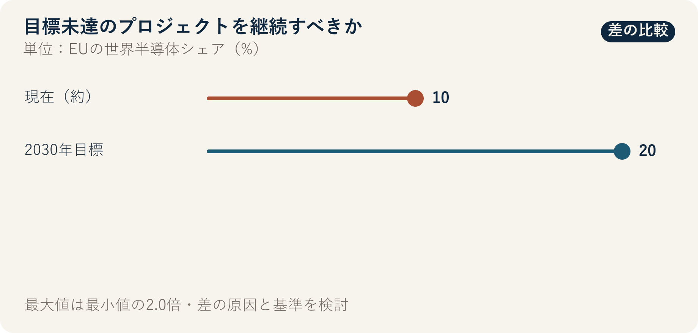

::: {.book-question}
[本日の策問]{.book-question-label}

{.book-question-image width=30mm fig-alt="未完成の半導体工場と、残された人材・特許の行方を見定めるミニマルな水墨画"}

[生産目標は未達でも人材と特許が残る国策ファブ事業を延長すべきでしょうか。]{.book-question-prompt}
:::

朝鮮王朝の策問^[本章は、中宗が1507年に実際に出した策問「始めと終わりを同じくする政治」を、失敗した事業の終了と継承の問題に結び付けます。策問アーカイブが意味を縮約して再構成した漢文は「善始者未必善終，何也？欲始終惟一，其道何由？」であり、原文の逐語訳ではありません。「良い始まりを迎えた者が、必ずしも良い終わりを迎えられないのはなぜか。始めから終わりまで一貫するには、どの道をたどるべきか」という問いです。]は、当初の大義が正しかったという事実で、最後の失敗を弁明することを許しません。同時に、当初の数値目標を達成できなかったからといって、その過程で生まれた能力まで捨てよという意味でもありません。政策評価を担う若手は、目標達成度、残存能力、追加予算の機会費用を分けて、延長・再設計・終了を判断する必要があります。

## なぜ今、この問いなのか

EUは、世界の半導体市場に占めるシェアを約10%から2030年までに20%へ高める目標を掲げました。欧州半導体法（European Chips Act）は2023年9月21日に発効しました。2026年、欧州委員会は、既存政策が官民合わせて520億ユーロ超の投資を動員し、直接・間接雇用を約4.6万件創出したと説明しました。

10%から20%へという目標は方向性と野心を示しますが、成果そのものではありません。「動員された投資」はEU予算の実支出額と異なる可能性があり、発表・計画・着工・執行が混在している場合もあります。4.6万件も直接雇用と間接雇用を合算した推計値であるため、純雇用、雇用期間、職種を確認する必要があります。

プロジェクト単位の評価では、さらに対象を絞ります。実際に追加された生産能力、顧客認定済みの製品、民間投資の追加性、熟練人材の再就職、特許の量産適用、認定サプライヤーの継続受注を確認します。当初の生産量だけを評価すれば学習成果を見落とし、「能力」という抽象語だけを評価すれば目標未達と埋没費用を隠すことになります。

## データの視点

{fig-alt="EUの世界半導体シェア約10%と2030年目標20%を比較したグラフ"}

### 根拠データ表

| 区分 | 原資料の数値・範囲 | プロジェクト評価での意味 |
|---:|---|---|
| 政策上の基準点 | EUの世界半導体シェアは、政策説明で約10%とされています。 | 定義と基準年によって変わり得る出発点です。 |
| 政策目標 | 2030年の目標は世界シェア20%です。 | 法・政策上の目標であり、達成済みの生産実績ではありません。 |
| 発効の事実 | 欧州半導体法は2023年9月21日に発効しました。 | 制度の開始日であり、個別事業の着工・執行・量産日とは異なります。 |
| 欧州委員会の説明 | 2026年までに官民投資520億ユーロ超を動員したと発表しました。 | 「動員」の定義、重複、実際の執行額を確認する必要があります。 |
| 欧州委員会の説明 | 直接・間接雇用を約4.6万件創出したと説明しました。 | 推計範囲、純雇用、継続期間、職務の質を別々に検証する必要があります。 |

### 数字の読み方

世界シェア20%という目標を生産額基準で計算する場合、世界市場の成長率によってEUが増やすべき生産規模は変わります。名目売上高、生産能力、出荷量のどれで算出したかも確認しなければなりません。「目標は2倍」という一文だけから必要なファブ数を逆算することはできません。

520億ユーロの「動員」は、公的予算が同額支払われたことを意味しない場合があります。民間の既存計画が含まれるのか、補助金がなくても実現した投資なのか、発表額と実際の執行額はいくらかを分けます。4.6万件の雇用についても、工事期間中の間接雇用と長期の量産職を同じ価値として扱ってはいけません。

失敗した個別事業を評価するときは、3つの台帳を作ります。第1は生産・財務・雇用の約束台帳、第2は再利用可能な人材・特許・協力網の能力台帳、第3は追加予算を別事業に使った場合の機会費用台帳です。すでに使った資金は延長の理由になりません。今後回収できる価値だけを比較します。

## 対立する答案

### 答案A — 能力を残すための延長論

戦略産業で得られる学習は、短期の生産量だけでは捉え切れません。熟練人材、プロセス特許、認定サプライヤーが残り、次のラインの失敗確率や認定期間を減らせるなら、事業を即時終了することで公共投資が生んだ知的資産を散逸させるおそれがあります。

特にインフラと人材育成が完了し、追加予算でボトルネックを解消できるなら、限定的な延長は原案全体を一からやり直すより効率的かもしれません。ただし、残存資産を後続事業で実際に使う主体と契約が必要です。

### 答案B — サンセット・終了論

「長期的な能力」は、目標未達を説明する便利な言葉になり得ます。生産能力と顧客を伴わない特許、移る先のない訓練人材、受注のないサプライヤー認定は、帳簿上の成果にすぎません。中止基準がなければ、失敗した事業が予算と人材を占有し続け、よりよい代替案を妨げます。

すでに投入した資金が惜しいという理由は、埋没費用の誤謬です。追加予算で得られる将来成果が別事業より小さいなら、事業を終了し、人材と特許を別途移管する方が合理的です。

### 答案C — 範囲を絞った条件付き再設計

原案をそのまま延長せず、失敗原因が明確で再利用価値の高い部分だけを残します。生産目標、顧客認定、人材・特許の実移管、民間投資の流入について12カ月の中間目標を置き、未達なら自動終了するサンセット条件を付けます。

再設計は、過去の投入額ではなく追加予算の限界便益で評価します。新予算がボトルネックを除き、販売可能な生産能力を生むのか、別のプロジェクトに投入するより価値が大きいのかを公開します。独立評価者が、元の事業チームとは異なる資料で成果を検証する必要があります。

## AI調査設計

### AIへのプロンプト

> 生産目標を達成できなかった国策半導体ファブを延長・再設計・終了すべきか評価する報告書を作成してください。法令・支援契約、当初事業計画と修正計画、実際の執行・生産・雇用資料、顧客認定、特許・研修・サプライヤーの活用記録、外部監査の順に調査してください。EUの10%という基準点、2030年の20%目標、520億ユーロの動員、4.6万件の雇用のような目標・発表値を、実際の執行・純効果と区別してください。個別事業については、計画比の生産能力、実売上、民間投資の追加性、熟練人材の再配置、特許の量産適用、サプライヤーの継続受注を表にしてください。確認済み事実・当事者の主張・推計・シナリオ仮定を分け、すべての外部資料に機関、文書名、発表日、直接URLを付けてください。追加予算の機会費用と12カ月のサンセット条件も含めてください。

### データ取得

| 優先順位 | 資料 | 必ず記録する項目 |
|---:|---|---|
| 1 | 当初計画・支援契約 | 生産・投資・雇用目標、日程、変更手続、返還・サンセット、責任主体 |
| 2 | 実際の執行・運営資料 | 支給額・執行額、設備・稼働能力、歩留まり、販売、顧客認定、遅延原因 |
| 3 | 人材・特許資料 | 熟練職の維持・移動、特許の登録・利用・収益、後続プロジェクトでの再利用 |
| 4 | サプライヤー・民間投資資料 | 認定後の継続受注、新規民間資金、補助金が生んだ追加性 |
| 5 | 代替事業資料 | 同じ追加予算で可能な生産・研究・人材成果と移行費用 |

### 情報の判定

1. **目標と実績：** 政策目標・発表・契約・着工・量産・販売を段階別に示します。
2. **埋没費用の除外：** すでに支出した金額ではなく、今後の費用と回収可能な便益を比較します。
3. **能力の実在性：** 人材・特許・協力網を使う後続主体、日程、契約を確認します。
4. **追加性：** 民間投資が補助金によって新たに生まれたのか、既存計画が移動しただけなのかを調べます。
5. **サンセットの執行：** 中間目標未達時に誰が自動終了を実行するのか、例外と変更権限まで定めます。

### 討論の核心

- 生産目標62%と、人材・特許の残存価値を同じ点数に合算できますか。
- 追加予算25%が埋没費用を救済する資金なのか、将来のボトルネックを解消する資金なのか、どう区別しますか。
- 熟練人材2,000人と認定サプライヤー40社が実際に再利用されたと認める最低限の証拠は何ですか。
- 政治的圧力があっても12カ月のサンセット条件を執行できる独立性を、どう確保しますか。

## ケース討論

以下はEUの実在事業ではなく、**面接用の仮想状況**です。あなたは産業政策評価チームの若手研究員です。支援対象ファブの生産目標達成率は62%にとどまりましたが、熟練人材2,000人、特許300件、認定サプライヤー40社が残っています。事業継続に必要な追加予算は原案の25%です。残存能力の実際の再利用率と顧客の追加購入は、まだ検証されていません。

1. 運営チームは、生産62%の原因を需要・歩留まり・設備・インフラに分解します。
2. 人材チームは、2,000人の職務、維持・移動、後続事業への配置を確認します。
3. 技術チームは、特許300件とサプライヤー40社の量産適用・継続受注を検証します。
4. 財務チームは、追加予算25%と別事業に使った場合の便益を比較します。
5. あなたは、**原案の延長・12カ月の再設計・終了と資産移管**のいずれかを勧告します。

再設計を選ぶなら、「もう一度機会を与える」ではなく、12カ月後の自動終了を判断する数値と責任者を明記しなければなりません。終了を選ぶなら、人材・特許・サプライヤーをどこへ移すかまで述べます。

## 90秒回答例

「私は、**答案C、原案の延長ではなく範囲を絞った12カ月の再設計**を勧告します。EUは世界半導体シェアを約10%から2030年までに20%へ高める目標を立て、欧州委員会は既存政策が520億ユーロ超の投資を動員したと説明しています。しかし、目標と動員額は個別ファブの生産性を証明しません。事例の目標達成率62%、熟練人材2,000人、特許300件、追加予算25%はすべて仮定です。後続量産に使える人材と特許を捨てれば損失になるという延長論の反論は認めます。一方で、『戦略的能力』という言葉で埋没費用を隠すこともできます。したがって、追加予算は確認済みのボトルネックと資産移管にだけ使い、顧客認定済み生産能力・人材配置・特許の量産利用・サプライヤーの継続受注をゲートとして公開します。中間目標を達成できない場合や、別事業の限界便益がより大きい場合は自動終了します。実売上と民間の追加投資が確認された場合にだけ次段階を承認します。失敗を隠さず、次の選択に使える資産へ変えることが再設計の目的です。」

## 追加質問

**反対尋問と再反論**

- 生産目標62%が市場需要の減少によるものなら、技術的には成功した事業と評価できますか。
- 熟練人材2,000人が別企業に就職した場合、それは元事業の成果ですか、それとも終了の根拠ですか。
- 特許300件の価値が低くても、サプライヤー40社の認定が残るなら再設計しますか。
- 追加予算25%を別の人材事業に使う代替案と、どう公正に比較しますか。
- 12カ月後に目標をわずかに下回った場合でも、サンセット条件をそのまま執行しますか。
- 政治目標であるシェア20%と、個別事業の経済性を分けて報告できますか。

## 出典

- [欧州委員会, *European Chips Act*（2023年発効、2026年閲覧）](https://digital-strategy.ec.europa.eu/en/policies/european-chips-act)
- [欧州委員会, *Chips Act 2.0*（2026）](https://digital-strategy.ec.europa.eu/en/policies/chips-act-2)
- [欧州委員会, *Proposal for the Chips Act 2.0*（2026）](https://digital-strategy.ec.europa.eu/en/library/proposal-chips-act-20)
- [朝鮮王朝策問アーカイブ, 「始めと終わりを同じくする政治」（中宗、1507）](https://waterfirst.github.io/Joseon-Dynasty-Civil-Service-Examination/#jungjong-1507/0)

> **資料メモ：** EUの政策・発表値と事例の仮定を区別しています。62%・2,000人・300件・40社・25%・12カ月は、教育用の評価条件または本章で提案する基準です。
