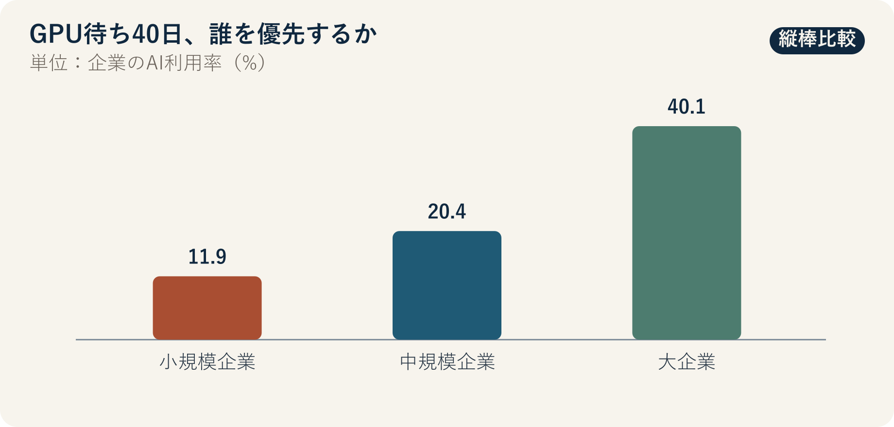

::: {.book-question}
[本日の策問]{.book-question-label}

{.book-question-image width=30mm fig-alt="限られたGPU資源を複数チームに配分するミニマルな水墨画"}

[社内の共有GPUが不足するとき、売上部門と若手実験チームのどちらに先に割り当てるべきでしょうか。]{.book-question-prompt}
:::

朝鮮王朝の策問^[本章は、世宗期の1447年の記録につながる実際の策問「人材をどう求めるか」を、現代の計算資源配分の問題へ移します。策問アーカイブが意味を縮約して再構成した漢文は「人才國之寶也。何以養之、辨之、用之？君臣相遇之難，其故何歟？」であり、原文の逐語訳ではありません。「人材は国の宝である。どう育て、見分け、用いるべきか。君主と臣下が互いに巡り会うのが難しいのはなぜか」という問いです。]は、すでに能力が表れた人の用い方だけでなく、まだ表れていない能力をどう育て、見いだすかを問いました。GPU配分も、現在の売上が大きいチームから順に並べるだけの問題ではありません。新しいチームが能力を証明できる最低限の機会をどう保証するかという問いです。

## なぜ今、この問いなのか

OECDが各国の公式統計を集めて比較した資料では、AI利用率は小規模企業11.9%、中規模企業20.4%、大企業40.1%でした。大企業の利用率は小規模企業の約3.4倍です。同じ技術が公開されていても、資金、データ、人材、教育、失敗から立て直す時間が異なれば、実際の利用機会には大きな差が生じます。

ただし、企業規模別の利用率を社内GPUの配分比率へそのまま移すことはできません。この統計はAIを利用する企業の割合であり、業務成果、GPU時間、投資収益率を表すものではありません。国・産業の構成も混在しています。社内での意思決定には、チーム別待ち時間、予約時間に対する実利用率、実験の再現性、顧客期限、データ準備、成果物の後続利用を収集する必要があります。

社内では、アカウント保有と実際の実験機会を区別しなければなりません。全員にアカウントを与えても、データ整備、メンタリング、レビュー時間、最初の失敗後の再試行機会がなければ、成果を生み出す条件は同じではありません。そのため、配分規則はGPU時間だけでなく、準備支援と初回失敗後の再挑戦経路も扱う必要があります。

## データの視点

{fig-alt="OECDの企業規模別AI利用率が小規模企業11.9%、中規模企業20.4%、大企業40.1%であることを示すグラフ"}

### 根拠データ表

| 区分 | 原資料の数値・範囲 | 社内配分での意味 |
|---:|---|---|
| OECD集計 | 小規模企業のAI利用率は11.9%でした。 | 企業単位の利用有無であり、小規模チームのGPU需要や能力を直接測るものではありません。 |
| OECD集計 | 中規模企業のAI利用率は20.4%でした。 | 規模が大きくなるほど、資源・技術支援の障壁を越えやすくなる可能性を示します。 |
| OECD集計 | 大企業のAI利用率は40.1%でした。 | 高い利用率が、すべての導入の成果や効率を保証するわけではありません。 |
| 原資料からの計算 | 大企業の利用率は小規模企業の約3.4倍です。 | アクセス格差のシグナルであり、原因がGPU不足だけだという意味ではありません。 |

### 数字の読み方

11.9%、20.4%、40.1%は、企業がAIを利用しているかどうかについてのOECD加盟国集計です。生成AIだけの利用率か、すべてのAIを含むのかは文書の定義を確認する必要があります。企業数を基準にした平均は、従業員数や利用時間を基準にした平均とは異なります。

規模と利用率の相関だけで因果関係を断定してはいけません。大企業にはGPUだけでなく、データ基盤、法務・セキュリティ、専任人材、教育も多い可能性があります。したがって、GPU配分政策の成果はアカウント数より、待ち時間の短縮、完了した実験、再現可能な結果、現場採用、チーム間格差で評価すべきです。

公正な配分は、すべてのチームに同じ時間を与えることとも異なります。顧客デモの期限のように遅延費用が大きい業務には緊急性があり、まだ成果のない若手実験には機会が必要です。緊急顧客枠と基礎探索枠を分け、未使用予約を速やかに回収し、初回実験を通過したチームには次の段階でより多くの資源を与える方式なら、2つの目的を同時に扱えます。

## 対立する答案

### 答案A — 売上・期限優先論

顧客日程とキャッシュフローが明確なチームへ先に配分すれば、同じGPUからより早く事業成果を生み出せます。データとコードを準備済みのチームは、予約資源を実際に使う可能性も高くなります。希少資源を準備不足の実験に固定することは、全社の機会費用を増やします。

特に期限が迫ったデモは、一度逃すと取り戻しにくい場合があります。緊急業務を別の待ち行列に置き、予想売上、契約確率、準備状況を審査することは合理的です。

### 答案B — 機会の公平論

現在の成果だけで順位を決めれば、すでに顧客・人材・データを持つチームが常に優先され、若手・研究チームは能力を証明する最初の実験すらできません。短期売上のない探索からも、次の製品、失敗原因、再利用可能なデータが生まれます。公平性は施しではなく、将来の選択肢を作る投資です。

成果順の配分は、測定しやすい結果を出すチームに有利で、基礎研究と長期改善を構造的に締め出すおそれがあります。すべての新規チームに、小規模な検証を少なくとも1回実施できる基礎枠とメンタリングを与えるべきです。

### 答案C — 2つのプールと段階昇格

緊急顧客プールと基礎研究プールを分け、各プール内で準備度・期待効果・待ち時間を審査します。新規チームには最低限の実験機会を保証する一方、データ・コード・評価指標を事前登録させます。最初の結果が再現され、後続価値が確認できれば、より多くの資源を割り当てる段階へ進めます。

予約時間に対する実利用率が低い、または成果物を提出しない場合は、残りの割当を回収して次のチームへ渡します。緊急顧客チームも事後に売上・顧客成果を報告し、期待成果を繰り返し出せなければ優先順位を下げます。配分規則と異議申立て経路を公開し、管理者裁量が特別扱いに見えないようにします。

## AI調査設計

### AIへのプロンプト

> 社内共有GPUが需要より不足するとき、売上部門と若手実験チームへ公正に配分する運用案を設計してください。OECDの企業規模別AI利用率は外部背景としてのみ使い、社内スケジューラーログ・予約・実利用・待ち時間、チーム別データ準備、実験計画・再現性、顧客期限、実際の事業成果を収集してください。個人・チームの機微情報を最小限にし、職位・部門による差別の可能性を点検してください。「アクセス権」「実利用」「完成成果物」「現場採用」を区別し、すべての外部数値に機関・文書名・年・単位・分母・直接URLを付けてください。固定クオータ、成果順、抽選と審査の組合せを比較し、緊急顧客プール、基礎研究プール、未使用割当の回収、異議申立て、四半期監査基準を提案してください。

### データ取得

| 優先順位 | 資料 | 必ず記録する項目 |
|---:|---|---|
| 1 | GPUスケジューラーログ | 申請・承認・開始・終了、待ち時間、予約比利用率、失敗・中断理由 |
| 2 | 実験の事前登録 | データ準備、コード、予想GPU時間、評価尺度、セキュリティ・個人情報承認 |
| 3 | 成果物リポジトリ | 再現可能性、モデル・コード・失敗記録、後続チームでの再利用、現場採用 |
| 4 | 顧客・事業資料 | 期限、契約段階、遅延費用、デモ結果、実際の売上寄与 |
| 5 | チーム属性の監査資料 | 職位・部門・勤続年数別の待ち時間格差、異議申立て、例外承認、管理者裁量 |

### 情報の判定

1. **指標の分離：** アカウント保有、GPU割当、実利用、完了、事業成果を別々の段階として数えます。
2. **準備度の検証：** データ・コード・評価尺度が準備できていない緊急申請を、そのまま優先してはいけません。
3. **機会の補正：** 過去実績のない新規チームには、小規模な検証を通じて実績を作る機会を与えます。
4. **再現性の確認：** 良い結果だけでなく、失敗条件・コード・ログを再利用できて初めて学習成果と認めます。
5. **格差の監査：** 平均待ち時間だけでなく、チーム規模・職位別の分布と例外承認を公開します。

### 討論の核心

- 2週間後の顧客デモと、若手チームの平均待ち時間40日では、どちらの緊急性を優先しますか。
- GPU需要の60%しか処理できないとき、「基礎研究枠」をどの原則で保護しますか。
- 過去実績のないチームの潜在力を審査すると、評価者の偏見が再び入りませんか。
- 失敗した実験も成果物と認めるには、どの記録が再現可能でなければなりませんか。

## ケース討論

以下の値はOECD統計とは別の、**社内配分を扱う面接用の仮定**です。あなたは共有計算資源運営チームの若手社員です。売上部門は2週間以内に顧客デモを行う必要があり、若手研究チーム12チームは平均40日待っています。現在のGPUは申請需要全体の60%しか処理できません。各チームの予約時間に対する実利用率と、失敗した実験の成果物が再利用されたかどうかは、まだ公開されていません。

1. 売上部門は顧客期限、準備済みのデータ・コード、遅延費用を提出します。
2. 若手研究チームは、小規模検証の目標、必要時間、再現性計画を事前登録します。
3. 運営チームは、チーム別の40日平均に隠れた分布と未使用予約を確認します。
4. あなたは、**固定クオータ・成果順・抽選と審査の組合せ**のいずれかを設計します。
5. 運用案には、2週間の緊急経路、基礎実験機会、未使用枠の回収、昇格・降格、異議申立てを含めます。

若手チームに配慮するからといって、準備不足の業務に長時間占有させてはいけません。売上を理由に同じ部門が例外を独占することも許されません。誰もが規則を予測し、結果を検証できる必要があります。

## 90秒回答例

「私は、**答案C、審査と抽選を組み合わせた2つのプール**を提案します。OECD集計では、AI利用率は小規模企業11.9%、中規模企業20.4%、大企業40.1%で、大企業は小規模企業の約3.4倍でした。この格差は、ツールを開放するだけでは機会が同じにならないことを示しますが、社内配分比率を直接決めるものではありません。事例の顧客デモ2週間、若手チーム12チーム、平均待ち時間40日、処理能力60%はすべて仮定です。準備済みの顧客案件を遅らせれば実売上を失うという反論は妥当です。そこで、緊急顧客プールでは期限・準備度・期待効果を審査し、基礎研究プールでは事前登録を通過した新規チームに、抽選で初回実験の機会を与えます。結果が再現できれば次の段階へ進め、予約を使わない、または成果物がなければ直ちに回収します。待ち時間・実利用率・再現性・部門別例外を四半期ごとに公開します。新規チームの最初の成果が引き続き阻まれる場合や、顧客プールの未使用率が基準を超える場合は、プールの比率を再調整します。公正なアクセスとは、時間を均等に分けることではなく、能力を証明できる経路を開くことです。」

## 追加質問

**反対尋問と再反論**

- 2週間後の顧客デモが確定契約ではなく可能性にすぎない場合、緊急プールに入れますか。
- 若手チーム12チームの準備度を審査するとき、部門・学歴への偏見をどう減らしますか。
- 平均待ち時間40日が一部の長期プロジェクトで歪んでいる場合、どの分位点を公開しますか。
- 処理能力60%を引き上げる投資と配分規則の改善では、どちらを先に提案しますか。
- 失敗実験のログが後続チームで再利用された場合、売上成果と同じ水準で報いることができますか。
- 高成果チームに未使用割当がないのに、基礎研究枠のため待たなければならないという反論にどう答えますか。

## 出典

- [OECD, *Generative AI and the SME Workforce: New Survey Evidence*（2025）](https://www.oecd.org/en/publications/generative-ai-and-the-sme-workforce_2d08b99d-en.html)
- [OECD, *Introduction: Generative AI and the SME Workforce*—企業規模別AI利用率（2025）](https://www.oecd.org/en/publications/generative-ai-and-the-sme-workforce_2d08b99d-en/full-report/component-3.html)
- [朝鮮王朝策問アーカイブ, 「人材をどう求めるか」（世宗期の記録、2026年閲覧）](https://waterfirst.github.io/Joseon-Dynasty-Civil-Service-Examination/#sejong-1447-talent/0)
- [国史編纂委員会「わたしたちの歴史ネット」, 「姜希孟」（2026年閲覧）](https://contents.history.go.kr/mobile/kc/view.do?code=kc_age_30&levelId=kc_n300400)

> **資料メモ：** OECDの企業規模別数値は外部根拠です。2週間・12チーム・40日・60%は、社内資源配分のための教育用仮定です。
