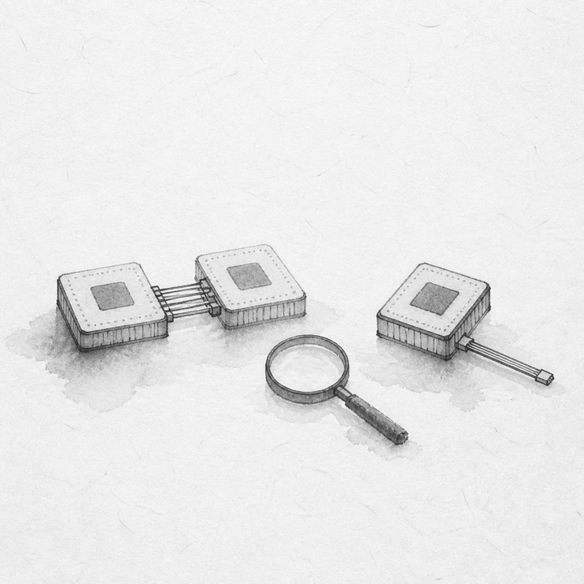
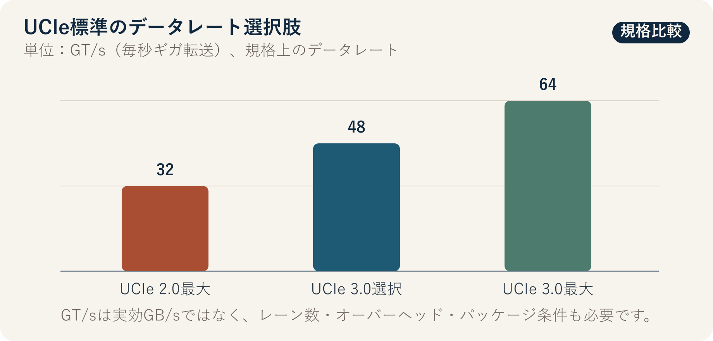

::: {.book-question}
[本日の策問]{.book-question-label}

{.book-question-image width=30mm fig-alt="かみ合う2つの標準チップレットと、より高速だが孤立した独自チップレットの間に検証用の虫眼鏡を置いた水墨画"}

[次世代AIアクセラレーターのチップレット接続をUCIe^[UCIeは **Universal Chiplet Interconnect Express** の略称です。1つのパッケージ内でチップレット同士を接続するための、オープンなダイ間インターフェース規格です。[UCIe Consortium公式説明](https://www.uciexpress.org/why-choose-us)を参照してください。]標準に統一すべきでしょうか。それとも性能と電力のため、一部区間に独自インターフェースを使うべきでしょうか。]{.book-question-prompt}
:::

世宗が1447年に出した法と権限に関する策問^[本章が結び付ける実際の策問（[策問]{.hanja}）は、規則が弊害を生み、そのため再び規則を設ける循環と、責任の所在を問いました。策問アーカイブが意味を縮約して再構成した漢文は「[法立而弊生，弊生而法又立。其所以救之者何歟？政權當歸於何所歟？]{.hanja}」であり、原文全体の逐語訳ではありません。「法を立てれば弊害が生じ、弊害が生じればまた法を立てる。これを救う方法は何か。権限はどこに置くべきか」という問いです。今日の問いは、朝鮮王朝の統治機構をチップレット規格に対応させた翻訳ではありません。共通ルールと例外設計がそれぞれ新たな費用を生むとき、誰が検証し、元の設計へ戻すのかを問う構造を借りています。[朝鮮王朝策問アーカイブの個別項目](https://waterfirst.github.io/Joseon-Dynasty-Civil-Service-Examination/#sejong-1447/0)]は、標準を定めたという事実だけで問題は終わらないと考えました。インターフェース標準は供給元を広げ、検証の共通言語を作れますが、すべてのパッケージで最適性能を保証するものではありません。反対に独自リンクは特定ワークロードに合わせられますが、設計知識とサプライチェーンを1カ所に固定するおそれがあります。

## なぜ今、この問いなのか

AIアクセラレーターは、演算ダイ、入出力ダイ、キャッシュ、メモリーインターフェースを1つのパッケージ内で組み合わせます。単一の大型ダイよりプロセスノードと機能を分けやすい一方、ダイ間の帯域幅・遅延・電力・熱・テストをシステムレベルで再調整しなければなりません。UCIeは、物理層からプロトコル、ソフトウェアモデル、適合性試験までの共通基盤を提供します。

UCIe Consortiumは2025年8月にUCIe 3.0を発表し、48 GT/sと64 GT/sをサポートして、UCIe 2.0の32 GT/sに比べ最大データレートを2倍にしたと説明しました。しかし、NISTの2024年標準活動報告書は、単一の汎用標準がまだ広く採用されたとは言いにくく、異なる企業のチップレットを実際に統合した事例も多くないと評価しました。標準が目指す方向と、現在のエコシステムの成熟度を併せて読む必要があります。

若手設計エンジニア一人で意思決定できるわけではありません。ただし、どの境界に標準を適用するか、独自リンクの性能上の利得が検証・再設計・単一供給リスクを上回るか、どの試験に失敗したら標準案へ戻るかを数値で提案できます。

## データの視点

{fig-alt="UCIe 2.0の最大データレート32 GT/sと、UCIe 3.0の新たな選択肢48 GT/s・64 GT/sを比較した棒グラフ"}

### 根拠データ表

| 根拠 | 公式資料の数値・範囲 | 設計判断での意味 |
|---:|---|---|
| 1 | UCIe Consortiumは、UCIe 3.0が48 GT/sと64 GT/sをサポートし、UCIe 2.0の32 GT/sに比べ最大データレートを2倍にしたと発表しました。 | 標準を選んでも高速リンクの選択肢があります。ただし、GT/sはアプリケーションが利用するGB/sと同じではありません。 |
| 2 | UCIe 3.0は、最大100 mmの拡張サイドバンド、早期ファームウェアダウンロード、優先パケット、緊急停止通知を追加し、以前のバージョンとの後方互換性を明記しました。 | データ経路だけでなく、初期化・管理・障害分離までアーキテクチャ検討の範囲に含める必要があります。 |
| 3 | UCIe 2.0は、約10～25 μmから1 μm未満までのバンプピッチを想定するUCIe-3Dと、複数チップレットのテスト・テレメトリー・デバッグ構造を提示しました。 | 微細ピッチ自体が歩留まりを保証するわけではありません。ボンディング工程、熱応力、known-good-die、修理戦略も必要です。 |
| 4 | NISTの2024年活動報告書は、広く採用された単一の汎用チップレット標準はまだなく、複数供給元の統合事例も限られるとまとめました。 | 「標準準拠」と「即時交換可能なチップレット」を同義にすると、エコシステムの成熟度を誇張します。 |
| 5 | 米国NAPMPは、先端パッケージングの6つの優先領域、パイロット施設、人材育成へ約30億ドルを投資すると発表しました。 | インターフェース以外にも、基板、プロセス装置、電力・熱、光接続、協調設計、量産検証がボトルネックであることを意味します。 |
| 6 | NISTのチップレット標準ワークショップは、パッケージ組立設計キット（PADK）、熱・機械的制約、欠陥位置を特定する機能試験、fail-fast手順を未整備領域として挙げました。 | リンク規格だけを合わせる試験計画では、複数供給元パッケージの責任分界を明確にできません。 |

### 数字の読み方

**64 GT/sは64 GB/sではありません。** GT/sはリンクのシンボル転送レートです。実効帯域幅は、レーン数、符号化と誤り訂正のオーバーヘッド、プロトコル効率、双方向構成、パッケージ配線、熱制約によって変わります。したがって、図は規格上の速度選択肢を示すだけで、特定製品のスループットを予測するものではありません。

10～25 μmと1 μm未満はUCIe-3Dが想定するバンプピッチの範囲であり、ある供給元がそのピッチで目標歩留まりを達成した実績ではありません。最大100 mmのサイドバンドも、主データ経路の到達距離と混同してはいけません。約30億ドルは政策プログラムの規模であり、当社プロジェクトの収益率や納期を証明するものではありません。

標準案と独自案を比較するときは、少なくとも次の指標を、同じワークロード・同じパッケージ条件で測定する必要があります。

- 実効帯域幅と、往復遅延の平均値だけでなくテール値
- 転送エネルギー、リンク電力、パッケージ温度、スロットリング時間
- PHY^[PHYは **Physical Layer** の略称で、チップレット間で信号を実際に送受信する物理層の回路と電気的インターフェースを指します。]・プロトコル・DFx^[DFxは **Design for X** の略称です。UCIeの文脈では、複数チップレットのテスト容易性、管理機能、デバッグを設計段階から考慮する活動をまとめて指します。[UCIe Consortiumの規格説明](https://www.uciexpress.org/specifications)を参照してください。]要求事項のトレーサビリティとエラー注入試験の合格率
- known-good-dieの選別率、組立歩留まり、ファーストシリコンの再設計確率
- IP・ファウンドリー・OSATの交換に必要な週数と、再認定が必要な範囲

## 対立する答案

### 答案A — 標準優先

すべての供給元境界をUCIe 3.0に統一すれば、PHYとプロトコルの共通要求事項、適合性試験、管理・デバッグ手順を再利用できます。第2のIP供給元や別のチップレットを検討するときも、交渉基準が生まれます。最初の製品の最高性能より、後続製品群の交換可能性と検証資産を重視するなら、標準優先は合理的です。

ただし、規格互換はパッケージ互換の必要条件にすぎず、十分条件ではありません。異なるバンプマップ、電源網、熱設計、ファームウェア、エラー処理方針を合わせられなければ、標準PHYを使っても統合は失敗します。標準ブロックの面積やプロトコルオーバーヘッドが、特定データ経路の電力上限を超える可能性もあります。

### 答案B — 独自最適化

ワークロードが固定され、同じ企業が両方のダイとパッケージを一体設計するなら、独自リンクは不要な機能を削れます。短い配線と専用フロー制御に合わせてレーン・バッファー・電圧を調整すれば、性能と電力で利得を得られる可能性があります。製品発売時点で標準IPの検証が遅れている場合、既存の社内リンクが日程リスクを減らすこともあります。

その代償はシステム検証とサプライチェーンに現れます。1社のPHY、パッケージ工程、ツールに固定されると、欠陥原因をダイ・リンク・組立のどこに帰属させるか合意しにくくなります。次世代や外部チップレットへ移行するとき、既存の検証資産を失う可能性もあります。「より速い」というシミュレーションだけでは、この費用を相殺できません。

### 答案C — 境界別の条件付き混在

外部供給元と接する境界、管理・デバッグ経路はUCIeに固定し、同じ責任組織が両方のダイを管理する性能ボトルネック1カ所だけを独自リンク候補にします。独自案は、実ワークロードでの利得、電力・熱の余裕、障害分離、再設計日程、代替経路をすべて満たす場合にだけ採用します。

混在案は、標準と独自の短所を自動的に消すものではありません。インターフェースの種類が増え、検証マトリクスと障害対応が複雑になる可能性があります。したがって、「交換可能な標準境界はどこまでか」「どの試験で独自区間を断念するか」を、アーキテクチャ凍結前に文書で確定する必要があります。

## AI調査設計

### AIへのプロンプト

> 次世代AIアクセラレーターのチップレット接続について、UCIe 3.0へ統一する案、独自インターフェースを使う案、供給元境界だけをUCIeとする混在案を比較してください。UCIe Consortiumの規格・プレスリリース、NISTの標準報告書・CHIPS R&D資料、実際のIP供給元データシート、当社のシミュレーション・検証ログを区別してください。各主張に機関、文書名、バージョン・発表日、節・ページ、単位、直接URLを記載してください。32・48・64 GT/sをGB/sへ換算するとき、レーン数とオーバーヘッドを任意に仮定しないでください。規格上のサポート、供給元の主張、独立実測、社内仮定を別々の列に置いてください。相互運用性は、PHY適合性、プロトコル、パッケージ・PADK、熱・電力、初期化・ファームウェア、障害分離、供給元交換に分けてください。最後に、3案を分ける事前試験、失敗しきい値、標準案へ戻れる最終時点を提示してください。

### データ取得

| 順序 | 資料 | 必ず確保する項目 |
|---:|---|---|
| 1 | UCIe規格・公式発表 | バージョン、データレート、パッケージ種別、サイドバンド、DFx、後方互換性、適合性条項 |
| 2 | NIST・CHIPS標準資料 | 複数供給元統合の空白、PADK、熱・機械、試験・修理、サプライチェーン上の論点 |
| 3 | PHY・パッケージ供給元資料 | 対応プロセス・バンプピッチ、PPA条件、BER試験条件、IP変更・サポート期間 |
| 4 | 社内設計資料 | ワークロード別の実効帯域幅・遅延、リンク電力、温度、面積、日程、検証項目数 |
| 5 | 組立・試験ログ | known-good-die、ボンディング歩留まり、エラー注入、欠陥分離時間、再作業可能性 |

### 情報の判定

1. **規格と実装を分けます。** 規格が許容する最大値と、特定IPが特定プロセスで達成した値を区別します。
2. **単位を復元します。** GT/s、Gb/s、GB/s、TB/s、単方向・双方向、レーン当たり・パッケージ全体を混在させません。
3. **試験条件を合わせます。** 同じワークロード、電圧、温度、パッケージ配線、エラー率で比較していないPPAには順位を付けません。
4. **相互運用性の範囲を記します。** PHY適合性だけに合格したのか、ファームウェア・DFx・パッケージ・熱まで共同検証したのかを示します。
5. **仮定を意思決定ゲートへ変えます。** 独自案の利得と再設計費用を範囲で示し、範囲を外れたら選択を変えます。

### 討論の核心

- 標準が減らす検証費用はどれで、当社パッケージに残る非標準の問題は何ですか。
- 独自リンクの利得は、リンクベンチマークだけでなく最終AIワークロードでも残りますか。
- 供給元の交換可能性を、企業名の数ではなく実際の再検証週数でどう測りますか。
- 若手エンジニアが中止を要請できる試験は何で、最終承認権者は誰ですか。

## ケース討論

あなたは、6個のチップレットを結ぶAI推論アクセラレータープロジェクトの若手die-to-die設計エンジニアです。製品発売まで14カ月、パッケージ電力の上限は700 W、リンク電力予算は70 Wです。以下の数値はすべて討論用の社内仮定であり、供給元の保証値でも量産実測値でもありません。

- **全面UCIe案：** UCIe 3.0の64 GT/s PHYを使用します。代表的な3ワークロードで目標性能の96%、リンク電力68 W、統合12カ月、検証要求事項900件と推定されます。代替PHYの接続には10週間かかります。
- **全面独自案：** 社内の80 GT/s目標リンクです。目標性能の104%、リンク電力56 W、統合10カ月と推定されますが、検証要求事項は1,350件で、PHY供給元は1社です。代替設計には24週間必要です。
- **混在案：** 外部I/O・管理境界はUCIeとし、2つの演算チップレット間のボトルネックだけに独自リンクを置きます。目標性能の100%、リンク電力62 W、統合11カ月、検証要求事項1,100件と推定されます。独自区間は単一供給です。
- ファーストシリコンの再設計予算は1回分だけで、アーキテクチャ凍結まで8週間です。

あなたは各案のシミュレーション条件をそろえ、パッケージ・検証・調達エンジニアと設計レビュー案を提出しなければなりません。選択肢は、**全面UCIe・全面独自・境界別混在**です。最終案には、採用区間、8週間以内に終える検証、単一供給の緩和策、独自案を断念する数値条件を含めてください。

## 90秒回答例

「私は、**答案C、外部供給元との境界をUCIe 3.0に固定し、ボトルネック1カ所だけに独自リンクを残す混在案**を選びます。UCIe 3.0は48・64 GT/sをサポートし、2.0の最大32 GT/sに比べ規格上のデータレートを2倍にしましたが、NISTは複数供給元の統合事例が限られると見ています。標準という名称だけで相互運用性を保証できないということです。事例では、独自案が性能104%、リンク電力56 Wで最良ですが、検証要求事項1,350件と代替期間24週間が必要という仮定です。独自最適化が性能と電力を守るという反論を認め、8週間、同じワークロードとパッケージ条件で比較します。独自区間が性能を5%以上向上させる、または電力を10 W以上削減し、エラー注入・初期化・熱試験に合格した場合にだけ維持します。1つでも失敗するか、日程が2週間以上遅れた場合は全面UCIe案へ戻します。試験ログと断念理由は次世代設計でも再利用できるよう残します。最高速度より、供給元の交換可能性と検証責任を保つことが選択基準です。」

## 追加質問

- 64 GT/sを実際の実効帯域幅へ換算するには、どの情報がさらに必要ですか。
- UCIe適合性試験に合格しても、複数供給元パッケージが失敗し得る3つの原因は何ですか。
- 独自リンクの性能利得が4%、電力削減が12 Wなら、どの基準を優先しますか。
- 単一PHY供給元が、24週間の代替期間を12週間へ短縮すると約束したら、何で検証しますか。
- ファーストシリコンで間欠エラーが出た場合、ダイ・パッケージ・プロトコルの責任をどのログで分けますか。
- 次世代で外部チップレットを追加する可能性が高まったら、今日の混在案をいつ全面標準案へ変えますか。

## 出典

- [UCIe Consortium, *UCIe 3.0 Specification With 64 GT/s Performance and Enhanced Manageability*（2025）](https://www.uciexpress.org/_files/ugd/8dc731_ae67289d0ec646cdba5c1aee245538b3.pdf)
- [UCIe Consortium, *Specifications*—UCIe 1.0～3.0概要（2026年閲覧）](https://www.uciexpress.org/specifications)
- [UCIe Consortium, *UCIe 2.0 Specification: Continuing Innovation to Drive an Open Chiplet Ecosystem*（2024）](https://www.uciexpress.org/_files/ugd/0c1418_b6481ec611e24c6e91f1beb743b0c860.pdf)
- [NIST, *Semiconductors and Microelectronics Standards Working Group Annual Report for 2024*, NIST IR 8577（2025）](https://nvlpubs.nist.gov/nistpubs/ir/2025/NIST.IR.8577.pdf)
- [NIST CHIPS R&D, *Chiplets Interfaces & Digital Twin Technical Standards Workshops Summary Report*（2024）](https://www.nist.gov/system/files/documents/2024/11/22/Technical%20Standards%20Workshop%20Summary%20Report-DEC2023-Final-508C.pdf)
- [NIST, *National Advanced Packaging Manufacturing Program Announcement*（2023）](https://www.nist.gov/speech-testimony/national-advanced-packaging-manufacturing-program-announcement-morgan-state)
- [NIST, *Nanoscale Mechanical Characterization for Hybrid-Bonding-Ready Structures in Advanced Packaging*（2026）](https://www.nist.gov/news-events/news/2026/01/nanoscale-mechanical-characterization-hybrid-bonding-ready-structures)
- [朝鮮王朝策問アーカイブ, 世宗1447年「法の弊害と権力の所在」個別項目](https://waterfirst.github.io/Joseon-Dynasty-Civil-Service-Examination/#sejong-1447/0)
- [国史編纂委員会「わたしたちの歴史ネット」, 「成三問」](https://contents.history.go.kr/mobile/kc/view.do?code=kc_age_30&levelId=kc_n305300)

> **資料メモ：** 図の32・48・64 GT/sは、UCIe Consortiumが発表した規格上のデータレートです。NISTの相互運用性評価は、2024年の活動をまとめた2025年報告書によるものです。事例の80 GT/s、性能・電力・日程・検証項目・温度・切替基準はすべて討論用の仮定であり、実在企業や製品の数値ではありません。
