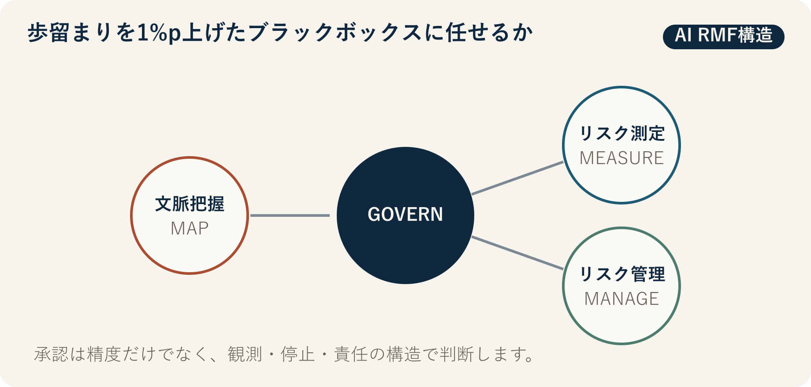

::: {.book-question}
[本日の策問]{.book-question-label}

{.book-question-image width=30mm fig-alt="黒い墨点とプロセス制御線の間に置かれた半導体ウエハーを描く水墨画の象徴図"}

[歩留まりを1パーセントポイント高めたものの、理由を説明できないAIに工程の自動運転を任せてもよいでしょうか。]{.book-question-prompt}
:::

朝鮮王朝の策問^[本章につながる原文は、明宗が1558年に出した「天の理と人の政治」の「天道難知亦難言也。日月麗乎天，一晝一夜，有遲有速者，孰使之然歟？」です。目に見える規則があっても、その原因を知ったと性急に言えるのかを問います。当時のプロセスAIに関する問いではなく、現象・原因・責任を区別する現代的な接続です。[個別の策問と解説](https://waterfirst.github.io/Joseon-Dynasty-Civil-Service-Examination/#myeongjong-1558/0)、[韓国学中央研究院・実録Wiki「天道策」](https://dh.aks.ac.kr/sillokwiki/index.php/%EC%B2%9C%EB%8F%84%EC%B1%85%28%E5%A4%A9%E9%81%93%E7%AD%96%29)]は、知り難い理を言葉だけで断定してはならないと戒めます。プロセスAIについても、平均歩留まりが上がったという結果と、未知の製品で安全に動作するという保証を分けて考える必要があります。

## なぜ今、この問いなのか

半導体工程は数百の変数と設備状態が絡み合い、人がすべての相互作用を説明するのは困難です。AIはレシピ補正と異常検知をよりうまく行える可能性がありますが、製品切替・センサー交換・設備保守の後にデータ分布が変われば、昨日の最適化が今日の欠陥を生むことがあります。若手検証エンジニアは、「説明可能」という抽象語より、どの条件で止め、誰へ引き継ぐかを設計しなければなりません。

NIST AIリスクマネジメントフレームワークは、GOVERN・MAP・MEASURE・MANAGEの4機能でリスク管理を構成し、GOVERNを他の機能を貫く層に置きます。GOVERN機能は、役割と責任、方針、組織文化、継続的レビューを求めます。工程自動運転の核心は「人が画面の前にいる」という文言ではありません。独立した観測経路と実行ログに基づき、実際の異常を報告し、停止し、以前の状態へ戻せる構造です。

## データの視点

{fig-alt="GOVERN、MAP、MEASURE、MANAGEの循環でプロセスAIを検証する判断構造"}

### 根拠データ表

| 根拠 | 原資料の範囲 | 現場での意味 |
|---:|---|---|
| 1 | NIST AI RMF 1.0は、リスク管理の中核をGOVERN・MAP・MEASURE・MANAGEの4機能で構成します。 | 歩留まり1指標だけで展開を決めず、役割・文脈・測定・対応を併せて見ます。 |
| 2 | GOVERNはMAP・MEASURE・MANAGEの全過程に浸透する横断機能です。 | 自動運転の責任者、変更承認、停止権限、記録保存をモデル性能と併せて定める必要があります。 |
| 3 | NISTは2026年、重要インフラにおける信頼できるAIのためのAI RMFプロファイル概念文書を公開しました。 | プロセスAIも、実験室での精度だけでなく、設備可用性・安全・サプライチェーンのライフサイクル全体で扱う必要があります。 |

### 数字の読み方

本章の公的根拠は、単一の「安全スコア」を示しません。4機能は、順番に1度チェックして終わる認証表ではなく、反復構造です。GOVERNがあってもリスクが消えるわけではなく、MEASUREが平均歩留まりだけを意味するわけでもありません。製品別の誤検知・見逃し、作業者介入率、ドリフト検知時間、以前のレシピへ戻す時間を併せて測定する必要があります。

したがって、事例の歩留まり1パーセントポイント改善と誤検知率は検証条件であり、業界平均ではありません。パーセントとパーセントポイントも区別します。誤検知率が2%から6%になれば、4パーセントポイント上昇し、3倍になったことを意味します。

## 対立する答案

### 答案A — 性能優先の自動運転論

完全な因果説明を待てば、複雑な工程で検証済みの改善機会を失う可能性があります。独立したオフライン試験と限定パイロットで人より安定しているなら、リスクが低く復旧可能な製品群から自動運転を許可できます。説明の不足は、範囲制限とリアルタイム監視で補います。

### 答案B — 説明・復旧優先論

平均歩留まり1パーセントポイントの改善は、製品切替後の誤検知増加や、まれに起きる大損失を隠す可能性があります。原因が分からなければ、設備保守やレシピ変更時に失敗を再現しにくく、責任をモデルの背後に隠しやすくなります。原因診断と安全な復帰を検証するまでは、AIは提案だけを行い、実行は人が担うべきです。

### 答案C — 製品群別の限定運転論

自動運転の可否を「説明可能／不可能」に二分しません。製品群別の許容範囲、二重観測、作業者の停止権限、ドリフト警報、以前のレシピへの復帰時間を定めます。誤検知・見逃し・復旧時間のいずれかがしきい値を超えたら直ちに提案モードへ下げ、独立検証後にだけ再稼働します。

## AI調査設計

### AIへのプロンプト

> NIST AI RMF 1.0と、2026年の重要インフラ向けプロファイル概念文書を基準に、半導体工程の自動運転検証案を作成してください。GOVERN・MAP・MEASURE・MANAGEごとに、責任者、必要データ、試験、停止条件、証拠ログを表にしてください。平均歩留まりに加え、製品別の誤検知・見逃し、作業者介入率、分布変化の検知時間、安全復帰時間を要求してください。モデル開発チームの主張と独立検証結果を分け、出典はNIST文書名・年・節・直接URLで示してください。AIが把握できない設備故障モードとデータ欠損も別の列に記載してください。

### データ取得

| 順序 | 資料 | 確認項目 |
|---:|---|---|
| 1 | NIST AI RMF本文とプレイブック | 機能別定義、ライフサイクル、独立レビュー、リスク優先順位 |
| 2 | 工程履歴とモデルバージョン | 製品・設備・レシピ・センサーバージョン、学習期間、展開時点 |
| 3 | シャドー運転と限定パイロット | 人の判断との差、誤検知・見逃し、歩留まり、介入理由 |
| 4 | 障害・復旧ログ | 検知時刻、停止時刻、以前のレシピへの復帰、損失ウエハー |

### 情報の判定

1. 学習に使ったロットと試験ロットを分け、製品切替区間を別途評価します。
2. 平均改善が特定製品の損失を隠していないか、製品別分布を確認します。
3. モデルの提案と実際の設備指令を結ぶ実行ログが完全か確認します。
4. 作業者が不利益を受けずに停止できるか、実地訓練で検証します。
5. 再稼働承認は開発チームではなく、工程・品質・安全の共同署名で残します。

### 討論の核心

- 説明が不足していても許容できる工程被害の範囲と復旧可能性はどこまでですか。
- 平均歩留まりと、最悪の製品群における誤検知では、どちらの指標に停止の優先権を与えますか。
- 人が「ループ内」にいることを、ボタンではなく、どのログと時間で証明しますか。

## ケース討論

あなたはプロセスAI検証チームの若手エンジニアです。限定パイロットで平均歩留まりは1パーセントポイント上がりましたが、製品切替後の誤検知率は2%から6%へ増加しました。異常検知から人が介入するまで平均18分、以前のレシピへ戻すまで25分かかります。**本節のすべての数値は討論用の仮想条件であり、実在ファブの実績ではありません。**

1. 自動運転を維持する、既存製品群だけ許可する、全面停止する、のいずれかを勧告します。
2. 新製品を提案モードへ下げ、原因別に誤検知を再分類するか決めます。
3. 停止しきい値と、再稼働に必要な連続検証ロット数を示します。
4. 作業者・開発者・工程責任者のうち、誰が停止と再稼働の権限を持つか定めます。
5. 歩留まり上の利得を上回る安全・品質損失が出たとき、以前のモデルへ戻す手順を書きます。

## 90秒回答例

「私は、**答案C、既存製品群だけに自動運転を許可し、新製品は提案モードへ下げます。** NIST AI RMFはGOVERN・MAP・MEASURE・MANAGEの4機能を求め、GOVERNを全過程の責任構造に置きます。平均歩留まりだけが上がったからといって自動運転を承認できない理由です。事例の歩留まり1パーセントポイント改善、誤検知率の2%から6%への増加、介入18分、復帰25分はすべて仮定です。複雑な工程で完全な説明を待てば改善機会を失うという反論は認めます。李珥（イ・イ）が現象と原理を分けて考えたように、平均性能と製品切替後の失敗条件を別々に検証します。^[1558年の別試初試で首席となった李珥（イ・イ）の「天道策」を現代的に意訳しました。この答案は、変化する気（氣）とその原理である理（理）を区別しつつ、現実の弊害を正すべきだと論じます。[朝鮮王朝策問アーカイブの個別項目](https://waterfirst.github.io/Joseon-Dynasty-Civil-Service-Examination/#myeongjong-1558/0)、[韓国学中央研究院・実録Wiki「天道策」](https://dh.aks.ac.kr/sillokwiki/index.php/%EC%B2%9C%EB%8F%84%EC%B1%85%28%E5%A4%A9%E9%81%93%E7%AD%96%29)] 作業者に即時停止権限を与え、ドリフト警報と復帰訓練を独立検証します。新製品の誤検知率が2%水準に戻れば自動運転を拡大しますが、再び6%へ近づく、または復旧時間が延びる場合は、既存製品も手動モードへ切り替えます。停止要請者に不利益を与えない手順も設けます。人の統制は承認印ではなく、実際の停止・復旧ログで証明すべきです。」

## 追加質問

- 歩留まり1パーセントポイントの改善と、誤検知4パーセントポイントの増加を、同じ費用単位でどう比較しますか。
- 製品切替後だけ性能が悪化するなら、学習データの何を最初に点検しますか。
- モデルの説明が優れていても性能が低い場合、より安全だといえますか。
- 作業者が停止ボタンを押せなくする組織的圧力を、どう測定しますか。
- 独立検証チームも同じデータに依存する場合、独立性は十分ですか。
- どの条件を満たせば、条件付き運転から全面自動運転へ移行しますか。

## 出典

- [米国国立標準技術研究所, *Artificial Intelligence Risk Management Framework (AI RMF 1.0)*（2023）](https://nvlpubs.nist.gov/nistpubs/ai/nist.ai.100-1.pdf)
- [NIST AI Resource Center, *AI RMF Core*（2023、2026年閲覧）](https://airc.nist.gov/airmf-resources/airmf/5-sec-core/)
- [NIST, *Concept Note: AI RMF Profile on Trustworthy AI in Critical Infrastructure*（2026）](https://www.nist.gov/programs-projects/concept-note-ai-rmf-profile-trustworthy-ai-critical-infrastructure)
- [朝鮮王朝策問アーカイブ, 明宗「天の理と人の政治」個別項目](https://waterfirst.github.io/Joseon-Dynasty-Civil-Service-Examination/#myeongjong-1558/0)

> **資料メモ：** NISTの4機能は公開文書に基づきます。歩留まり・誤検知・介入・復帰の数値は、事例のために作った仮定です。
