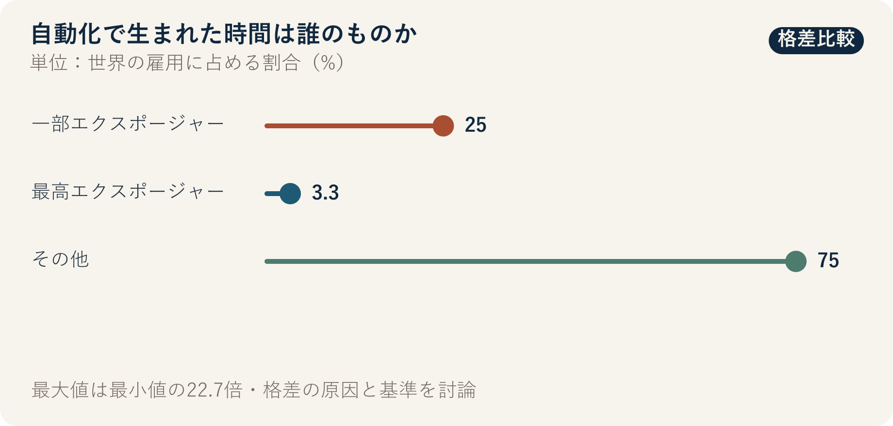

::: {.book-question}
[本日の策問]{.book-question-label}

{.book-question-image width=30mm fig-alt="人の手と自動化の歯車の間を時間が流れる様子を描いたミニマルな水墨画"}

[AIによって生産性が20%高まったなら、削減された労働時間と利益を会社・チーム・社員でどのように分けるべきでしょうか。]{.book-question-prompt}
:::

朝鮮王朝の策問^[明宗（ミョンジョン）代の「教育はどこへ向かうべきか」で、この章と最も深く関わる原文は「敎所以成材也。其本末次第與作人之方何如？」です。「教育とは人材を育てるものである。その本末の順序と、人を育てる方法はいかにあるべきか」という問いです。自動化や企業内の配分を直接問うものではありません。ここでは、仕事が減った人を次の役割へ移れるよう育成する問題に結び付けています。[個別の策問と解説](https://waterfirst.github.io/Joseon-Dynasty-Civil-Service-Examination/#myeongjong-1558-education/0)]は、教育を知識の伝達ではなく、人と役割をつくる営みとして捉えています。自動化の成果も、余剰人員を減らすだけで終わるのか、新たな技能を生み出すのかで判断すべきです。

## なぜ今、この問いなのか

ILOは、世界の労働者の4人に1人が、生成AIに何らかの形でさらされる職業に就いていると推計しています。しかし、エクスポージャーは解雇率ではありません。一部のタスクが変わる可能性を、職業全体が消える割合として読めば、自動化投資も人員計画もゆがみます。会社は設備とモデルに資本を投じ、社員は工程データ、例外処理、現場技能を提供しました。生産性向上の源泉が双方にあるなら、配分原則も導入後の交渉ではなく、導入前に決めるべきです。

ILOが全面的な代替よりも職務変容の可能性を大きく見ている以上、新入社員が現場で問うべきことも「AIは雇用を奪うのか」より具体的でなければなりません。自動化で節約された時間を誰が所有するのか、次の職務へ移るための有給学習時間と現場メンタリングを誰が負担するのかを、導入前に合意しておく必要があります。

## データの視点

{fig-alt="世界の雇用に占める生成AIへの一部エクスポージャー職種25%、最高エクスポージャー区分3.3%、その他75%を比較した図"}

### 根拠データ表

| 根拠 | 原資料の数値・範囲 | 討論での意味 |
|---:|---|---|
| 1 | ILOは、世界の労働者の25%、すなわち4人に1人が、生成AIに何らかの形でさらされる職業に就いていると推計しました。 | タスク変化の範囲が広いため、職務別の移行計画が必要です。 |
| 2 | 最高エクスポージャー区分は、世界の雇用の3.3%です。 | 「エクスポージャーのある25%がすべて代替される」という解釈は、異なる区分を混同した誤りです。 |
| 3 | ILOは、全面的な代替よりも職務変容の可能性が大きいと判断しました。 | 成果指標を人員削減数だけでなく、タスクの変化、賃金、時間、再配置まで広げる必要があります。 |

### 数字の読み方

25%は、生成AIが実行できるタスクを含む職業の割合であり、消える雇用の割合ではありません。3.3%も実際の解雇率ではなく、最高エクスポージャー区分が雇用全体に占める割合です。国、性別、職業構造によってエクスポージャーも異なります。この数値をそのまま企業の人員削減率に置き換えることはできません。

社内では、自動化の前後で、同じ製品・同じ品質基準における労働時間、エラー、手直し、生産量を比較します。削減された時間が残業削減に回ったのか、人員削減だけに吸収されたのか、有給教育後に実際の配置と賃金が維持されたのかも併せて確認します。

## 対立する答案

### 答案A — 再投資優先論

企業が開発費と失敗リスクを負担した以上、生産性向上の利益の相当部分を設備高度化と研究開発に再投資すべきです。利益をただちにすべて労働時間短縮と成果給に配分すれば、次の自動化投資が減る可能性があります。長期雇用を守る再投資も、社員への還元です。

### 答案B — 労働還元論

AIは、現場社員が蓄積したデータと例外処理の知識によって機能します。人員を減らして業務量だけを増やし、会社が生産性向上の利益を独占すれば、信頼と技能継承が崩れます。確認された純利益の一部は、労働時間短縮、成果給、有給の再教育に回すべきです。

### 答案C — 事前配分方式論

自動化の前に配分方式を合意します。品質と安全を維持した純生産性向上分だけを計算し、再投資、チーム報酬、有給教育、時間短縮に配分します。再教育後の配置率と離職率が基準を下回れば、追加の人員削減ではなく、まず教育と職務設計を見直します。

## AI調査設計

### AIへのプロンプト

> ILOの2025年報告書 *Generative AI and Jobs: A Refined Global Index of Occupational Exposure* の原文を確認し、エクスポージャー、最高エクスポージャー、代替、職務変容の定義を区別してください。半導体生産職について自動化前後のタスク一覧を作成し、生産量、品質、手直し、労働時間、賃金、人員、有給教育時間、再配置率を同じ期間・製品群で比較してください。企業の投資費用と、社員によるデータ・技能の貢献を分けた生産性向上利益の配分表を示し、確認済みの事実、会社の仮定、労働者の意見、分析者の推論を別々の列に記載してください。すべての数値に単位、期間、職務範囲、直接URLを付けてください。

### データ取得

| 順序 | 資料 | 確認項目 |
|---:|---|---|
| 1 | ILO原文と方法論 | エクスポージャーの定義、職業・タスク単位、最高エクスポージャー、解釈上の限界 |
| 2 | 工程MES・品質記録 | 同一製品の時間当たり生産量、不良、手直し、停止時間 |
| 3 | 人事・給与・勤務記録 | 職務別人員、賃金、残業、離職、再配置 |
| 4 | 教育・配置記録 | 有給か否か、教育時間、修了ではなく実際の配置と定着 |

### 情報の判定

1. 生産量増加から、製品ミックスと需要増加の影響を除きます。
2. 生産性20%が、1人当たり、1時間当たり、設備1台当たりのどれを指すのか、分母を固定します。
3. 教育修了率ではなく、配置率、配置後の賃金と雇用維持を確認します。
4. エラーや安全事故が増えた場合は、その費用を生産性向上の利益から差し引きます。
5. 社員の意見は平均だけでなく、職務、交替勤務、勤続年数別の分布を確認します。

### 討論の核心

- 自動化投資の回収と、社員によるデータ・技能の貢献を、どの基準で分けますか。
- 削減された時間が新たな業務で埋まった場合、生産性向上の利益を社員に還元したと言えますか。
- 再教育の成果は、修了、配置、賃金維持のどれで判定しますか。

## ケース討論

あなたは生産革新チームの新入社員です。自動化後、時間当たり生産性は20%上がりましたが、ある職務の人員は30%減り、再教育後に別の職務へ配置された割合は55%です。会社は今後1年間の純生産性向上利益を、設備再投資、成果給、週4時間の労働時間短縮、有給教育に配分しなければなりません。**すべての数値は討論用の仮定であり、実際の会社データではありません。**

1. 品質、手直し、減価償却を差し引いた純利益から再計算するよう求めます。
2. 4項目の配分比率と、その理由を提案します。
3. 30%の人員削減を維持するか、再教育期間中は追加削減を停止するかを決めます。
4. 配置率55%を高めるための職務、メンター、有給時間の施策を定めます。
5. 6か月後に配分方式を見直す転換条件を書きます。

## 90秒回答例

「私は**答案C、生産性向上の利益を会社と社員が事前に定めた基準で分ける案**を選びます。ILOによると、世界の労働者の25%が生成AIに何らかの形でさらされる職業に就いていますが、最高エクスポージャー区分は3.3%であり、全面的な代替よりも職務変容の可能性が大きいとされています。エクスポージャー率をそのまま人員削減率として読んではなりません。事例の生産性20%向上、人員30%減少、再教育後の配置率55%は、すべて仮定です。企業が投資費用を回収しなければ次の自動化ができないという反論は認めます。ただし、現場データと技能の貢献を配分から外せば、次の移行は失敗します。品質と手直しの費用を差し引いた純利益を、設備再投資40%、有給教育25%、成果給20%、週4時間の短縮15%に分けます。この比率も討論用です。配置率が70%に届かなければ追加の人員削減を止め、教育への配分を増やします。反対に、配置と賃金維持が確認できれば、再投資の比率を高めます。その基準は四半期ごとに公開します。自動化の成功は、削減した人数ではなく、より安全で熟練を要する役割へ移った人の割合で判断すべきです。」

## 追加質問

- 生産性20%が時間当たりか1人当たりかによって、配分案はどう変わりますか。
- 自動化の開発費を回収する前でも、成果給を支払うべきですか。
- 週4時間短縮後に業務強度が上がれば、時間を還元したと言えますか。
- 再教育後の配置率55%という失敗の責任を、社員と会社でどのように分けますか。
- 新入社員の反復業務を自動化した場合、技能形成の段階を何で置き換えますか。
- どのような条件なら、社員への配分を減らして設備再投資を増やしますか。

## 出典

- [International Labour Organization, *Generative AI and Jobs: A Refined Global Index of Occupational Exposure*, Working Paper 140 (2025)](https://www.ilo.org/publications/generative-ai-and-jobs-refined-global-index-occupational-exposure)
- [International Labour Organization, *Generative AI and Jobs: A 2025 Update* (2025)](https://www.ilo.org/publications/generative-ai-and-jobs-2025-update)
- [朝鮮時代策問アーカイブ、明宗代「教育はどこへ向かうべきか」](https://waterfirst.github.io/Joseon-Dynasty-Civil-Service-Examination/#myeongjong-1558-education/0)

> **資料メモ：** 25%と3.3%はILOによる職業エクスポージャーの推計値です。生産性、人員削減、配置、配分の比率は、仮想事例の条件または提案値です。
