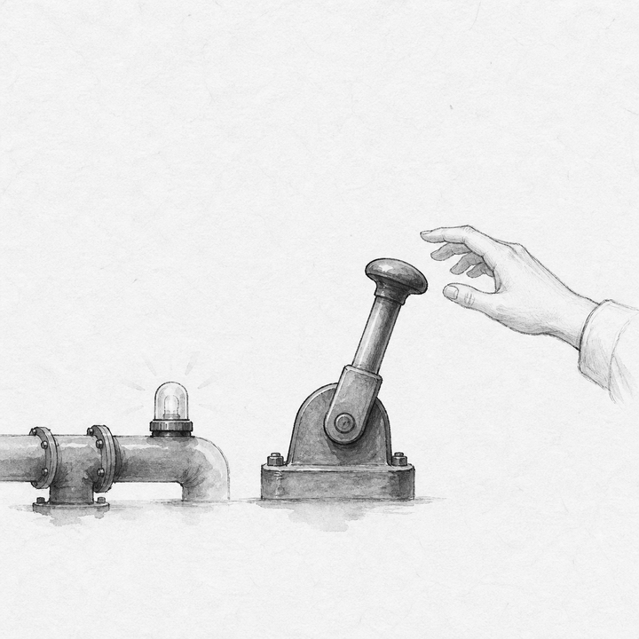
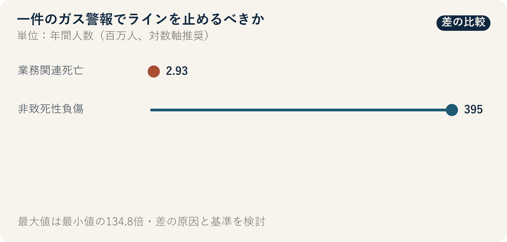

::: {.book-question}
[本日の策問]{.book-question-label}

{.book-question-image width=30mm fig-alt="細いガスの痕跡と停止標識を描いた半導体ファブのミニマルな水墨画"}

[納期が2日遅れても、確証のないガス漏れ警報だけで若手エンジニアはライン停止を要請すべきでしょうか。]{.book-question-prompt}
:::

朝鮮王朝の策問^[本章につながる原文は、光海君が1611年に出した「壬辰倭乱後に最も急ぐべきこと」の「今之國事，何者最急？用人、賦役、田政、戶籍，孰先孰後？」です。「今の国事で何が最も急を要するのか。人材登用・賦役・土地行政・戸籍のうち、何を先にし、何を後にするのか」と問います。ガス警報に関する古文を現代語に移したものではなく、複数の損失を前に、取り返しのつかない危険を先に見分ける判断へ結び付けたものです。[個別の策問と解説](https://waterfirst.github.io/Joseon-Dynasty-Civil-Service-Examination/#gwanghae-1611/0)、[韓国学中央研究院の1611年試験記録](https://dh.aks.ac.kr/~sonamu5/wiki/index.php/%EA%B4%91%ED%95%B4%28%E5%85%89%E6%B5%B7%29_3%EB%85%84%281611%29_%EC%8B%A0%ED%95%B4%28%E8%BE%9B%E4%BA%A5%29_%EB%B3%84%EC%8B%9C%28%E5%88%A5%E8%A9%A6%29)]は、優先順位を述べるには、被害の性質と回復可能性を同時に考えなければならないことを示します。ファブでは納期遅延は回復できても、有害ガスへの曝露で失った生命と健康は元に戻せません。

## なぜ今、この問いなのか

半導体ファブは、毒性・可燃性・腐食性の物質を使いながら長時間連続稼働します。警報のたびに全面停止すれば誤警報コストと警報疲れが増えますが、確認を待って実際の漏れを見逃せば避難時間を失います。特に若手は生産損失を過大に感じ、自分のセンサー解釈を過小評価しがちです。勇気だけを求めるのではなく、停止段階と報告経路をあらかじめ定める必要があります。

ILOは、業務関連要因によって毎年293万人が死亡し、非致死性の業務上負傷が3億9,500万件に上ると推計しています。世界全体の数字は予防の重要性を示すだけで、特定ファブの単独警報が実際の漏れかどうかは分かりません。現場判断には、物質の毒性、濃度、警報継続時間、二重センサーの一致、換気と避難時間、最近のセンサー故障情報が必要です。

## データの視点

{fig-alt="年間の業務関連死亡2.93百万人と非致死性業務上負傷395百万件を比較した安全データ"}

### 根拠データ表

| 根拠 | 原資料の数値・範囲 | ファブの安全判断での意味 |
|---:|---|---|
| 1 | ILOは、業務関連の事故と疾病によって毎年293万人が死亡すると推計しています。 | 安全上の損失には、平均的な納期費用だけでは換算しにくい不可逆的被害が含まれます。 |
| 2 | 非致死性の業務上負傷は年間3億9,500万件と推計されています。 | 死亡だけを集計すると、治療・休業・長期的な健康被害を見落とします。 |
| 3 | ILO資料では、世界の業務関連死亡の約63%がアジア太平洋地域で発生しています。 | 労働力規模と産業構造が異なる地域総数を、1工場のリスク確率として使ってはいけません。 |

### 数字の読み方

293万人は業務関連の**事故と疾病**を合わせた世界推計であり、単年度のファブにおけるガス事故件数ではありません。3億9,500万件は負傷件数であり、人数と一致しない場合があります。63%も、アジアの工場が本質的に危険だという因果的証拠ではなく、労働人口と産業分布を反映した地域比率です。

これらの数字は「すべての警報で全面停止せよ」という命令ではなく、見逃しの被害を意思決定表から除外してはならないという背景情報です。現場基準は、ガス別の許容濃度、センサー信頼度、警報の一致、避難可能時間、部分隔離の効果に基づいて別途定めます。

## 対立する答案

### 答案A — 即時全面停止論

有害ガスは、1回の見逃しでも回復不能な被害を生む可能性があるため、若手が受けた単独警報であっても、まず安全状態へ移行すべきです。停止後に独立測定で誤警報を確認する費用は、実際の曝露を見逃す費用より限定的です。作業停止を求めた人に不利益を与えないことで、警報の機能が保たれます。

### 答案B — 誤警報の検証優先論

センサーの誤警報が繰り返される工程で、単発の短い警報ごとにライン全体を止めれば、納期と設備安定性が損なわれ、従業員が警報を無視するようになるおそれがあります。物質の危険度、隣接センサー、換気状態を反映した部分停止と再測定の手順が必要です。

### 答案C — 区域隔離・段階的拡大論

毒性・濃度・継続時間・二重センサーの一致を基準に、段階別の自動措置を定めます。致死性が高い、または避難の余裕が短い場合は、単独警報でも直ちに全面停止します。局所化できる警報は、区域隔離と避難の後に独立測定を行います。再稼働は生産部門ではなく安全責任者が承認します。

## AI調査設計

### AIへのプロンプト

> ILOの労働安全に関する一次資料と、事業所で承認されたガス安全手順を分けて検討してください。世界の業務関連死亡、非致死性負傷、アジア太平洋の比率について、発表機関、基準年、推計範囲、単位、直接URLを記録してください。続いて、対象ガスの安全データシート、センサー校正記録、最近の警報・誤警報履歴、換気区域、避難時間、設備の安全停止手順を表にしてください。AIに停止の可否を単独で決めさせず、法定基準と社内基準を区別してください。確定事実、センサー観測、作業者証言、推論を別々の列に置き、欠落情報は「未確認」としてください。

### データ取得

| 順序 | 資料 | 確認内容 |
|---:|---|---|
| 1 | 事業所の緊急対応手順と安全データシート | 物質別の危険性、自動停止基準、避難・応急措置 |
| 2 | センサー生ログと校正記録 | 時刻、濃度、継続時間、隣接センサー、校正期限 |
| 3 | 設備・換気図面と作業者位置 | 隔離可能区域、気流、避難経路、残留人員 |
| 4 | 警報・停止・再稼働履歴 | 誤警報原因、停止時間、承認者、再発の有無 |

### 情報の判定

1. 警報が通信エラーなのか、実際のセンサー測定なのかを生ログで区別します。
2. 隣接センサーが正常でも、気流と検出限界を考えると漏れを否定する証拠になるかを検討します。
3. 見逃し被害と誤警報コストを同等に扱わず、深刻度と可逆性を反映します。
4. 停止要請後に人事上の不利益や報告遅延があったかを記録します。
5. 再稼働では、原因除去、独立測定、安全責任者の承認という3条件をすべて確認します。

### 討論の核心

- 単独センサーでも直ちに全面停止すべき物質・濃度・避難条件は何ですか。
- 最近誤警報が多かったという事実は、今回の警報を無視する根拠になりますか。
- 生産部門と安全部門の判断が異なる場合、最終的な再稼働権限は誰が持つべきですか。

## ケース討論

あなたは夜勤の若手プロセスエンジニアです。1台のセンサーが12秒間ガス基準を超え、隣接センサーは正常です。直近1カ月に同じセンサーで誤警報が2回あり、全面停止すると顧客納期が2日遅れます。当該区域には作業者が3人います。**本節の時間・人数・納期の数値は、討論のために作った仮想条件です。**

1. 直ちに区域を避難させて部分停止する、全面停止する、稼働中に再測定する、のいずれかを選びます。
2. 隣接センサーの正常値が結論を変える条件を説明します。
3. 安全チーム・施設チーム・生産責任者への報告順序と時間を定めます。
4. 携帯型の独立検知とセンサー校正の後、誰が再稼働を承認するかを定めます。
5. 誤警報と判明しても、警報を報告した若手に不利益が及ばない記録項目を提案します。

## 90秒回答例

「私は、**答案A、作業者3人を直ちに避難させ、ラインの全面停止を要請**します。ILOは、業務関連の事故と疾病によって毎年293万人が死亡すると推計していますが、この世界統計は今回の警報の真偽を証明しません。事例の12秒の警報、最近の誤警報2回、隣接センサーの正常値、納期2日の遅延はすべて仮定です。誤警報の可能性が高く、全面停止の費用が大きいという反論は妥当です。しかし、作業者がいる区域の有害ガスは、見逃した被害を元に戻せません。したがって、その情報は最初の避難を遅らせる根拠ではなく、再稼働判断に使います。停止直後に、携帯型の独立検知、センサー校正、換気確認を同時に始めます。互いに独立した2つの測定値が正常で、センサー故障の原因が判明し、残留人員がいないという3条件を安全責任者が確認した場合にだけ再稼働します。どれか1つでも満たさなければ、納期にかかわらず停止を維持します。誤警報と結論づけられても、当時の情報に即した停止要請として記録し、要請者に不利益を与えません。」

## 追加質問

- 世界の死亡統計が今回のセンサー警報の真実性を証明できないのはなぜですか。
- 隣接センサーが正常でも、漏れを排除できないのはどのような条件ですか。
- 部分停止がかえって避難を妨げる設備なら、結論をどう変えますか。
- 誤警報が繰り返される場合、警報しきい値を上げることとセンサーを交換することのどちらを優先しますか。
- 停止要請者の保護が実際に機能しているか、どの指標で確認しますか。
- どの証拠が出れば、部分停止から直ちに全面停止へ切り替えますか。

## 出典

- [国際労働機関, *Safety and health at work*（2023、2026年閲覧）](https://www.ilo.org/topics-and-sectors/safety-and-health-work)
- [国際労働機関, *Nearly 3 million people die of work-related accidents and diseases*（2023）](https://www.ilo.org/resource/news/nearly-3-million-people-die-work-related-accidents-and-diseases)
- [国際労働機関, *Safety and health at work in Asia and the Pacific*（2022）](https://www.ilo.org/resource/safety-and-health-work-asia-and-pacific-0)
- [朝鮮王朝策問アーカイブ, 光海君「壬辰倭乱後に最も急ぐべきこと」個別項目](https://waterfirst.github.io/Joseon-Dynasty-Civil-Service-Examination/#gwanghae-1611/0)
- [韓国学中央研究院, 1611年試験記録](https://dh.aks.ac.kr/~sonamu5/wiki/index.php/%EA%B4%91%ED%95%B4%28%E5%85%89%E6%B5%B7%29_3%EB%85%84%281611%29_%EC%8B%A0%ED%95%B4%28%E8%BE%9B%E4%BA%A5%29_%EB%B3%84%EC%8B%9C%28%E5%88%A5%E8%A9%A6%29)

> **資料メモ：** ILOの数値は世界推計です。12秒・誤警報2回・納期2日・作業者3人は事例の仮定です。
