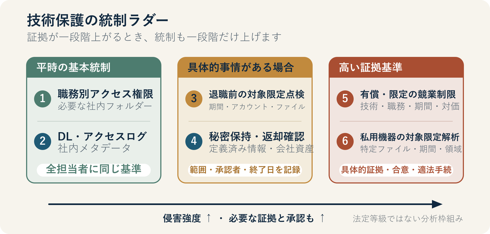

::: {.book-question}
[本日の策問]{.book-question-label}

{.book-question-image width=30mm fig-alt="閉ざされた技術保管庫と開かれた転職の扉の間で、保護の範囲を測るエンジニアを描いた水墨画"}

[国家核心技術を守るため、エンジニアの転職活動をどこまで制限・監視すべきでしょうか。]{.book-question-prompt}
:::

朝鮮王朝の策問^[宣祖が1568年の大庭別試で出した策問を、策問アーカイブが縮約・再構成した漢文は**「禦外之道，戰與和而已。義、力、勢，何所先後？」**です。「外部へ対応するとき、大義・力・情勢をどの順序で考えるべきか」という問いであり、公開された試験原文の逐語訳でも、本章の現代的な問いの翻訳でもありません。ここでは、大義だけを先行させず、保護目的、実際の統制能力、具体的状況を併せて考える思考法だけを結び付けます。[策問アーカイブの個別項目](https://waterfirst.github.io/Joseon-Dynasty-Civil-Service-Examination/#seonjo-1568/0)、[KRpia『朴世堂の策問』書誌項目](https://www.krpia.co.kr/product/detail?nodeId=NODE03961489&plctId=PLCT00004893)]は、戦争と和平のどちらかを先に選べとは問いませんでした。大義・力・情勢が食い違うとき、何から正すべきかを問いました。技術保護も同じです。「国家安全保障」という大義が重くても、すべての転職者を疑えば人材競争力を損ないます。「職業の自由」だけを語り、アクセス権限と持出しの痕跡を無視すれば、実際の流出リスクを見逃します。

本章の問いは、人の忠誠心を測ることではありません。**守る技術、確認する証拠、使う手段、終了する時点**を区別することです。国籍や転職先の国をリスクの代理変数にせず、同じ行為には同じ手続を適用する必要があります。

## なぜ今、この問いなのか

2025年10月施行の「国家核心技術の指定等に関する告示」は、国家核心技術を13分野79技術へ拡大・変更しました。この数字は、79人の人材や79社を監視せよという意味ではありません。保護対象となる**技術の範囲**を定めた一覧です。

2026年6月施行の「産業技術保護指針」は、国家核心技術を保有する機関に対し、アクセス権限の管理、未承認送信の遮断・記録、退職予定者の異常兆候の把握、返却資産の管理などを求めます。指針は、秘密保持・競業避止の誓約書も参照できるようにしています。ただし、この指針のどこにも、会社が退職者の私用携帯電話とノートパソコンの全内容を当然に複製できるという包括的権限は記されていません。

一方、「国家先端戦略産業法」は、指定された専門人材について、海外の同業種への転職制限とその期間、秘密流出の防止、退職後の再就職情報提供などを契約に盛り込めるようにしています。これは指定と契約を前提とする制度であり、すべての半導体エンジニアへ自動適用される出国・転職禁止ではありません。政府が2025年、半導体・AIなどのグローバル人材を誘致する「トップティア・ビザ」を導入した事実も、人材の国際移動が競争力の源であることを示します。

捜査実績もリスクの実在を示します。韓国警察庁は、2025年に技術流出犯罪179件で378人を検挙し、このうち国家核心技術関連事件は8件だったと発表しました。ただし、「検挙」は有罪確定ではなく、179件は未申告事件まで含む発生率でもありません。この数字は保護措置の必要性を裏付けますが、特定の転職者を犯罪者と推定する根拠にはできません。

## データの視点

{fig-alt="職務別アクセス権限、業務ログ、退職前の対象限定点検、秘密保持、有償の競業制限、私用機器フォレンジックへ進むほど、侵害の強度と必要な証拠がともに高まる技術保護統制ラダー"}

### 根拠データ表

| 根拠 | 公式原文で確認できる事実 | 討論での正確な使い方 |
|---:|---|---|
| 1 | 韓国警察庁は、2025年の技術流出犯罪取締りで179件・378人を検挙し、国家核心技術関連事件は8件だったと発表しました。 | 取締り規模を示しますが、犯罪発生率、有罪確定者数、すべての転職者のリスクを意味しません。 |
| 2 | 2025年10月の告示は、国家核心技術を13分野79技術へ拡大・変更しました。 | 保護対象は人の肩書ではありません。まず、告示に該当する具体的技術かを判定する必要があります。 |
| 3 | 2026年の「産業技術保護指針」は、情報の閲覧・保管・持出し履歴とアクセス権限を管理し、退職予定者の異常兆候と返却資産を確認するよう求めています。 | 会社システムと会社資産に平時から適用できる基本統制の根拠です。私用機器全体を検索する根拠ではありません。 |
| 4 | 個人情報保護委員会は、業務ネットワークのログも個人情報であり、労働者の監視目的で使ってはならない一方、権限外アクセスの有無を確認するログ管理は可能だと案内しました。 | 「ログがあるから何でも見る」のではなく、目的・項目・保有期間を定めた対象限定確認が必要です。 |
| 5 | 大法院2009ダ82244判決は、競業避止契約の有効性を、保護すべき利益、退職前の地位、期間・地域・職種、対価、退職経緯、公益などから総合判断するよう示しました。 | 秘密保持義務と、職業そのものを妨げる競業制限を分け、後者には狭い範囲と対価が必要です。 |
| 6 | 憲法第15条は職業選択の自由を保障し、個人情報保護法第3条は目的に必要な最小限の情報と、私生活への侵害の最小化を求めます。 | 私用機器の全内容複製のように侵害性が高い手段ほど、具体的根拠と、より侵害の少ない代替策の検討が必要です。 |

### 統制手段を分けて考える

図の6段階は法令が定める公式等級ではなく、討論のための**侵害強度ラダー**です。

| 段階 | 手段 | 確認範囲 | 引き上げ条件 |
|---:|---|---|---|
| 1 | 職務別アクセス権限 | 会社リポジトリ内の業務上必要なフォルダー | 職務変更、過剰権限、保護等級変更 |
| 2 | ダウンロード・アクセスログ | 時刻、アカウント、ファイル名、容量、外部媒体接続などの会社システムメタデータ | 平常時の基準から大きく外れたアクセスと、業務上の説明の不一致 |
| 3 | 退職前の対象限定点検 | 特定期間・アカウント・ファイル・会社資産 | 国家核心技術ファイルと未承認の持出し経路が具体的に結び付く |
| 4 | 秘密保持・返却・削除の確認 | 契約で定義した非公開情報と会社資産 | 返却漏れ、削除確認の拒否、外部公開の兆候 |
| 5 | 有償・限定の競業制限 | 特定技術・職務・業種・期間 | 指定・契約、保護すべき利益、合理的範囲、対価をすべて確認 |
| 6 | 私用機器の対象限定フォレンジック | 合意または適法手続で特定したファイル・期間・領域 | 外部複製・送信を裏付ける具体的証拠と独立した法務レビュー |

### 数字の読み方

179件のうち国家核心技術関連が8件だったという数値を、「国家核心技術流出の確率4.5%」と読んではいけません。2つの数字は、警察が2025年に検挙した異なる分類の件数であり、企業全体・退職者全体という分母がありません。検挙と有罪確定も区別する必要があります。

4.8 GBのダウンロードのような異常値は出発点であり、結論ではありません。同じ容量でも、承認済みの引継ぎ資料か、通常業務の何倍か、ファイルが実際に外部媒体へ書き込まれたか、送信が成功したかによって意味が異なります。ログの欠落は、「流出なし」も「流出あり」も自動的には証明しません。

競業制限と秘密保持も異なる手段です。秘密保持は特定情報を使用・公開しない義務であり、競業制限は特定の仕事を一定期間行えなくするものです。技術を保護できるより狭い手段があるなら、職業全体を先に禁止してはいけません。

## 対立する答案

### 答案A — 積極的保護論

国家核心技術はいったん外部へ複製されると、回収が困難です。設計図やプロセスレシピは小さな記憶媒体にも保存できるため、退職後の訴訟だけでは被害を元に戻せません。そのため、保有機関は、職務別の最小権限、持出し承認、ダウンロード・外部媒体ログ、退職時の高リスク権限の即時回収、会社資産の返却を平時から整える必要があります。

指定専門人材が実際に代替困難な最新技術を扱う場合、秘密保持だけでは不十分なこともあります。特定の競合職務と技術寿命に合わせた期間、十分な補償を明記した競業制限を事前に契約し、違反の兆候があれば速やかに裁判所の判断を求める方が合理的です。この立場は監視を増やすのではなく、被害が起きる前に統制可能な会社システムから強化しようという主張です。

ただし、保護対象を広く記載したり、すべての退職者に同じ制限を課したりすれば、統制費用と誤検知が増えます。過度な制限は優秀な人材に核心業務を避けさせ、最終的には保護すべき技術を生み出す能力まで弱める可能性があります。

### 答案B — 転職・プライバシーの境界論

エンジニアの一般的経験、公開知識、問題解決能力は、会社のファイルと同じではありません。転職することや海外企業へ移ることだけを理由に私用機器を複製し、世界中の同業種への就職を禁止すれば、職業選択の自由と私生活を過度に制限するおそれがあります。国は、海外人材を誘致しながら自国人材の移動だけを封じる矛盾も避けるべきです。

セキュリティは人を縛るより、技術を源流で守るべきです。リポジトリの細分化、最小権限、承認済みの持出し経路、会社機器の監査可能性、重要ファイルのウォーターマークとハッシュ値、退職時の返却・削除確認を先に整えれば、個人生活を深く調べなくてもリスクを下げられます。具体的な送信証拠がなければ、秘密保持義務を再確認しつつ、転職自体は尊重することが原則です。

ただし、ログ異常と外部媒体接続をすべて「私生活」を理由に確認しなければ、会社は法令上の保護措置を実行しにくくなります。正当な転職を守るためにこそ、調査範囲と終了条件が明確な対象限定点検が必要です。

### 答案C — リスクベースの条件論

統制強度は人の国籍や転職先ではなく、4つの事実で決めます。**技術の保護等級、本人の実際のアクセス権限、平時と異なる行為、外部送信を裏付ける証拠**です。4項目すべてが低ければ、最小権限と通常の退職手続で終えます。一部だけが高ければ、会社ログと会社資産を対象限定で点検します。外部複製・送信の証拠が具体化した場合にだけ、独立した法務レビュー、限定フォレンジック、仮処分・捜査機関への申告といった次段階へ進みます。

競業制限は最後の手段として分けます。保護技術と重なる職務、技術の有効期間、対象業種を狭め、対価を支払います。調査対象者には、根拠を聞き、釈明する機会と、独立したレビュー担当者へ異議を申し立てる手続が必要です。調査資料は、目的別保有期間が終われば削除します。

この方式の核心は、「疑わしければすべて見る」のではなく、**証拠の確度が一段階高まったとき、統制も一段階だけ高める**ことです。承認済みの引継ぎで説明できれば直ちに低い段階へ戻し、外部送信が確認されれば本人の背景に関係なく同じ手続きで強化します。

## AI調査設計

### AIへのプロンプト

> 2026年8月時点で、韓国の半導体企業において国家核心技術を扱うエンジニアが退職し、国内または海外の同業界へ転職する状況を調査してください。韓国国家法令情報センターの産業技術保護法・施行令・産業技術保護指針・国家核心技術告示、国家先端戦略産業法・施行令、個人情報保護法第3条・第15条、大法院2009ダ82244判決、個人情報保護委員会の人事・労務案内、韓国警察庁の2025年技術流出取締り実績だけを一次根拠として使ってください。アクセス権限、ダウンロードログ、退職前点検、秘密保持、競業制限、私用機器確認をそれぞれ「義務・許容可能・契約必要・裁判所判断必要・根拠なし」に分類してください。各判断に機関、文書名、条文、施行・判決・発表日、直接URLを付けてください。検挙と有罪、ログ異常と実際の送信、会社資産と私用機器、国家核心技術と一般ノウハウを混同しないでください。最後に、技術の機微性・アクセス権限・行為証拠・送信証拠に応じて統制強度が変わる意思決定表を作成してください。

### データ取得

| 優先順位 | 資料 | 必ず記録する項目 |
|---:|---|---|
| 1 | 韓国国家法令情報センターの現行法令・告示・指針 | 施行日、正確な条文、適用対象、義務と裁量を示す文言 |
| 2 | 大法院判決原文 | 事件番号、判決日、競業避止の判断要素、事件の結論 |
| 3 | 個人情報保護委員会の案内 | ログの個人情報性、許容目的、目的外監視の禁止、最小収集原則 |
| 4 | 韓国警察庁の取締り資料 | 基準年、事件・人数の単位、検挙と有罪の違い、国家核心技術の分類 |
| 5 | 企業内部資料 | 技術保護等級、権限表、承認記録、ログ収集範囲・保有期間、契約と補償 |

### 情報の判定

1. **対象判定：** ファイルと工程が、現行告示の国家核心技術または国家先端戦略技術に実際に該当するか確認します。
2. **権限判定：** 閲覧が職務上許可されていたか、ダウンロード・持出しまで承認されていたかを分けます。
3. **行為判定：** 平時基準からの異常値を計算しつつ、引継ぎ、障害対応、教育用コピーなどの代替説明を確認します。
4. **送信判定：** 外部媒体接続、ファイル書込み、メール・クラウドへのアップロード、受信確認を別々の証拠として記録します。
5. **手段判定：** 同じ目的を達成できる、より侵害の少ない手段があるか、範囲・期間・承認者・削除日・異議手続が定まっているか確認します。
6. **結論判定：** 「確認済み事実」「合理的推定」「確認不能」「仮想事例の仮定」を別々の欄に置きます。

### 討論の核心

- 「技術を守る」とは、具体的にどのファイル・工程・権限を指しますか。
- ログ異常と実際の複製・送信の間には、どの証拠がさらに必要ですか。
- 会社システムの点検で目的を達成できるのに、私用機器全体を見る必要がありますか。
- 競業制限の職務・期間・地域・対価を、誰がどの基準で決めますか。
- 調査終了と資料削除、本人の釈明・異議手続はいつ機能しますか。

## ケース討論

あなたは架空の半導体企業**ガオンメモリー**で働く入社1年目のプロセス技術エンジニアで、退職時セキュリティ手順を改善するタスクフォースの若手実務担当者です。以下の数値はすべて討論のために作った**仮想条件**であり、実在する企業や事件を指しません。

勤続7年のプロセス統合エンジニアが14日後に退職し、海外の同業界で研究開発職へ移る予定です。このエンジニアは、会社が国家核心技術として管理していると仮定する先端プロセスレシピを閲覧する権限を持っていました。別途補償を伴う競業避止契約はなく、秘密保持・会社資産返却契約だけを結んでいます。

退職意思を示す前の7日間のダウンロード量は4.8 GBでした。同じ職務の従業員における直前90日間の週間中央値0.3 GBの16倍です。ただし、4.0 GB、すなわち83.3%はチーム長が承認した引継ぎフォルダーでした。残り0.8 GBの12ファイルは引継ぎ一覧の対象外で、このうち3つが核心レシピです。すべて閲覧権限の範囲内でしたが、持出し承認はありませんでした。

私用の外部記憶装置が会社のノートパソコンに11分間接続された記録もあります。当時のセキュリティエージェントの不具合により、ファイル書込みが成功したかどうかの記録は残っていません。会社は、私用ノートパソコン・携帯電話の全内容複製と、24カ月間にわたる世界中の同業種への就職禁止を要求しようとしています。退職予定者は、会社資産の返却、会社アカウントの監査、問題の12ファイルに限った独立フォレンジック機関によるハッシュ照合には協力しますが、私用機器全体の複製は拒否しています。

次の3つから1つを選んでください。

1. 承認済みの引継ぎ資料の比率が高いため、通常の退職手続だけを進めます。
2. 核心技術へのアクセス権限を直ちに回収し、会社ログ・会社資産・12ファイルだけを対象限定で点検し、狭い範囲で有償の競業制限合意案を提案します。
3. 私用機器全体を確保し、24カ月の全面的な競業制限と捜査機関への申告を直ちに進めます。

選択後は、点検範囲、本人の釈明機会、競業制限の職務・期間・補償、強化・解除条件、調査資料の削除日も示す必要があります。

## 90秒回答例

「私は、**答案B、転職の自由を優先しつつ、確認されたリスクだけを対象限定で点検**します。韓国警察庁は、2025年に技術流出犯罪179件で378人を検挙し、そのうち国家核心技術関連事件は8件だったと発表しました。深刻なリスクですが、すべての転職者を疑う根拠ではありません。事例の4.8 GBのダウンロード、平時の16倍、一覧外の核心レシピ3つ、24カ月の就職禁止はすべて仮定です。承認済み資料が83.3%であり、外部機器の接続だけでは流出意図を証明できないという反論も重要です。まずアクセス権限と会社ログを保全し、その後、問題の12ファイルのハッシュだけを独立に照合し、釈明機会を与えます。私用機器全体は複製しません。競業制限は、当該技術と直接重なる職務に限って9カ月、基本給80%の補償を条件に合意します。外部送信の証拠が確認されれば法的措置へ強化しますが、承認業務だったと確認されれば制限を解除し、調査資料を削除します。技術保護が正当な転職まで犯罪扱いしてはなりません。」

## 追加質問

- 4.8 GBが平時の16倍でも83.3%が承認済み資料なら、どの指標を追加で確認しますか。
- 外部記憶装置への書込みログがない状況を、「流出なし」と「確認不能」のどちらで記録しますか。
- 退職予定者が12ファイルのハッシュ照合も拒否した場合、どの追加証拠があれば裁判所手続へ切り替えますか。
- 9カ月・基本給80%という仮想の競業制限が過大か不足かを、何に基づいて計算しますか。
- 国内競合企業への転職と海外同業界への転職の統制差を、技術リスクと法的根拠からどう説明しますか。
- 調査結果が嫌疑を裏付けない状況で終わった場合、誰がいつログ・フォレンジック資料の削除を確認すべきですか。

## 出典

- [韓国警察庁, 「ひと目で分かる2025年技術流出犯罪取締り実績」（2026）](https://www.police.go.kr/user/bbs/BD_selectBbs.do?q_bbsCode=1007&q_bbscttSn=20260130144015448)
- [韓国産業通商部, 「国家核心技術の指定等に関する告示」産業通商部告示第2025-2号（2025）](https://www.law.go.kr/LSW/admRulLsInfoP.do?admRulId=25045&efYd=0)
- [韓国産業通商部, 「国家核心技術の指定等に関する告示」制定・改正理由、13分野79技術（2025）](https://www.law.go.kr/admRulInfoP.do?admRulSeq=2100000272798&chrClsCd=010202&urlMode=admRulRvsInfoR)
- [韓国産業通商部, 「産業技術保護指針」産業通商部告示第2026-76号（2026）](https://www.law.go.kr/admRulLsInfoP.do?admRulSeq=2100000281960)
- [韓国国家法令情報センター, 「産業技術の流出防止及び保護に関する法律」（2026年施行版）](https://www.law.go.kr/LSW/lsInfoP.do?ancYnChk=0&chrClsCd=010202&efYd=20260603&lsiSeq=280043&urlMode=lsInfoP)
- [韓国国家法令情報センター, 「産業技術保護法施行令」第14条・国家核心技術の保護措置（2026）](https://www.law.go.kr/LSW/lsLinkCommonInfo.do?lspttninfSeq=113438)
- [韓国国家法令情報センター, 「国家先端戦略産業の競争力強化及び保護に関する特別措置法」（2026年施行版）](https://www.law.go.kr/LSW/lsInfoP.do?ancYnChk=0&chrClsCd=010202&efYd=20260602&lsiSeq=286519&urlMode=lsInfoP)
- [韓国国家法令情報センター, 「国家先端戦略産業法施行令」第24条・専門人材等の指定申請等（2026）](https://www.law.go.kr/LSW/lsInfoP.do?ancYnChk=0&chrClsCd=010202&efYd=20260201&lsiSeq=282935&urlMode=lsInfoP)
- [個人情報保護委員会, 「個人情報保護ガイドライン・人事労務編」質疑応答（2023）](https://pipc.go.kr/np/cop/bbs/selectBoardArticle.do?bbsId=BS212&mCode=C040030000&nttId=8636)
- [韓国国家法令情報センター, 「個人情報保護法」第3条・個人情報保護の原則（2025年施行版）](https://www.law.go.kr/LSW/lsLawLinkInfo.do?chrClsCd=010202&lsJoLnkSeq=900072509)
- [韓国国家法令情報センター, 「個人情報保護法」第15条・個人情報の収集・利用（2025年施行版）](https://www.law.go.kr/LSW/lsLinkCommonInfo.do?chrClsCd=010202&lsJoLnkSeq=1029334745)
- [韓国国家法令情報センター, 「大韓民国憲法」第15条・第17条（1988年施行版）](https://www.law.go.kr/lsLinkCommonInfo.do?chrClsCd=010202&lsJoLnkSeq=1026032837)
- [韓国大法院, 2010年3月11日宣告・2009ダ82244判決](https://law.go.kr/precInfoP.do?precSeq=215665)
- [大韓民国政策ブリーフィング, 半導体・AIなどのグローバル人材向け「トップティア・ビザ」導入（2025）](https://www.korea.kr/news/policyNewsView.do?newsId=148940244)
- [朝鮮王朝策問アーカイブ, 宣祖の大庭別試策問・個別項目（2026年閲覧）](https://waterfirst.github.io/Joseon-Dynasty-Civil-Service-Examination/#seonjo-1568/0)
- [KRpia, 『朴世堂の策問』書誌項目（2026年閲覧）](https://www.krpia.co.kr/product/detail?nodeId=NODE03961489&plctId=PLCT00004893)

> **資料メモ：** 法令・告示・指針は、2026年8月20日現在の韓国国家法令情報センター施行版を基準としています。警察庁の数値は取締り実績であり、事例の企業名・職位・容量・期間・比率・補償率はすべて討論用の仮定です。図の統制ラダーは、複数の公式原文を侵害強度の順に再構成した分析枠組みであり、法定等級ではありません。実際の調査・競業制限・フォレンジックは社内規程だけで決めず、個人情報・労働・営業秘密の担当者による個別の法的検討を経る必要があります。
