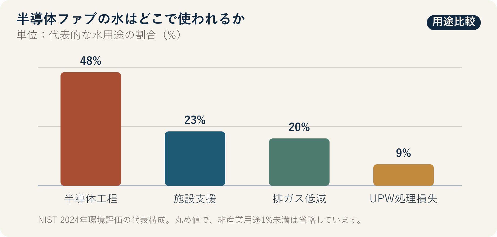

::: {.book-question}
[本日の策問]{.book-question-label}

{.book-question-image width=30mm fig-alt="ウエハーを洗う清流が再利用ループへ戻り、その途中に微量汚染を調べる虫眼鏡を配した水墨画"}

[AI半導体ファブで超純水の再利用率を高めるとき、微量汚染と歩留まりリスクをどこまで許容すべきでしょうか。]{.book-question-prompt}
:::

1798年、正祖（チョンジョ）の湖南（ホナム）に関する策問^[この章と結び付けた実際の策問（[策問]{.hanja}）は、湖南の物産と地域住民の暮らしをともに支える方策を問いました。伝承された答案に先立つ最初の原文は「[王若曰，湖南一路卽我朝興王之地也。]{.hanja}」、すなわち「王は言う。湖南一帯は我が王朝が興った地である」です。今日の問いは、当時の地域政策を半導体工場へ移した翻訳ではありません。生産の便益と資源負担が異なる場所に生じるとき、総量だけでなく負担の分布も見るという問題構造を借りています。[朝鮮時代策問アーカイブの個別項目](https://waterfirst.github.io/Joseon-Dynasty-Civil-Service-Examination/#jeongjo-1798/0)]は、資源が豊富であることと住民の暮らしが良くなることを同一視していません。ファブが大量の水を再利用しても、取水量、渇水期の負担、放流水の水質、歩留まりリスクを別々に測らなければ、成果を過大評価する可能性があります。

## なぜ今、この問いなのか

先端ロジックとメモリの工程では、ウエハー表面の粒子、イオン、有機物を繰り返し洗い流します。一般用水から超純水（UPW）をつくり、使用後に再び回収する過程には、逆浸透、イオン交換、紫外線酸化、脱気、精密ろ過が続きます。再利用率を高めれば、新規取水と放流を減らせますが、回収水の汚染物質が濃縮したり、監視の死角が生じたりすれば、膜汚染、配管汚染、歩留まり低下につながるおそれがあります。

NISTの2024年環境評価は、平均的な半導体ファブが受け入れた水の40～70%を敷地内で再利用し、一部の大手メーカーでは工程活動における再利用が80%を超えるとまとめています。同じ文書は、水用途の48%を半導体工程、23%を施設支援、20%を排ガス低減に配分しています。この数値は再利用を増やす余地が大きいことを示しますが、すべての排水をただちに最終ウエハー洗浄へ投入してよいという意味ではありません。

企業の実際の経路も段階的です。TSMCは、回収水をまず二次用途に使い、検証後に成熟工程から先端工程へ広げ、2024年に5 nmと3 nm工程への適用を確認したと報告しました。サムスン電子は2026年報告書で、2025年の韓国内半導体事業所における水再利用量を1億796万7千トンと示しました。再利用「量」は、何度も循環した同じ水を合算する場合があるため、新規取水の削減率と同じものとして解釈してはいけません。

## データの視点

{fig-alt="半導体ファブの水用途を、工程48%、施設支援23%、排ガス低減20%、超純水処理損失9%で比較した棒グラフ"}

### 根拠データ表

| 根拠 | 公式資料の数値・範囲 | 工程・インフラ判断での意味 |
|---:|---|---|
| 1 | NISTの2024年環境評価は、代表的な水用途を、半導体工程48%、施設支援23%、排ガス低減20%、UPW処理損失9%、非産業用途1%未満とまとめています。 | 用途ごとに必要な水質が異なります。高純度洗浄水と、冷却・スクラバー補給水を1つの再利用率でまとめると、リスクを隠します。 |
| 2 | 同評価は、一般的な敷地内再利用の範囲を受け入れた水の40～70%、一部の大手メーカーによる工程UPWの再利用を80%超と示しています。 | 高い比率は可能性の根拠であり、自社工程の合格基準ではありません。まず分母と工程範囲をそろえる必要があります。 |
| 3 | TSMCは2024年、台南で1日6万7千m³の再生水供給を受け、年間1,965万m³を使用して上水道使用量を31%減らし、再生水代替率17%を報告しました。 | 外部からの再生水供給、内部循環、上水道使用量の削減は、それぞれ異なる指標です。1つの数値で代替できません。 |
| 4 | TSMCは検証を経て、2024年に再生水を5 nmと3 nm工程に適用したと明らかにしました。 | 先端工程への適用は、「全面投入」よりも、水質別の分離、パイロット、段階承認が現実的な経路であることを示します。 |
| 5 | サムスン電子の2026年報告書は、韓国内DS事業所の水再利用量を、2023年9,265万7千トン、2024年1億110万6千トン、2025年1億796万7千トンと示しています。 | 再利用量の増加は成果ですが、総取水量と循環回数がなければ、再利用率や地域の取水削減を計算できません。 |
| 6 | NISTの2026年Micronニューヨーク最終環境影響評価書は、用水需要を2029年の1日785万ガロンから、2041年の全面稼働時には1日4,800万ガロンになると予測しています。 | これは将来の事業計画に関する予測値であり、現在の使用実績ではありません。地域インフラは、段階別の実稼働率と渇水期条件に合わせて承認する必要があります。 |

### 数字の読み方

再利用率は、分母が異なれば比較できません。「総使用量に対する循環量」「取水量に対する回収量」「工程UPWだけの回収率」「外部再生水が上水道を代替した割合」は、互いに異なる問いです。同じ水を循環のたびに合算すれば、再利用量が新規取水量を上回ることもあります。

グラフの48%、23%、20%、9%は、NIST環境評価が引用した代表的な構成です。事業所ごとの工程世代、冷却方式、除害設備にそのまま適用できる比率ではありません。40～70%と80%超も業界の範囲であり、歩留まりの安全基準ではありません。Micronの1日785万～4,800万ガロンは、2029～2041年の建設計画に基づく予測であり、実際の取水と区別する必要があります。

再利用拡大案は、次の計測を同じ時間軸で結び付ける必要があります。

- 水源別の純取水量、工程別の回収量、循環回数、放流量
- UPW使用点の比抵抗、全有機炭素、シリカ・ホウ素、溶存酸素、粒子数
- 膜の差圧・寿命、イオン交換の再生周期、エネルギー・薬品使用量
- 製品群・工程段階別の欠陥マップ、歩留まり、工程能力指数
- 渇水期の河川流量、地域の生活・農業用水への影響、放流水の水質

## 対立する答案

### 答案A — 再利用早期拡大論

用途別に回収水を分け、十分な高度処理設備を設ければ、新規取水、放流、水供給停止のリスクを同時に減らせます。大規模ファブは水質センサーと工程データを多く保有するため、汚染を早期検知し、低リスク用途から迅速に拡大できます。地域の水負担がすでに大きい場所では、保守的な目標を繰り返すことも、リスクを外部に残す選択です。

ただし、経営目標を再利用率1つにすると、水質の異なる水を無理に混ぜたり、警報の報告を遅らせたりする誘因が生じる可能性があります。新規取水の減少が小さく、エネルギー・薬品使用と濃縮排水が増えれば、環境成果も予想より小さくなります。

### 答案B — 工程再投入保留論

先端工程の微量汚染は、複数工程を経た後に欠陥として現れ、原因追跡が難しくなります。顧客の信頼と長い学習サイクルを考えれば、冷却塔、スクラバー、緑地散水などウエハーに直接触れない用途で再利用し、最終洗浄水は十分な長期データが蓄積するまで従来の供給を維持する方が安全です。

この立場にも費用があります。「完全な無リスク」を待てば、パイロットによる学習が始まらず、地域社会が新規取水の負担を負い続けます。既存の上水道にも、干ばつ、水質変動、供給停止のリスクがあるため、現状維持も無リスクではありません。

### 答案C — 水質区分別の段階承認論

回収水を汚染特性ごとに分け、冷却・除害設備から始め、前処理、初期洗浄、最終洗浄の順に検証します。各段階は、水指標だけでなく、欠陥マップと歩留まりも同時に合格する必要があります。異常時には自動隔離し、従来の補給水に戻せる二重配管と貯留余力を設けます。

段階案は設備と運用が複雑で、初期投資も大きくなります。そのため、承認段階を増やすこと自体が目的になってはいけません。取水削減、総費用、炭素・薬品、汚染事象、歩留まりを同じ検討表に置き、拡大、維持、後退を決める必要があります。

## AI調査設計

### AIへのプロンプト

> AI半導体ファブの超純水再利用を58%から75%へ高める案を検討してください。NISTの環境評価・最終環境影響評価書、環境当局・自治体・水資源機関の資料、半導体企業の最新サステナビリティ報告書、事業所の水質・歩留まり原データを優先してください。各数値について、機関、文書名、基準年、実績・目標・予測の区分、分子と分母、水質区分、単位、節・ページ、直接URLを記載してください。水再利用量、内部再利用率、外部再生水代替率、新規取水削減率を混同しないでください。回収水系統別の比抵抗、TOC、シリカ、ホウ素、粒子、膜差圧、エネルギー・薬品、欠陥・歩留まり、渇水期の取水と放流を同じ時間軸で分析してください。相関を歩留まりの因果関係と断定せず、スプリットロット、対照系統、回帰変数、検出力を示してください。最後に、水質区分別の拡大順序、自動隔離基準、歩留まりの中止条件、地域社会への公開指標を提案してください。

### データ取得

| 順序 | 資料 | 必ず確保する項目 |
|---:|---|---|
| 1 | 取水・循環・放流メーター | 水源と系統、時間当たり流量、純取水、反復循環、損失、放流 |
| 2 | UPW・回収水の水質ログ | 採水点、比抵抗、TOC、イオン・シリカ・ホウ素、粒子、校正・検出限界 |
| 3 | 工程・歩留まりデータ | ロット、製品、装置、レシピ、欠陥マップ、歩留まり、再加工、時間差 |
| 4 | 設備・費用データ | 膜の差圧・寿命、エネルギー、薬品、汚泥、保全、バイパス系統容量 |
| 5 | 流域・地域データ | 渇水期流量、生活・農業用水、取水許可、放流水、住民の苦情・協議記録 |

### 情報の判定

1. **水の種類を区別します。** 上水、工業用水、外部再生水、内部回収水、UPWを同じ「水」としてまとめません。
2. **分母を固定します。** 再利用率の計算式と反復循環の扱いを公開していない比率は、比較表から除外します。
3. **時間差を反映します。** 水質異常から欠陥・歩留まり変化までの工程サイクルを合わせ、事後的に選んだ区間だけを見ません。
4. **未検出と不存在を区別します。** 検出限界、校正失敗、欠測を正常値として扱いません。
5. **地域性と工程の公正性を同時に見ます。** 取水削減がない、または渇水期の負担、濃縮排水、エネルギーが増える場合、再利用量だけで成功と判定しません。

### 討論の核心

- 歩留まりリスクを最初に表す系統と製品群はどこですか。
- 水指標が規格内なのに歩留まりが低下した場合、どの交絡変数を最初に除きますか。
- 新規取水1 m³削減当たり、エネルギー、薬品、廃棄物の増加をどこまで認めますか。
- 地域社会へ公開する指標と、企業内部の営業秘密の境界をどう定めますか。

## ケース討論

あなたは新設AI半導体ファブのインフラ・工程統合チームに配属された新人エンジニアです。現在、総工程用水の循環を基準にした再利用率は58%で、1年後の目標は75%です。総水需要を1日4万5千m³に単純固定すると、新規取水は1日1万8,900m³から1万1,250m³へと7,650m³減ります。この計算は、漏水、蒸発、反復循環、生産量の変化を無視した討論用の仮定です。

12週間のパイロットで、回収水がUPW補給水に占める比率を20%から40%へ高めました。比抵抗は社内規格を満たしましたが、TOC警報が4回発生し、20 nm以上の粒子数は対照系統より15%高くなりました。パイロットロットの歩留まりは0.18パーセントポイント低下しましたが、標本が18ロットしかないため、因果関係と統計的有意性は確定していません。膜交換周期は10%短くなり、新規取水は12%減りました。すべての数値と社内規格は討論用の仮定です。

生産チームは、歩留まりのシグナルが不確実なため拡大速度を落としたいと考えています。インフラチームは、渇水期の前に取水余力を確保する必要があると考えています。環境チームは、取水だけでなく、エネルギー、薬品、放流水の濃度も併せて見るべきだと考えています。どのチームも相手の目標を否定していません。

あなたは、**ただちに75%へ拡大する、工程への再投入を中止する、水質区分別に段階拡大する**のいずれかを勧告する必要があります。新入社員の役割は最終承認ではなく、データ整合性の確認、スプリットロット設計、自動隔離・バイパス条件、意思決定ログ案の作成です。

## 90秒回答例

「私は**答案C、水質区分別の段階拡大**を選びます。NISTは、一般的なファブの敷地内水再利用を40～70%とし、一部では80%を超えるとまとめています。TSMCは検証後、2024年に5 nmと3 nm工程へ再生水を適用しました。高い再利用が可能である根拠ですが、自社の歩留まり安全基準を決めるものではありません。事例の再利用率58%から75%、1日4万5千m³、歩留まり0.18パーセントポイント低下は、すべて仮定です。ただちに拡大すれば取水を減らせるという反論は妥当ですが、TOC警報と粒子増加を無視できません。冷却、スクラバー、非重要洗浄から拡大し、最終洗浄への適用は、計30ロットの検証と8週間連続の水質合格後に限って引き上げます。TOC警報が週2回発生するか、粒子が対照系統より10%を超えて増えた場合は自動隔離します。歩留まりが対照群より0.10パーセントポイント以上低いことが確認された場合、前の段階へ戻します。月ごとの純取水、渇水期取水、放流水、歩留まりを併せて公開し、水削減の便益と工程リスクを同じ表で判断します。」

## 追加質問

- 再利用率75%の分子と分母をどのように定義すれば、事業所間で比較できますか。
- 比抵抗は正常でもTOCと粒子が増えた場合、どの採水点と装置から隔離しますか。
- 18ロットで歩留まりが0.18パーセントポイント低いとき、拡大中止を判断するには、どの統計情報がさらに必要ですか。
- 新規取水は減ったものの、膜交換、エネルギー、薬品の使用が増えた場合、どの単位で総効果を比較しますか。
- 渇水期の地域取水が限界に近づいた場合、生産量、再利用段階、住民供給に対してどの事前ルールを適用しますか。
- 8週間の合格後、量産で汚染が再発した場合、責任の所在を問う前に実行すべき自動措置は何ですか。

## 出典

- [NIST, *Final Programmatic Environmental Assessment for Modernization and Expansion of Existing Semiconductor Fabrication Facilities* (2024)](https://www.nist.gov/system/files/documents/2024/06/28/Final%20PEA%20for%20Modernization%20and%20Expansion%20of%20Semiconductor%20Fabs%206-28-2024%20-%20OGC-508C.pdf)
- [NIST, *Micron Semiconductor Manufacturing Project, Clay, New York — Final Environmental Impact Statement* (2026)](https://www.nist.gov/document/micron-ny-feis-final)
- [TSMC, *2024 Sustainability Report* (2025)](https://esg.tsmc.com/en-US/file/public/2024-TSMC-Sustainability-Report-e.pdf)
- [TSMC, *2024 Annual Report*, Water Management (2025)](https://investor.tsmc.com/static/annualReports/2024/english/ebook/files/basic-html/page159.html)
- [サムスン電子、『サステナビリティ報告書2026』（2026）](https://download.semiconductor.samsung.com/resources/others/Samsung_Electronics_Sustainability_Report_2026_KOR.pdf)
- [サムスン電子半導体「京畿地域の半導体事業所における第1段階水再利用事業」業務協約](https://semiconductor.samsung.com/kr/news-events/news/mou-with-ministry-of-environment/)
- [朝鮮時代策問アーカイブ、正祖1798年「湖南の7つの弊害と解決策」個別項目](https://waterfirst.github.io/Joseon-Dynasty-Civil-Service-Examination/#jeongjo-1798/0)
- [韓国学湖南振興院「光州の風教を担った光州郷校」（2021）](https://www.hiks.or.kr/HonamHeritage/19/read/629)
- [韓国国史編纂委員会、『正祖実録』正祖22年6月18日](https://sillok.history.go.kr/id/kva_12206018_002)

> **資料メモ：** グラフの48%、23%、20%、9%と、40～70%、80%超は、NISTの2024年環境評価の数値です。TSMCの数値は2024年の台南実績、サムスン電子の数値は2025年の韓国内DS実績、Micronの数値は2029～2041年の予測です。事例の水需要、再利用率、水質、歩留まり、膜寿命、承認・中止基準は、すべて討論用の仮定であり、特定企業の実際の運用値ではありません。
