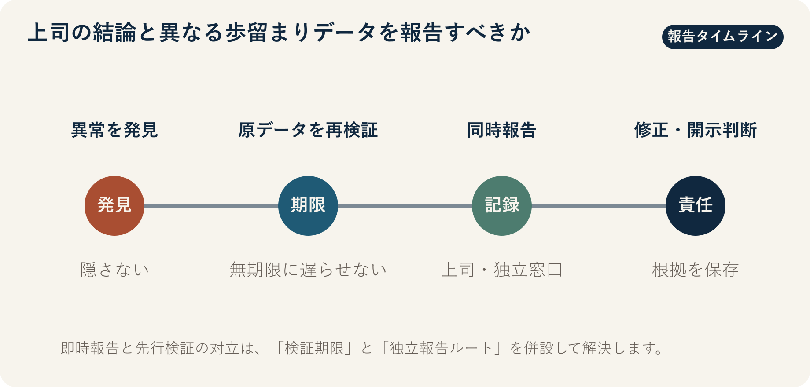

::: {.book-question}
[本日の策問]{.book-question-label}

{.book-question-image width=30mm fig-alt="異なる歩留まり表を挟み、発言する勇気と検証責任を天秤にかけるミニマルな水墨画の象徴画"}

[四半期業績発表の直前に上司の結論と異なる歩留まりデータを発見したら、新入社員でもただちに報告すべきでしょうか。]{.book-question-prompt}
:::

1611年、光海君（クァンヘグン）の策問^[この章と結び付けた実際の策問（[策問]{.hanja}）は、戦乱後の国政再建で何を優先するかを問いました。策問アーカイブが意味を要約して再構成した漢文は「[今之國事，何者最急？用人、賦役、田政、戶籍，孰先孰後？]{.hanja}」であり、原文の逐語訳ではありません。「今、国事において何が最も急務か。人材登用、賦役、土地行政、戸籍のうち、何を先にし、何を後にするのか」という問いです。今日の問いは、この文を現代組織にそのまま置き換えたものではありません。危機の際に不都合な事実の優先順位を定めるという構造を、歩留まり報告に応用した再解釈です。]は、良い施策をすべて列挙するよう求めたのではありません。何を最初に直すのかを選び、その順序を説明するよう求めました。四半期発表を控えた組織にも同じ難題があります。開示日程を守ること、分析ミスを再検証すること、顧客や投資家に誤った数字を出さないことが、同時に差し迫っています。

新入社員の職位が低いことは、データの真偽を決めません。だからといって、最初の計算をただちに確定事実のように広めてよいわけでもありません。この章の論点は「発言する勇気」だけではなく、**再現可能な証拠、限られた検証時間、独立した報告ルート、通報後の保護**を一つの手続きにすることです。

OECD責任ある企業行動ガイドラインは、企業にリスクベースのデュー・ディリジェンスと苦情処理手続きの整備を求めています。実務における少数意見は、それだけで正解ではありません。取り返しのつかない発表の前に、再現と独立検証を受けるべき早期警報です。

## なぜ今、この問いなのか

半導体の歩留まりは、売上、原価、納期、顧客品質を同時に動かします。しかし、同じウエハー記録でも、製品群の除外基準、再加工品の扱い、検査工程、良品の定義、集計時点によって、異なる歩留まりが出ることがあります。数字が違うという事実だけで虚偽報告とは断定できませんが、「標本の定義が違う」という説明だけで差を埋もれさせることもできません。

OECDの2023年「多国籍企業行動指針（責任ある企業行動）」は、企業責任の範囲を情報開示、人権、雇用・労使関係、環境、消費者利益、科学技術などに広く設定しています。責任ある企業行動は、通報箱を設置して終わるものではありません。負の影響を特定・評価し、予防・軽減し、結果を追跡し、どう対処したかを伝え、必要に応じて救済する一連の過程が必要です。

新人の歩留まり分析担当者が今すぐ統制できるのは、巨大な企業文化ではありません。原データを保存し、計算環境を固定し、差が生じた行を示し、検証担当者と報告期限を記録することです。組織の発言経路は、「会議で自由に話せる」という印象よりも、**発見→検証依頼→意思決定者への通知→措置→再発確認**に要した時間で測る方が適切です。

## データの視点

{fig-alt="歩留まり92%と89.8%の差を、独立検証と報告の流れに結び付けたデータ図"}

### 根拠データ表

| 根拠 | 原資料または計算 | 性格 | 討論での意味 |
|---:|---|---|---|
| 1 | OECDは2023年ガイドラインで、情報開示、人権、雇用、環境、消費者利益、科学技術などを責任ある企業行動の主要領域として扱っています。 | OECD原文に基づく事実 | 歩留まり隠蔽の問題を個人の礼儀ではなく、情報開示、顧客への影響、技術責任が交差する問題として捉えます。 |
| 2 | この章の根拠資料は、組織の発言経路を、匿名通報窓口の有無よりも、報告後の報復の有無、措置までの時間、再発率で測ることを提案します。 | プロジェクトの分析枠組み・統計ではない | 通報件数だけでなく、報告が実際の措置と学習につながったかを確認します。 |
| 3 | 反対意見を検討する時間と最終決定を下す時間を分ければ、熟議とスピードを両立する設計が可能です。 | プロジェクトの分析枠組み・統計ではない | 検証を無期限に先延ばしせず、異論も消えないようにします。 |
| 4 | この章の事例では、発表案92%と再計算89.8%に2.2パーセントポイントの差があります。不良率に直すと8%から10.2%となり、相対的に27.5%増加します。 | **討論用仮定の算術計算** | 歩留まりの差は小さく見えても、不良規模と原価の観点でははるかに大きく見える場合があります。実際の企業数値ではありません。 |

### 数字の読み方

第一に、**パーセントとパーセントポイントを区別**する必要があります。92%と89.8%の差は2.2%ではなく、2.2パーセントポイントです。92%を基準にした相対低下率は約2.4%です。

第二に、意思決定には歩留まりより不良率の方が近い場合があります。同じ仮定では、不良率は8%から10.2%に増え、相対増加率は27.5%です。ただし、この計算だけで財務損失を確定することはできません。投入ウエハー数、ダイサイズ、販売可能グレード、再加工率、顧客補償条件が必要です。

第三に、集計定義をそろえる必要があります。2つの数字で製品群、工程段階、期間、再加工品を含むか否かが異なれば、比較は成立しません。したがって最初の報告は「歩留まりが間違っている」ではなく、「同じ原データに2つの定義を適用すると、2.2パーセントポイントの差が再現された」と書くべきです。

第四に、OECD資料は特定企業における通報効果を測定した統計ではありません。この章は、ガイドラインの責任手続きを歩留まり事例に適用しています。報告までの時間、報復の有無、措置完了率、同じ誤りの再発率は、**この章が提案する社内運用指標**であり、OECDが示した業界平均ではありません。

## 対立する答案

### 答案A — 即時報告論

発表前に発見した重大な差は、職位にかかわらずただちに報告すべきです。誤った歩留まりが社外に出た後で修正すれば、顧客の生産計画、原価見積もり、投資家の信頼を同時に損ねる可能性があります。新入社員が沈黙すれば、上司は反対データを見ないまま結論を確定しかねません。原データと再現手順を添えて監査、品質、開示の担当者に知らせることは、組織への忠誠に反するのではなく、忠誠を具体化する行為です。

弱点もあります。一つの分析が検証前に広く拡散すれば、発表準備が止まり、権限外の機密情報が漏れ、通常の定義差が不正疑惑に変わるおそれがあります。「即時」とは全社メールを送ることではなく、定められた独立報告ルートへ遅滞なく報告することを意味します。

### 答案B — 先行検証論

歩留まりは定義に敏感なため、最低限の二重検証を経てから報告すべきです。原データのハッシュ、クエリのバージョン、除外ルール、標本期間を合わせなければ、92%と89.8%は異なる母集団の数字かもしれません。発表直前の限られた時間をうわさと釈明に使うより、2人の分析者が独立に再現し、差の原因を1枚にまとめる方が正確です。

しかし、「さらに検証が必要だ」という言葉は、最も一般的な遅延手段にもなります。検証者と終了期限がなく、直属の上司だけが結論を統制するなら、次の四半期に先送りしようという要求は、事実上の隠蔽として機能します。先行検証論には、時間制限と上位報告の条件が不可欠です。

### 答案C — 時間制限付き独立検証論

私は原データをただちに凍結し、24時間以内の独立再現を依頼すると同時に、「検証中の2.2パーセントポイントの差」が存在することを開示責任者に限定して知らせます。独立計算でも差が維持されるか、顧客・財務への影響がしきい値を超える場合は、直属上司の同意なしに監査、品質、開示委員会へ報告します。逆に、定義を統一して差が消えた場合は、分析修正の記録を残し、発表案を維持します。

これは即時報告と先行検証の中間案ではありません。**報告先、証拠水準、検証期限、転換条件をあらかじめ分ける**設計です。反対意見を出す時間を保障しつつ、最終決定時刻も固定します。

## AI調査設計

### AIへのプロンプト

> 半導体メーカーにおける歩留まり算定の差と、社内異論の解決手続きを調査してください。①会社提供のデータ辞書と歩留まり計算式、②原データとクエリ・コードのバージョン、③工程・品質・生産の承認権限、④監査・開示規定、⑤OECD責任ある企業行動ガイドラインの順に確認してください。92%と89.8%について、母集団、検査工程、期間、再加工品・試験品を含むか否かを表で対照し、差をパーセントポイント、相対的な歩留まり変化、不良率変化でそれぞれ計算してください。各部門の主張、根拠、利害関係、中立的な仲裁者、中止・再開条件、最終承認者を権限表にしてください。確認済みの事実、担当者の主張、AIの推論、討論用の仮定を別々の列に示し、個人名、通報者の身元、未公開の顧客情報は入力しないでください。結論には、24時間の独立検証、開示保留または維持の条件、反対意見の保護、意思決定ログの項目、事後の再発点検を含めてください。

### データ取得

| 順序 | 資料 | 必ず残す項目 |
|---:|---|---|
| 1 | MES・検査装置・データウェアハウスの原データ | 抽出時刻、ロット・製品群、工程段階、欠損・重複、原データのハッシュ |
| 2 | 歩留まりクエリと分析コード | リポジトリのバージョン、分子・分母の定義、除外ルール、再加工品の扱い、実行環境 |
| 3 | 財務・顧客影響資料 | 販売可能グレード、廃棄・再加工原価、顧客補償、売上認識と開示締め切り |
| 4 | 社内の品質・監査・通報規定 | 受付責任者、独立検証者、上位報告ルート、秘密保持、報復禁止、処理期限 |
| 5 | OECDと規制当局の原文 | 文書名、発行年、適用範囲、原文URL、会社規定と異なる点 |

### 情報の判定

1. **再現性：** 別の分析者が同じ原データとコードから同じ値を得られるか確認します。
2. **定義の一致：** 良品、投入量、再加工、試験ロットの定義と集計期間をそろえます。
3. **影響の分離：** 統計上の差、顧客品質への影響、財務・開示上の重要性を別々の列に置きます。
4. **出典の格付け：** システムの原簿と承認済み規定は事実、担当者の説明は主張、AIによる原因説明は推論と表示します。
5. **セキュリティ：** AIには匿名化した集計と承認済み文書だけを入力し、通報者、顧客、工程レシピの情報は除外します。
6. **反証記録：** 92%が正しい条件と89.8%が正しい条件を両方記し、どの検査で両者を区別できるか指定します。

### 討論の核心

- 検証前の警報を誰まで共有すれば、正確性と機密性を両立できますか。
- 歩留まり2.2パーセントポイントが、開示、顧客、品質の面で重大となるしきい値を誰が決めますか。
- 工程、品質、生産の定義が衝突したとき、KPIを所有しない仲裁者は誰ですか。
- 反対意見を意思決定ログに残しながら、提起者の評価・配置と切り離すには、どのようなアクセス権限が必要ですか。

## ケース討論

あなたは歩留まり分析チームに入社して4か月の社員です。経営陣の発表案には主力製品群の歩留まりが92%と記載されていますが、原データを再計算すると、特定の低歩留まり製品群を含めた場合は89.8%になりました。上司は標本定義の問題だとして、次の四半期に整理しようと言います。発表資料は36時間後に確定します。以下の追加数値はすべて討論用の仮定です。

- 当該四半期の投入量は10万枚のウエハーで、製品ミックスの差を補正していない単純集計です。
- 独立分析者1人が再現するには8時間、財務影響の一次推計には6時間必要です。
- 仮想の社内規定では、歩留まり差が0.5パーセントポイント以上、または予想損失が5億ウォン以上の場合、24時間以内に品質責任者へ通知することになっています。
- 直属上司を通さない監査窓口はありますが、受付の事実を上司に知られるおそれがあります。

同じ原データをめぐって解釈が分かれます。工程チームは、低歩留まり製品は開発段階にあるため、量産歩留まりから分けるべきだと考えます。生産チームは、再加工完了前の暫定値で発表日程を維持したいと考えます。品質チームは、顧客に出荷される製品なら現在の母集団に含めるべきだと考えます。3つの主張はいずれも検証すべき点があり、どのチームも不正を行っているとは前提にしません。

役割と権限を分けます。新人分析者は、原データ、コード、差が生じた行を保存します。工程、生産、品質チームは8時間以内に、それぞれの分子・分母と根拠規定を提出します。KPIを所有しないデータガバナンス責任者が仲裁し、品質責任者は出荷保留を、開示委員会は発表の保留・再開を承認します。監査担当者は、意思決定ログと反対意見を提起した人の身元へのアクセス権を管理します。ログには、各主張、使用したデータ・コードのバージョン、反証結果、最終権限者、有効期間、再審条件を残します。

チームは、**発表を維持して事後修正する、24時間の独立検証と条件付き保留を行う、ただちに発表を延期する**のいずれかを選ばなければなりません。定義をそろえた差が0.5パーセントポイント以上、予想損失が5億ウォン以上、または原データの追跡が途切れた場合に発表を中止するという仮想条件も検討します。最終案には、最初の8時間の作業、24時間後の仲裁会議、36時間後の発表判断、部門別権限、意思決定ログ、通報者の身元へのアクセス権、評価上の不利益の点検、30日後の再発検査を含めてください。

## 90秒回答例

「私は**答案A、独立報告ルートにただちに知らせ、まず発表を止める案**を選びます。OECDの2023年責任ある企業行動ガイドラインは、情報開示と科学技術における責任を主要領域として扱っています。ただし、事例の歩留まり92%と89.8%、差の2.2パーセントポイント、内部基準の0.5パーセントポイントと損失5億ウォンは、すべて仮定です。最も強い反論は、通常の定義差を性急に不正疑惑へ拡大するおそれがあることです。そこで、全社に疑惑を広めず、原データのハッシュとコードのバージョンを凍結し、監査、品質、開示の責任者だけに提出します。KPIを所有しない責任者が、24時間以内に分子・分母と根拠規定をそろえます。定義を統一した差が0.5パーセントポイント未満で、原データの追跡が完全なら、修正根拠と反対意見を残した上で発表を再開します。反対に、差が残るか原データの追跡が途切れた場合は、延期を確定します。報告は疑惑の確定ではなく、検証を始めるための措置です。発表の速さより、取り返しのつかない誤開示を防ぐことを優先すべきです。」

## 追加質問

**反対尋問と再反論**

- 工程、品質、生産が、それぞれ異なる歩留まり定義を規定上の根拠とともに示した場合、仲裁者は何を最終母集団とすべきですか。
- 独立再現の結果が90.4%なら、1つの数字を選びますか、それとも定義別の値を併記しますか。
- 品質責任者と開示委員会の結論が異なる場合、出荷権限と発表権限をどう分けますか。
- 意思決定ログに必ず残す項目と、通報者の身元から分離する項目は、それぞれ何ですか。
- 提起者の分析が誤っていた場合も保護しつつ、意図的な操作と区別するには、どのような手続きが必要ですか。
- 発表を維持した後、同じ誤りが30日以内に再発した場合、どの権限や算定ルールを変えますか。

## 出典

- [OECD, *OECD Guidelines for Multinational Enterprises on Responsible Business Conduct* (2023)](https://www.oecd.org/en/publications/oecd-guidelines-for-multinational-enterprises-on-responsible-business-conduct_81f92357-en.html)
- [OECD「責任ある企業行動」—リスクベースのデュー・ディリジェンスと苦情処理の概要（2026年閲覧）](https://www.oecd.org/en/topics/responsible-business-conduct.html)
- [朝鮮時代策問アーカイブ、光海君1611年「壬辰倭乱後、最も急ぐべきこと」](https://waterfirst.github.io/Joseon-Dynasty-Civil-Service-Examination/#gwanghae-1611/0)
- [韓国学中央研究院、1611年の科挙記録](https://dh.aks.ac.kr/~sonamu5/wiki/index.php/%EA%B4%91%ED%95%B4%28%E5%85%89%E6%B5%B7%29_3%EB%85%84%281611%29_%EC%8B%A0%ED%95%B4%28%E8%BE%9B%E4%BA%A5%29_%EB%B3%84%EC%8B%9C%28%E5%88%A5%E8%A9%A6%29)

> **資料メモ：** 92%、89.8%、10万枚のウエハー、0.5パーセントポイント、5億ウォン、8時間、36時間は、すべてこの章の討論用に設定した仮定であり、実際の企業業績ではありません。OECDガイドラインの内容と事例数値を混同しないでください。
