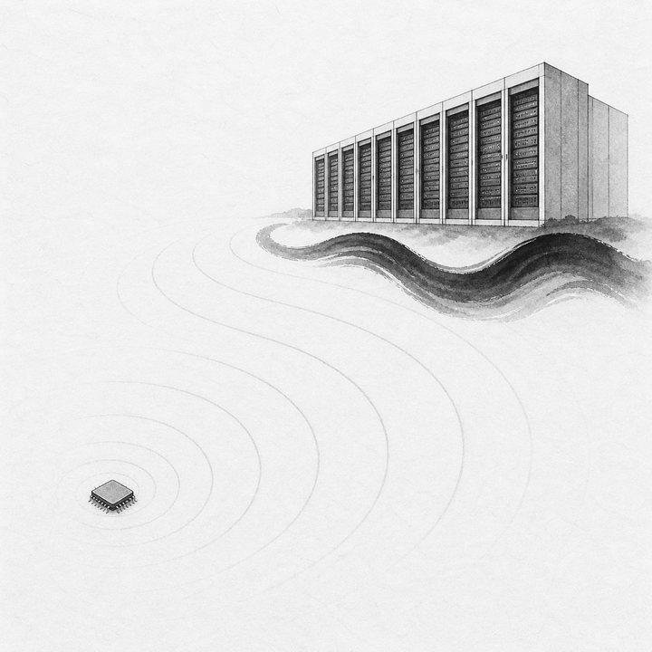
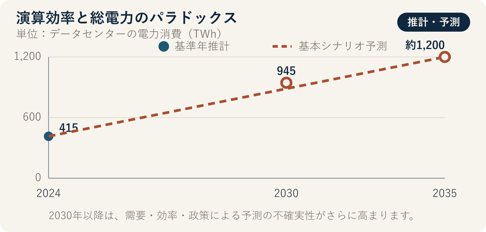

::: {.book-question}
[本日の策問]{.book-question-label}

{.book-question-image width=30mm fig-alt="小さくなった一滴の電力が多数のAIリクエストへ広がる様子を描いたミニマルな水墨画の象徴画"}

[新しいAIチップが演算当たりの電力を40%減らしても、サービス利用量が3倍になれば、環境に優しいと評価できるでしょうか。]{.book-question-prompt}
:::

中宗（チュンジョン）代の節制に関する策問^[この章と結び付けた実際の策問（[策問]{.hanja}）は、酒が礼や交際に用いられる利点を持ちながら、国と家庭を害する弊害に変わる理由と、節制する方法を問いました。策問アーカイブが意味を要約して再構成した漢文は「[酒有禮用，而其弊敗國喪家。何以節之？]{.hanja}」であり、原文の逐語訳ではありません。「酒には礼にかなう用途があるが、その弊害は国を滅ぼし、家を失わせる。どう節制すべきか」という問いです。この章は酒とAIを同じものと見なすのではなく、有用性を認めつつ総量の限界を設計するという問いの構造を借りています。]は、有用なものをなくそうとはしませんでした。良い用途が過剰な総量へ変わる地点をどう統制するかを問いました。

AI演算も同じです。同等の結果をより少ない電力で生成するチップは、明らかな技術進歩です。しかし、演算価格が下がり、広告推薦、動画生成、検索、エージェント呼び出しが大幅に増えれば、データセンターの総電力とピーク電力は上昇する可能性があります。効率と総量は競合する指標ではなく、異なる問いに答える指標です。

IEAの *Energy and AI* は、AI需要をサーバーだけでなく、データセンター、電力網、発電源までつながるシステムとして分析しています。したがって、効率もチップのデータシートだけで判断せず、サービスのリクエスト量とデータセンターの総電力まで責任範囲を広げて評価する必要があります。

## なぜ今、この問いなのか

IEAの2025年 *Energy and AI* の基本シナリオでは、世界のデータセンター電力消費は、2024年の約415 TWhから2030年には約945 TWhへと2倍以上に増えます。これは2030年の世界電力消費の3%弱です。IEAは、アクセラレーテッドサーバーの電力消費が年約30%で増え、純増分のほぼ半分を占めると予測しています。

この予測は、AIチップ1種類の電力や、すべての国の状況が同じだという意味ではありません。データセンターの立地は、電力網、気候、冷却方式、半導体供給、サービス需要によって集中します。世界比率が3%未満でも、特定地域では新規負荷が系統接続、電力価格、水使用、予備力に大きな影響を与える可能性があります。

新人のサステナビリティ担当者は、チップのTOPS/Wだけを見て環境配慮ラベルを付けてはいけません。実測したサーバー電力、稼働率、メモリ・ネットワーク、冷却を含む施設電力、リクエスト当たりのタスク品質、総リクエスト量、時間帯別の電力と炭素強度を結び付ける必要があります。

## データの視点

{fig-alt="データセンター電力消費について、2024年基準年推計415 TWhと、2030年945 TWh、2035年約1,200 TWhの基本シナリオ予測を実線と点線で区別したデータ図"}

### 根拠データ表

| 根拠 | 原資料の数値・範囲 | 性格 | 討論での意味 |
|---:|---|---|---|
| 1 | 世界のデータセンター電力消費は、2024年に約**415 TWh**と示されています。 | IEAの基準年推計 | データセンター全体の数値であり、AI演算だけの消費量ではありません。 |
| 2 | IEAの基本シナリオは、2030年に約**945 TWh**と予測しています。 | 条件付き予測 | 政策、効率、需要、供給が変われば、結果も変わります。 |
| 3 | 2030年の945 TWhは、世界の電力消費の**3%弱**です。 | IEA基本シナリオの世界比率 | 世界平均が低く見えても、地域の電力網への影響は別途確認する必要があります。 |
| 4 | アクセラレーテッドサーバーの電力消費は、2030年まで**年約30%**で増え、データセンター電力の純増分のほぼ半分を占める見通しです。 | IEAの技術別予測 | AIサーバーの効率と普及台数を同時に追跡する必要があります。 |
| 5 | IEAの基本シナリオは、2035年のデータセンター電力消費を**約1,200 TWh**としています。 | 長期の条件付き予測 | IEAも、2030年以降は予測の不確実性がより大きいと警告しています。 |
| 6 | 事例で演算当たりの電力が40%減れば、1リクエストは従来の60%を使用します。リクエスト量が3倍なら、総電力は0.6×3=1.8倍、すなわち**80%増加**します。 | **討論用仮定の算術計算** | 効率向上だけでは、総電力の減少を保証できないことを示します。 |

### 数字の読み方

TWhは一定期間に使用したエネルギーであり、GWは瞬時または契約上の容量です。945 TWhを945 GWと言い換えてはいけません。平均電力へ換算するには年間時間で割る必要がありますが、実際のピークは平均より高くなります。

415 TWhは2024年の基準年推計であり、945 TWhと約1,200 TWhは、それぞれ2030年と2035年の基本シナリオ予測です。3点を同じ確定実績のように連続して読んではいけません。データセンター全体の電力消費には、サーバーだけでなく、冷却、電力変換なども含まれ、AI電力と従来型ワークロードを完全に分離することは困難です。IEAが別の供給分析で示した2024年の発電量460 TWhは、送配電損失などを反映して消費量より大きいため、2つの値を混同しないでください。

年30%は、毎年同じ絶対量が増えるという意味ではなく、複利成長率です。「純増分のほぼ半分」と「総消費の半分」も異なります。

0.6×3=1.8は、この章の単純なシナリオです。タスク品質、モデル規模、バッチ、キャッシュ、リクエスト長、サーバー稼働率、冷却は固定したと仮定します。現実には、チップ効率が向上しても、より大きなモデルや高い品質を選び、リクエスト当たりの演算量そのものが変わる場合があります。

炭素も電力量と同じではありません。同じ1 MWhでも、時間と地域の発電源によって排出量が異なります。時間帯別の無炭素電力マッチング、電力ピーク、追加発電設備を併せて確認します。

## 対立する答案

### 答案A — 効率革新論

演算当たりの電力を40%減らす技術は、同じサービス水準で費用、電力、冷却負担を下げます。AIが医療、科学、産業最適化に使われる便益もあるため、利用量の増加そのものを浪費とは見なせません。高効率チップを速やかに普及させれば、旧式サーバーを置き換え、限られた電力網の中で、より多くの有用なタスクを処理できます。

ただし、「同じサービス水準」が実際に維持されているか確認する必要があります。効率改善分を、より大きなモデルと無制限の自動呼び出しにすべて使えば、総量とピークが増えます。製品指標だけで施設の環境性能を代用することはできません。

### 答案B — 総量上限論

環境影響は、最終的な総電力、水使用、排出によって生じます。リクエスト当たりの電力が減っても総電力が80%増えるシナリオなら、環境に優しいとは言いにくいでしょう。データセンターの電力予算、ピーク上限、不要不急の推論制限を先に定め、効率はその枠内で利用量を配分する手段と捉えるべきです。

しかし、固定した総量がすべてのサービスの社会的価値を同じと見なせば、有用な新規サービスまで妨げる可能性があります。上限が既存事業者に有利な参入障壁となるリスクもあります。

### 答案C — 二重台帳承認論

チップ承認には、演算当たりエネルギーと総サービスエネルギーの両方を入れます。製品チームは同一品質の標準タスク当たり電力を、サービスチームは月間総推論量、総電力、ピークを担当します。効率改善で節約した電力の一部だけを需要拡大に使い、残りは絶対量削減として残す予算を定めます。

再生可能電力の購入量だけで終えてはいけません。時間帯別の無炭素電力、新規電源の追加性、電力網の混雑、デマンドレスポンス、緊急削減を契約に入れます。総電力が承認予算を超えるか、ピーク時間の炭素強度が基準を超えた場合は、価値の低いリクエストを遅らせ、自動呼び出しの上限を下げます。

## AI調査設計

### AIへのプロンプト

> 新しいAIチップの演算当たり電力40%削減と、サービス利用量3倍の予測が、データセンターの総電力、炭素、ピークに与える影響を分析してください。①同一品質ベンチマークのサーバー実測、②実際のリクエストログとモデル、トークン、バッチ情報、③施設電力計とPUE・冷却、④時間帯別の電力・炭素強度と電力契約、⑤IEA *Energy and AI* 原文の順に確認してください。基準サーバーと新サーバーについて、チップ、メモリ、ネットワーク、施設電力を同じ機能単位で比較し、利用量1倍、2倍、3倍、5倍の感度分析で総電力とピークを計算してください。実測、モデリング、会社予測、IEA予測、討論用仮定を区別してください。再生可能エネルギー証書の購入を、実際の時間帯別無炭素電力供給と同一視しないでください。最後に、効率KPI、総電力予算、ピーク削減、デマンドレスポンス、承認取消条件を示してください。

### データ取得

| 順序 | 資料 | 確認項目 |
|---:|---|---|
| 1 | サーバーベンチマーク | モデル、精度、レイテンシー、バッチ、入出力長、チップ・メモリ・ネットワーク電力 |
| 2 | サービスリクエストログ | リクエスト数、トークン・画像サイズ、再試行・キャッシュ、自動呼び出し、顧客・機能別の価値 |
| 3 | 施設計測 | サーバーと施設の総電力、PUE、冷却水、最大需要、時間帯・地域 |
| 4 | 電力調達 | 系統電力、PPA、証書、新規性、時間帯マッチング、デマンドレスポンス義務 |
| 5 | IEA・系統の原文 | シナリオ、対象範囲、基準年、地域集中、予測の不確実性 |

### 情報の判定

1. **機能同等性：** 同じ品質、レイテンシー、タスク量を処理したか確認します。
2. **境界の一致：** チップ電力とサーバー・施設電力を混同せず、階層別に記録します。
3. **総量の検算：** 単位効率に実際の利用量を掛け、総電力を再計算します。
4. **時間・地域：** 年間平均とピーク、地域別の炭素・系統制約を分けます。
5. **追加性：** 電力購入によって新たな無炭素設備が増えたか確認します。
6. **リバウンドの原因：** 価格、新機能、自動再呼び出しのうち、需要増加の原因を分けます。

### 討論の核心

- 「環境に優しい」という言葉の分母を、演算、有用なタスク、顧客、施設の総電力のどこに置きますか。
- 効率による節約分のうち、どれだけを需要拡大に使い、どれだけを絶対量削減として残しますか。
- 価値の低いリクエストを判定し、遅延・中止する権限は、製品チームと顧客のどちらが持ちますか。
- 年間の再生可能電力購入量が同じでも、ピーク時間の電力が化石燃料由来なら、目標を達成したと言えますか。

## ケース討論

あなたはAIサーバー製品のサステナビリティ担当の新入社員です。新しいチップは、同一ベンチマークで演算当たりの電力を40%減らしますが、価格低下と新機能によって顧客の推論量が3倍になる見通しです。以下の数値はすべて討論用の仮定です。

- 既存サービスの年間施設電力は100 GWhで、リクエスト量だけが3倍になれば、新設備は単純計算で180 GWhを使用します。
- 現在の最大需要は20 MWで、電力系統運用者は25 MWを超える場合、接続増強費200億ウォンを求めます。
- 年間の再生可能電力契約は120 GWhですが、実際のリクエストピークは18～22時に集中します。
- 遅延を許容できるバッチ処理は総電力の30%で、その半分を日中へ移せます。

新入社員は、**効率性能だけで発売する、年間総電力150 GWhの上限と需要管理を条件に発売する、需要が確定するまで保留する**のいずれかを選びます。製品チームは性能、サービスチームはリクエスト価値、データセンターチームはピーク、調達チームは電力契約、財務チームは増強費を担当します。

最終契約には、同一品質の演算当たり電力、月間総電力、25 MWのピーク、時間帯別無炭素電力比率、バッチ移動、リクエスト上限、顧客通知、再承認条件を含めてください。

## 90秒回答例

「私は**答案C、総電力150 GWhの上限を設けた条件付き発売**を提案します。IEAの基本シナリオでは、データセンターの電力消費は2024年の約415 TWhから2030年には945 TWhへ増え、アクセラレーテッドサーバーの電力消費は年約30%で増える見通しです。効率改善だけでは総量削減を保証できないという実際の根拠です。事例の演算当たり電力40%削減、リクエスト量3倍、総電力100 GWhから180 GWh、ピーク25 MWは、すべて仮定です。利用量が増えても、価値の高い演算をより多く提供できるという反論は認めます。遅延可能な処理を日中へ移し、ピークが25 MWに達したら、価値の低い自動呼び出しを制限します。発売6か月後、有用なタスク当たり電力が30%以上減り、総電力が150 GWh以内なら拡大します。反対に、2か月連続で上限を5%超えるか、ピークを超えた場合は、新規の自動呼び出しを停止し、再承認を受けます。時間帯別無炭素電力比率も公開し、総量と炭素を区別します。環境配慮の判定は、速いチップ1つではなく、効率と総需要を同時に統制したサービスに下すべきです。」

## 追加質問

**反対尋問と再反論**

- リクエスト量3倍が医療診断のような価値の高いタスクによる場合、150 GWhの上限を超えてもよいですか。
- 「有用なタスク」の価値を製品会社が決めれば、恣意的になりませんか。
- PUEが改善してもチップ外のメモリ電力が増えた場合、演算当たり効率をどう再計算しますか。
- 年間の再生可能電力120 GWhをすべて購入しても、夕方のピークが化石燃料発電なら、炭素に関する主張をどう変えますか。
- 顧客が利用量上限を拒否した場合、価格、遅延、契約のどの手段を最初に使いますか。
- 総電力は150 GWh以内でも、地域の水使用と騒音が増えた場合、発売成功の判定を取り消しますか。

## 出典

- [IEA, *Energy and AI—Energy Demand from AI* (2025)](https://www.iea.org/reports/energy-and-ai/energy-demand-from-ai)
- [IEA, *Energy and AI—Executive Summary* (2025)](https://www.iea.org/reports/energy-and-ai/executive-summary)
- [IEA, *Global Data Centre Electricity Consumption by Sensitivity Case, 2020–2035* (2025)](https://www.iea.org/data-and-statistics/charts/global-data-centre-electricity-consumption-by-sensitivity-case-2020-2035)
- [IEA, *Energy and AI—Energy Supply for AI* (2025)](https://www.iea.org/reports/energy-and-ai/energy-supply-for-ai)
- [朝鮮時代策問アーカイブ、中宗代「酒の弊害を論ぜよ」](https://waterfirst.github.io/Joseon-Dynasty-Civil-Service-Examination/#jungjong-1513-wine/0)
- [韓国民族文化大百科事典、キム・グと中宗代の対策記録](https://encykorea.aks.ac.kr/Article/E0008751)

> **資料メモ：** 415 TWhはIEAの2024年基準年推計、945 TWhと約1,200 TWhは2030年・2035年の基本シナリオ予測です。3%弱、年30%もIEA予測の一部です。IEAの供給分析にある2024年の460 TWhは、データセンター需要を満たすための発電量です。40%、3倍、事例の100、180、150 GWh、20、25 MW、200億ウォン、120 GWh、30%、転換条件は、すべて討論用の仮定です。
