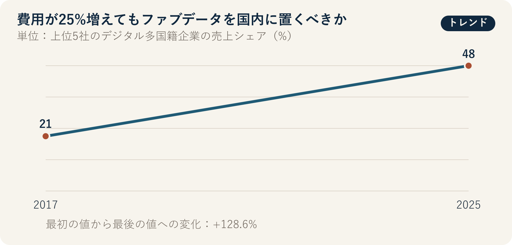

::: {.book-question}
[本日の策問]{.book-question-label}

{.book-question-image width=30mm fig-alt="国境を越えるデータの波と国内の金庫、協力工場をともに描いたミニマルな水墨画の象徴画"}

[ファブデータを国内に保管するとサプライヤーのクラウド費用が25%増えても、データを国内に置くべきでしょうか。]{.book-question-prompt}
:::

1447年、世宗（セジョン）の法と権限に関する策問^[この章と結び付けた実際の策問（[策問]{.hanja}）は、法が弊害を生み、そのために再び法をつくる循環と、権限の所在を問いました。策問アーカイブが意味を要約して再構成した漢文は「[法立而弊生，弊生而法又立。其所以救之者何歟？政權當歸於何所歟？]{.hanja}」であり、原文の逐語訳ではありません。「法を立てれば弊害が生じ、弊害が生じればまた法を立てる。これを救う方法は何か、政治権力はどこに帰属すべきか」という問いです。今日の問いは、当時の権力機関をデータセンターにそのまま対応させたものではありません。統制を強めるための規則が新たな費用と集中を生むとき、権限の所在と救済手続きを問い直す構造を借りています。]は、規則が存在するだけで良い統治が完成するわけではないと考えました。データを国内に置く規則は統制権を高める一方、市場を少数事業者に集中させたり、復旧や協業を難しくしたりする新たな弊害を生む可能性があります。

ファブデータは一種類ではありません。工程レシピと装置パラメータ、欠陥画像、予知保全ログ、作業者の個人情報、調達・顧客情報、匿名化した生産統計では、漏えい、改ざん、停止による被害が異なります。保管場所だけで一括すれば、最も機密性の高いデータには不十分で、最も機密性の低いデータには過剰な規則になりかねません。

## なぜ今、この問いなのか

UNCTADは、デジタル市場の集中を扱った2025年の資料で、上位5社のデジタル多国籍企業の売上シェアが、2017年の21%から2025年には48%へと2倍以上に拡大したと示しました。また、43か国の企業による電子商取引売上高は、2016～2022年に約60%増加しました。

この数値は、世界のデジタル市場が集中しているという背景であり、ファブデータの国内保管がセキュリティを高める、または低下させることを示す直接的な実験ではありません。むしろ、規則を設計する際に、少数のグローバルクラウド企業による支配と、国内の少数事業者への再集中の両方を見るべきだというシグナルです。

セキュリティは、データの物理的な場所よりも、暗号化、鍵の所有、アカウント権限、運用者アクセス、パッチ適用、バックアップ隔離、インシデント対応、サプライチェーンの弱点から侵害される場合があります。一方で、場所と管轄権も無意味ではありません。非常時の法執行、押収・アクセス、外国政府からの要求、サービス停止、契約執行に影響します。

新人のデータガバナンス担当者が行う実務は、「国内か海外か」の投票ではありません。データフローを描いて機密度を区分し、各区分に保管、処理、バックアップ、国外移転、鍵、運用者、削除のルールを付け、費用と復旧時間を試験することです。

## データの視点

{fig-alt="上位5社のデジタル多国籍企業の売上シェアが2017年の21%から2025年の48%へ増加したデータ図"}

### 根拠データ表

| 根拠 | 原資料の数値・範囲 | 性格 | 討論での意味 |
|---:|---|---|---|
| 1 | 上位5社のデジタル多国籍企業の売上シェアは、2017年の**21%**から2025年には**48%**へ増えました。 | UNCTADの世界市場分析 | クラウド、演算、データアクセスが少数企業に集中している背景です。 |
| 2 | 43か国の企業による電子商取引売上高は、2016～2022年に**約60%増加**しました。 | UNCTAD原文に基づく事実 | 国境を越えるデジタル取引が拡大する中、移転規則の費用が広範に及ぶ可能性があります。 |
| 3 | データの国内保管は統制権を高める一方、中小企業のクラウド利用費用も増やす可能性があります。 | 本章の分析枠組み | セキュリティ・管轄上の便益と、サプライヤーの費用・復旧を同じ評価表に置きます。 |
| 4 | UNCTADは、資本、データ、コンピューティングへのアクセスが、デジタル市場への参入障壁になり得ると説明しています。 | 原資料の政策分析 | 国内保管の設計でも、中小サプライヤーのアクセス可能性を独立したKPIにします。 |
| 5 | 事例では、全面的な国内保管によりサプライヤー費用が25%増加し、障害復旧が3時間遅れ、政府の緊急アクセスが24時間早まると仮定します。 | **討論用の仮定** | 公式統計ではなく、区分別ルールの損益を比較するための条件です。 |

### 数字の読み方

21%と48%は、UNCTADが定義した上位5社のデジタル多国籍企業の売上シェアです。クラウド市場全体のシェアや半導体ファブ用ソフトウェアのシェアと言い換えてはいけません。売上、資産、利用者、データ量は、それぞれ異なる集中度の指標です。

2017年から2025年までの増加は、集中が進んだことを示しますが、単一の原因を示すものではありません。規模の経済、M&A、ネットワーク効果、AI投資、規制が複合的に作用した可能性があります。

43か国の60%増加も、世界のすべての企業の増加率ではありません。国数、名目価格、通貨、標本範囲を確認する必要があります。

国内保管によるセキュリティ効果は、別途測定する必要があります。インシデント件数だけを数えると、検知能力が向上した組織が悪化したように見える場合があります。検知時間、権限乱用、鍵漏えい、復旧目標の達成、第三者アクセス、パッチ遅延、独立監査、実際の被害を併せて確認します。

25%、3時間、24時間は事例の仮定です。費用増加の分母がストレージ費用か総IT費用か、復旧時間がRTOか実際の平均か、緊急アクセスがどのような適法手続きを指すのかを明示する必要があります。

## 対立する答案

### 答案A — 重要データ国内保管論

工程レシピ、欠陥モデル、装置制御、セキュリティログは、生産競争力と国家安全保障に直結する可能性があります。国内管轄、国内での鍵管理、承認済み運用者、隔離バックアップを義務付ければ、海外サービスの停止や外国の法執行に対する統制力を高められます。インシデント時に政府と企業が共同対応する時間を短縮する便益もあります。

ただし、「国内保管」だけを満たし、アカウント、暗号化、パッチ適用が弱ければ、住所だけが安全なシステムになります。国内事業者1社に集中すれば、共通障害と値上げのリスクが高まります。

### 答案B — セキュリティ統制重視の自由移転論

データの場所よりも、エンドツーエンド暗号化、顧客管理鍵、最小権限、改ざん不能ログ、マルチリージョン・バックアップ、プロバイダーの切替可能性が重要です。グローバルなサプライヤーが同じプラットフォーム上で装置を診断できれば、復旧が速まり、中小企業も規模の経済を利用できます。全面的な国内保管による25%の費用増加は、イノベーションと競争を弱める可能性があります。

しかし、国外管轄、外国政府の要求、制裁、戦争、ネットワーク遮断といった非技術的リスクは、暗号化だけでは除去できません。最も機密性の高いデータの統制権と緊急アクセスは、場所と契約の影響を受けます。

### 答案C — 区分別データ主権論

データを4区分に分けます。装置制御、重要レシピ、セキュリティ鍵は、国内での保管・処理と、国内の隔離バックアップを原則とします。機密性の高い品質・顧客データは、承認済みの国の間で、暗号化と顧客管理鍵を用いた移転を認めます。匿名化統計と公開技術資料は、マルチリージョン・クラウドを利用します。個人情報と輸出管理対象データは、別途法務審査を行います。

区分は名称ではなく、被害シナリオで決めます。機密性、完全性、可用性、法的管轄、復旧時間、プロバイダー切替を採点し、例外には有効期限と承認者を定めます。国内保管で費用が増える中小サプライヤーには、共同セキュリティサービスと標準移転ツールを提供しますが、安価な契約の対価としてセキュリティ例外を与えてはいけません。

## AI調査設計

### AIへのプロンプト

> 半導体ファブデータについて、区分別の保管、処理、国外移転ルールを設計してください。①データ一覧と実際のフロー、②契約、管轄、個人情報、輸出管理に関する社内法務審査、③アカウント、暗号化、鍵、バックアップ、インシデント対応の統制、④費用、遅延、復旧訓練、⑤UNCTADのデジタル市場集中資料の順に確認してください。工程レシピ、装置制御、欠陥画像、予知保全ログ、作業者の個人情報、調達・顧客データ、匿名化統計を区別し、各区分について機密性、完全性、可用性の被害を評価してください。国内保管がセキュリティを自動的に保証すると仮定せず、鍵の所有、運用者の所在地、リモートアクセス、バックアップまで含めてください。確認済みの事実、法務意見、プロバイダーの主張、AIの推論、事例の仮定を分けてください。AIに原文のレシピ、個人情報、セキュリティ鍵を入力せず、法的結論は担当弁護士による確認対象と明記してください。

### データ取得

| 順序 | 資料 | 確認項目 |
|---:|---|---|
| 1 | データ一覧・フロー図 | 生成装置、フィールド、機密度、保管・処理・バックアップの場所、受信者、保存期間 |
| 2 | 権限・セキュリティログ | ユーザー・サービスアカウント、鍵の所有、リモート運用者、管理者アクセス、異常検知 |
| 3 | 契約・法務審査 | 管轄、再委託、政府要求の通知、移転・削除、サービス終了、監査権 |
| 4 | 費用・性能・復旧試験 | ストレージ・転送費用、遅延、RTO・RPO、マルチリージョン障害訓練、プロバイダー切替時間 |
| 5 | サプライヤーへの影響 | 企業規模、追加費用、技術人員、標準ツール、セキュリティ事故、支援ニーズ |

### 情報の判定

1. **場所と統制の分離：** サーバーの所在地、法的管轄、鍵、運用者、バックアップの場所を別々に記録します。
2. **最小化：** 業務に不要なフィールドと保存期間を先に減らします。
3. **復旧の実証：** 契約上のRTOではなく、実際の障害訓練結果を確認します。
4. **プロバイダー集中：** 国内事業者1社への移行が、新たな単一障害点をつくらないか確認します。
5. **費用の分母：** ストレージ費用、総クラウド費用、製品原価のどれの25%かを明示します。
6. **法令の最新性：** 管轄ごとの規則と契約は、施行日と例外を法務担当者が原文で再確認します。

### 討論の核心

- データ主権を、保管場所、暗号鍵、法的管轄、緊急アクセスのどれで定義しますか。
- 工程レシピと匿名化した装置診断統計を同じルールで扱うと、どのような費用が生じますか。
- 中小サプライヤーの25%の費用を、大企業と政府が分担すべき条件は何ですか。
- 国内保管が国内事業者の独占を強める場合、競争とセキュリティをどう両立しますか。

## ケース討論

あなたはデータガバナンスチームに入社して5か月の社員です。社内検討チームは、全面的な国内保管案により中小サプライヤーの総クラウド費用が25%増え、マルチリージョン障害からの復旧が3時間遅れる一方、政府による適法な緊急アクセスは24時間早まると予測しています。すべて討論用の仮定です。

- 移転対象は2 PBで、重要レシピ・制御5%、品質・欠陥画像35%、予知保全40%、個人情報・契約10%、匿名化統計10%です。
- 国内2社構成は年間40億ウォン、既存のマルチリージョン構成は年間32億ウォンです。
- 海外の装置メーカー12社が予知保全ログにアクセスし、国内中継方式では診断が平均90分遅れます。
- 国内の鍵管理と改ざん不能ログを適用すれば、高リスクの管理者アカウントを180件から60件に減らせます。

新入社員は、**全面的な国内保管、セキュリティ統制を強化した現状維持、区分別の国内保管と制限付き移転**のいずれかを選びます。ファブ運用、セキュリティ、法務、中小サプライヤー、海外装置メーカー、政府対応の各担当者が反論します。

最終案には、区分表、保管・処理・バックアップの場所、鍵の所有、海外アクセス方式、費用分担、RTO・RPO、緊急アクセス手続き、例外の有効期限、四半期監査項目を含めてください。

## 90秒回答例

「私は**答案C、全面的な国内保管ではなく、データ区分別の主権案**を選びます。UNCTADによると、上位5社のデジタル多国籍企業の売上シェアは、2017年の21%から2025年には48%へ拡大しました。集中リスクは明らかですが、国内保管だけでセキュリティが保証されるわけではありません。事例のデータ2 PB、費用25%増加、復旧3時間遅延、緊急アクセス24時間短縮は、すべて仮定です。全面的な国内保管が管轄権と緊急時の統制を高めるという反論は認めます。重要レシピ・制御の5%とセキュリティ鍵は、国内処理と隔離バックアップを義務付け、品質画像は国内の原本と仮名化した診断用コピーに分けます。予知保全データはフィールドを最小化し、顧客管理鍵、承認済みセッション、改ざん不能ログの下で海外アクセスを認めます。復旧訓練が現状より1時間以上遅れるか、管理者アカウントが目標を超えた場合は、その区分を再設計します。海外アクセスで鍵またはログの違反が1件でも確認されれば、ただちに国内中継へ切り替えます。データ主権は保管場所ではなく、アクセス・停止の権限と復旧能力で証明すべきです。」

## 追加質問

**反対尋問と再反論**

- 重要レシピが全体の5%でも、他のログと組み合わせて復元できる場合、区分をどう調整しますか。
- 国内事業者2社が同じ電力網とソフトウェアを使う場合、冗長化と言えますか。
- 政府の緊急アクセスが24時間早まる便益を、実際に必要となる事案の頻度と無関係に評価してよいですか。
- 海外装置メーカーの診断が90分遅れ、ファブの損失が拡大する場合、セキュリティチームはどの例外を認めるべきですか。
- サプライヤー費用25%の分母が総IT費用ではなくストレージ費用だけなら、結論は変わりますか。
- 法律上、国内保管が義務付けられるデータと、会社が自主的に定めたデータを文書上どう区別しますか。

## 出典

- [UNCTAD「Highly Concentrated Digital Markets Put Consumers at Risk」—上位5社のデジタル多国籍企業の売上シェア（2025）](https://unctad.org/news/highly-concentrated-digital-markets-put-consumers-risk-heres-how-change-course)
- [UNCTAD「Online Dispute Resolution Key to Boosting Consumer Trust」—43か国の企業による電子商取引売上高（2024）](https://unctad.org/news/un-trade-and-development-online-dispute-resolution-key-boosting-consumer-trust)
- [朝鮮時代策問アーカイブ、世宗1447年「法の弊害と権力の所在」](https://waterfirst.github.io/Joseon-Dynasty-Civil-Service-Examination/#sejong-1447/0)
- [韓国国史編纂委員会、『世宗実録』1447年8月5日の記録](https://sillok.history.go.kr/id/kda_12908005_001)

> **資料メモ：** 21%、48%、43か国、約60%はUNCTAD資料の市場集計です。費用25%、復旧3時間、緊急アクセス24時間、事例の2 PB、構成比、費用、装置メーカー、アカウント数、転換条件は、すべて討論用の仮定です。実際の法的義務は、管轄ごとの原文と法律専門家の検討によって確定する必要があります。
