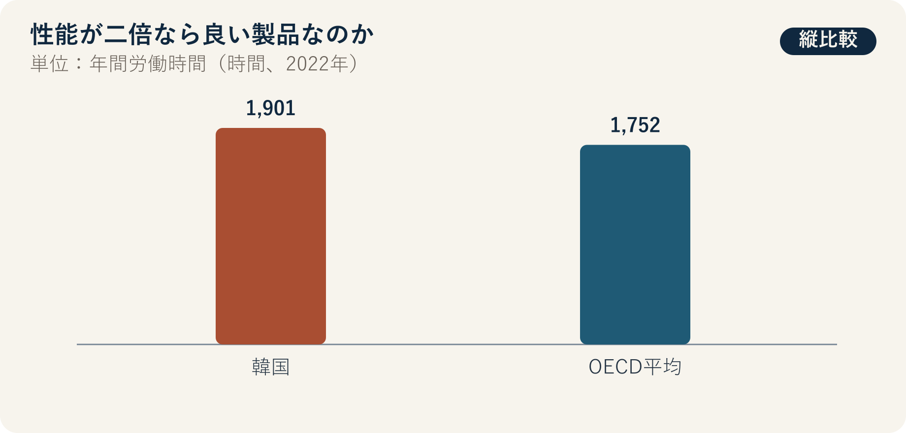

::: {.book-question}
[本日の策問]{.book-question-label}

{.book-question-image width=30mm fig-alt="高速で走るチップと、その後ろに置かれた電力・時間・暮らしの天秤を描いたミニマルな水墨画の象徴画"}

[新しいチップの性能が2倍でも、電力・交換費用・業務強度が増えれば、成功と見なせるでしょうか。]{.book-question-prompt}
:::

1515年、中宗（チュンジョン）の理想政治に関する策問^[この章と結び付けた実際の策問（[策問]{.hanja}）は、理想を今日の現実に実現するとき、何を最初に行うべきかを問いました。策問アーカイブが意味を要約して再構成した漢文は「[欲致堯舜之治於今日，何者爲先？子若孔子，將何以治國歟？]{.hanja}」であり、原文の逐語訳ではありません。「堯舜の治世を今日に実現しようとするなら、何を先にすべきか。あなたが孔子なら、どのように国を治めるか」という問いです。今日の問いは、理想政治を製品KPIに置き換えたものではありません。望ましい状態を言葉で称賛するだけで終わらず、現実の優先順位と実行基準を示すという構造を借りています。]は、良い社会を構成する要素の列挙だけでは終わりませんでした。何を先に行い、どのような結果で理想を確認するかを答えさせました。

製品も、「性能が高い」という一文だけで成功を定義しがちです。しかし、ユーザーの待ち時間が減らない、電力、冷却、交換費用が大幅に増える、処理速度の向上が追加業務の割り当てにしかつながらない場合、ベンチマーク性能と生活の改善は乖離します。

OECDの指標は、労働生産性と労働時間を別々の項目として測定します。製品評価もベンチマーク性能だけでなく、ユーザーの時間と健康、電力、冷却、交換費用を個別に確認する必要があります。そうして初めて、優れた構成要素が実際に優れたシステムをつくったか判断できます。

## なぜ今、この問いなのか

OECD *Economic Surveys: Korea 2024* が引用した比較では、韓国の2022年の年間労働時間は1,901時間で、OECD平均の1,752時間より149時間、約8.5%長くなっています。これは、韓国のすべての労働者が正確に1,901時間働いたという意味ではなく、国平均の比較です。

一方、OECDの生産性資料は、韓国の時間当たり労働生産性が1995年の13.9ドルから2024年には52.0ドルへと、ほぼ4倍になったと説明しています。単位は、2020年購買力平価（PPP）基準の実質ドルです。生産性向上は生活水準を高める基盤ですが、労働時間、健康、分配、環境が自動的に良くなったという意味ではありません。

新人エンジニアが製品評価会議で行うべきことは、性能を低く評価することではありません。ベンチマーク性能が実際の業務待ち時間と完了時間を減らすか、システム電力と総保有コストはいくらか、既存設備をどれだけ早く廃棄させるか、夜間・緊急業務が増えたか、高齢者や障害のあるユーザーも便益を得られるかという変換経路を確認することです。

## データの視点

{fig-alt="韓国とOECD平均の年間労働時間、韓国の時間当たり生産性の長期的上昇、製品成功を測る複数の指標を示したデータ図"}

### 根拠データ表

| 根拠 | 原資料の数値・範囲 | 性格 | 討論での意味 |
|---:|---|---|---|
| 1 | 2022年、韓国の年間労働時間は**1,901時間**でした。 | OECDの国平均統計 | 技術の便益がユーザーの時間を実際に減らしているかを問う社会的背景です。 |
| 2 | 同年のOECD平均は**1,752時間**でした。韓国は149時間、約**8.5%**長くなっています。 | OECD数値の算術比較 | 国ごとに制度・産業構造が異なるため、原因をチップ性能に直接結び付けてはいけません。 |
| 3 | 韓国の時間当たり労働生産性は、1995年の**13.9ドル**から2024年には**52.0ドル**へ高まりました。 | OECD、2020年PPP基準の実質ドル | 生産性がほぼ4倍になっても、生活のすべての指標が同じ比率で変わるわけではありません。 |
| 4 | 事例では、チップのベンチマーク性能2倍、システム電力35%増加、交換費用20%増加、実際の業務時間8%減少を仮定します。 | **討論用の仮定** | 性能、費用、ユーザー成果が異なる方向に動く選択を練習します。 |
| 5 | 性能を2、システム電力を1.35と単純に置けば、理論上の性能／電力は約**1.48倍**です。 | **討論用仮定の算術計算** | データシート上の効率は改善しますが、実際の業務時間8%削減とは異なる指標です。 |

### 数字の読み方

年間労働時間は平均です。正規・非正規、性別、職種、所得によって分布が異なり、長時間労働の原因を半導体やAIだけで説明することはできません。国平均は製品成功の直接的なKPIではなく、ユーザー時間を別途測定すべき理由です。

時間当たり労働生産性の13.9ドルと52.0ドルは、名目為替レートによるドルではなく、2020年PPP基準の実質価格です。約3.74倍であり、「正確に4倍」ではなく「ほぼ4倍」と表現します。生産性は産出／労働時間であり、賃金、生活満足度、環境の単位ではありません。

ベンチマーク2倍は、どのタスク、精度、電力制限、ソフトウェアを使ったかによって異なります。最大性能、持続性能、ユーザーの平均タスク時間を分けます。2/1.35≈1.48という計算も、最大性能とシステム電力が同じ条件で測定されたというシナリオにすぎません。

業務時間8%減少が、そのまま余暇8%増加を意味するわけではありません。節約した時間が追加業務、待機、報告、教育、休息のどこへ向かったかを確認する必要があります。チーム別の業務量、夜間呼び出し、エラー修正時間も併せて測定します。

## 対立する答案

### 答案A — 性能先導論

演算性能は、科学、製造、医療、創作の可能性を広げる汎用基盤です。性能が2倍、性能／電力が1.48倍なら、同じ時間でより大きな問題を解き、サーバー数を減らせます。当初の電力と交換費用が増えても、新機能、売上、顧客の待ち時間短縮が長期的な便益を生む可能性があります。

しかし、最高ベンチマークを実際の需要と取り違えれば、過剰な交換と遊休性能を生みます。節約された時間がユーザーに戻ったかを検証しなければ、性能は社内目標にとどまります。

### 答案B — 人間の成果優先論

実際の業務時間が8%しか減らないのに、電力が35%、交換費用が20%増えるなら、性能2倍を成功と呼ぶのは困難です。業務強度、夜間対応、健康、購入可能性、寿命、廃棄まで含め、ユーザーの生活が良くなる必要があります。十分な性能を持つ既存製品を使い続ける選択も、イノベーションです。

ただし、すべての人間的成果が長期データで確認できるまで発売を遅らせれば、必要な性能向上と市場機会を失う可能性があります。業務時間短縮だけでは、医療精度や研究可能性といった質的便益を見落とすこともあります。

### 答案C — 複数しきい値論

性能、電力、費用、ユーザー、環境を1つの加重平均で相殺せず、まず最低しきい値を設けます。安全・信頼性、実際の中核業務の改善、電力・熱の限界、総保有コスト、アクセシビリティ、製品寿命がすべて最低基準を通過した後、製品群別の加重点数を計算します。性能が極めて高くても、安全や電力網の最低基準を満たせなければ発売しません。

発売後は、節約された時間の帰属を確認します。業務時間が減っても業務量と夜間呼び出しが増えれば、組織プロセスを変え、実際の利用率が低ければ交換を遅らせます。特定の研究・医療タスクのように便益が大きい顧客には高い費用を認めますが、一般事務にも同じ交換周期を強制しません。

## AI調査設計

### AIへのプロンプト

> 新しい半導体製品の成功を、ベンチマーク性能以外の実際のユーザー、費用、環境成果で評価するダッシュボードを設計してください。①同一条件のチップ・システムベンチマーク、②顧客の作業ログと導入前後の時間調査、③電力、冷却、故障、交換、廃棄データ、④価格、総保有コスト、アクセシビリティ、健康調査、⑤OECDの労働時間・生産性原文の順に確認してください。性能2倍、電力35%増加、費用20%増加、業務時間8%減少は、すべて事例の仮定と表示し、機能・顧客群別の感度分析を行ってください。平均だけでなく、分布と最も不利益を受ける集団を示し、時間削減が追加業務と休息のどちらに向かったかを区別してください。確認済みの事実、会社の主張、ユーザー観測、AIの推論、予測を別々の列に記載してください。安全・個人ログは匿名化し、因果関係は比較群または段階導入で検証してください。

### データ取得

| 順序 | 資料 | 確認項目 |
|---:|---|---|
| 1 | チップ・システム試験 | タスク、精度、持続性能、チップ・メモリ・冷却電力、温度、エラー |
| 2 | ユーザー作業調査 | 業務種類、導入前後の完了時間、待機・修正、処理量、夜間呼び出し、学習時間 |
| 3 | 経済性資料 | 製品、設置、教育、電力、冷却、保全、中断、交換、残存価値 |
| 4 | アクセス・健康・品質 | 価格帯別の採用、障害者のアクセシビリティ、疲労・ストレス、エラー・顧客成果 |
| 5 | 寿命・環境 | 製造、輸送、使用、廃棄、実際の寿命、早期交換、回収・再利用 |

### 情報の判定

1. **条件同等性：** ベンチマークの精度、ソフトウェア、電力制限をそろえます。
2. **実利用：** 最大性能と、顧客の利用率・完了時間を分けます。
3. **分配：** 平均的な便益と費用を、ユーザー群、交代勤務、企業規模別に分けます。
4. **帰属：** 節約時間が休息、追加生産、会議・報告のどこへ向かったかを確認します。
5. **ライフサイクル全体：** 使用電力だけが減り、製造・早期廃棄の負担が増えていないか確認します。
6. **因果：** 製品導入前後に生じた他の制度・需要変化と、チップの効果を区別します。

### 討論の核心

- 安全、電力、費用、時間のうち、高い性能で相殺できないしきい値は何ですか。
- 実際の業務時間8%削減が、ユーザーの福祉向上なのか、追加業務なのかをどう判定しますか。
- 性能の便益が研究者に集中し、電力費を社会が負担する場合、価格に何を反映すべきですか。
- 1つの製品の成功KPIを顧客群別に変えることは、公正ですか。

## ケース討論

あなたは新製品評価会議に参加する、入社7か月のシステムエンジニアです。新しいチップは中核ベンチマーク性能が2倍ですが、システム電力は35%、交換費用は20%増え、パイロットユーザーの実際の業務時間は8%減りました。以下の数値はすべて討論用の仮定です。

- パイロットは設計検証チーム60人を8週間観測し、比較チームは既存設備を使った60人です。
- 新しいチップの利用率中央値は42%、上位10%のユーザーは78%です。
- 夜間の自動処理エラー呼び出しは週10件から16件へ増え、日中の待ち時間は平均50分減りました。
- 既存設備の会計上の残存耐用年数は2年で、1,000台を早期交換する追加費用は120億ウォンです。

新人エンジニアは、**全面発売、高負荷顧客群に限定した発売、1世代保留**のいずれかを勧告します。性能チーム、ユーザー代表、財務、サステナビリティ、安全・品質、営業が、それぞれKPIを提案します。

最終案には、相殺できない最低しきい値、重み、パイロットの偏り、早期交換、実際の時間削減、夜間呼び出し、顧客群別発売、6か月後の再評価、中止条件を含めてください。

## 90秒回答例

「私は**答案C、高負荷顧客群だけに限定して発売する案**を選びます。OECD資料では、韓国の2022年の年間労働時間は1,901時間で、OECD平均の1,752時間より約8.5%長くなっています。技術性能とユーザー時間を別々に測る必要があるという社会的背景です。事例のチップ性能2倍、電力35%増加、交換費用20%増加、業務時間8%減少、利用率42%は、すべて仮定です。最高性能の発売が遅れれば競争機会を失うという反論は認めます。しかし、ベンチマークが速くても、実際の業務と総費用を改善できなければ、製品の成功とは言えません。利用率60%以上が見込まれる顧客だけに発売し、既存設備は早期交換しません。安全・エラー、実際の業務時間、総保有コスト、電力・寿命、ベンチマークを併せて評価します。6か月後、業務時間が10%以上減り、夜間呼び出しと電力増加が基準内なら拡大します。最低基準を一つでも満たせなければ、修正後に再審査します。良いチップとは、単に速いチップではなく、ユーザーの時間と社会の費用を実際に改善するチップです。」

## 追加質問

**反対尋問と再反論**

- 医療・科学タスクの質が大きく向上するなら、業務時間が8%しか減らなくても発売範囲を広げますか。
- パイロットの60人が高性能ユーザーだけで構成されていた場合、実際の時間削減8%をどう補正しますか。
- 夜間呼び出しが60%増えても日中の待ち時間が50分減った場合、どちらの時間を重く評価しますか。
- ベンチマークの重みが10%しかなければ、半導体企業の中核競争力を過小評価することになりませんか。
- 既存設備の寿命が2年残っていても、競合企業が新製品を導入すれば早期交換を認めますか。
- 生産性の便益は会社に、電力・健康の費用はユーザーと地域に帰属する場合、価格と補償に何を含めますか。

## 出典

- [OECD, *OECD Economic Surveys: Korea 2024*—労働時間比較（2024）](https://www.oecd.org/content/dam/oecd/en/publications/reports/2024/07/oecd-economic-surveys-korea-2024_9343c046/c243e16a-en.pdf)
- [OECD, *Compendium of Productivity Indicators 2026*—韓国の時間当たり労働生産性の長期変化（2026）](https://www.oecd.org/en/publications/oecd-compendium-of-productivity-indicators-2026_734a5e68-en/full-report/labour-productivity-in-oecd-economies-recent-trends-and-shifting-drivers-of-growth_cd896487.html)
- [朝鮮時代策問アーカイブ、中宗1515年「理想政治を現実にする方法」](https://waterfirst.github.io/Joseon-Dynasty-Civil-Service-Examination/#jungjong-1515/0)
- [韓国学中央研究院、1515年謁聖試の合格者名簿](https://dh.aks.ac.kr/~sonamu5/wiki/index.php/SEDB%3A1515%EB%85%84%28%E4%B8%AD%E5%AE%97_10%29_%E4%B9%99%E4%BA%A5_%EC%95%8C%EC%84%B1%EC%8B%9C%28%E8%AC%81%E8%81%96%E8%A9%A6%29_%EB%AC%B8%EA%B3%BC%28%E6%96%87%E7%A7%91%29)

> **資料メモ：** 1,901時間と1,752時間は2022年のOECD比較であり、13.9ドルと52.0ドルは、1995年・2024年の2020年PPP基準の実質ドルによる生産性です。性能2倍、電力35%、費用20%、時間8%、パイロット、利用率、呼び出し、交換費用、模範答案のKPIは、すべて討論用の仮定です。
